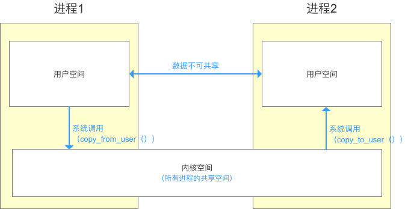
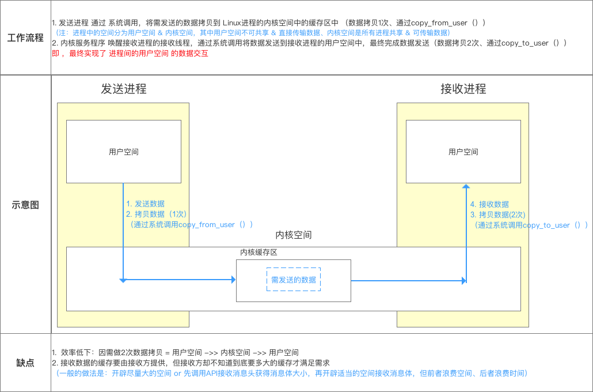
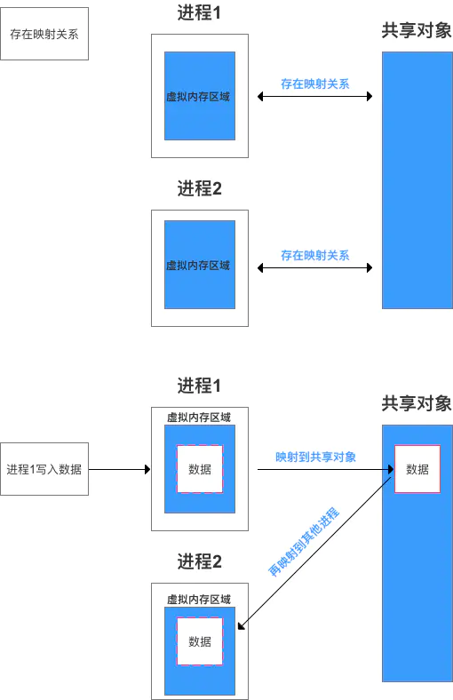
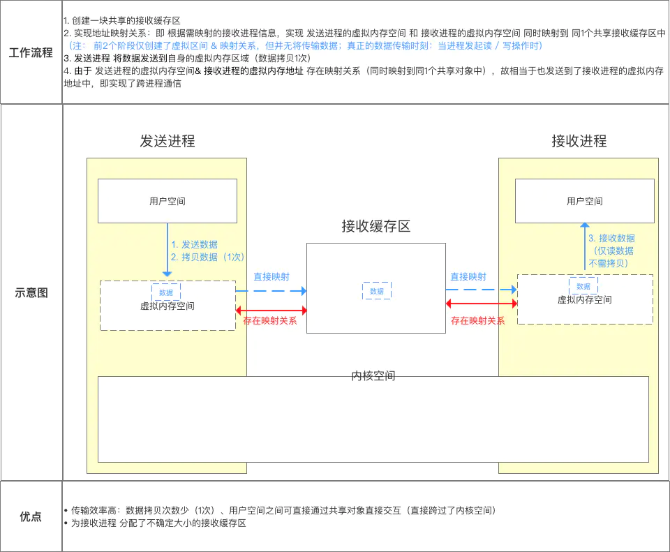

# Android Notes

- `TabLayout` 和 `ViewPager` 组合使用的时候，如果调用了`mTabLayout.setupWithViewPager(mViewPager)`方法，在使用`Tab.setText()`方法的时候会不起作用，原因和解决方法[在这里](https://blog.csdn.net/yoonerloop/article/details/70766002)

- `ConstraintLayout`进行线性布局时，常规的`wrap_content`或者`match_parent`可能会导致某些控件被部分挤出屏幕外，如下

  ```xml
  <?xml version="1.0" encoding="utf-8"?>
  <android.support.constraint.ConstraintLayout
      xmlns:android="http://schemas.android.com/apk/res/android"
      xmlns:app="http://schemas.android.com/apk/res-auto"
      xmlns:tools="http://schemas.android.com/tools"
      android:layout_width="match_parent"
      android:layout_height="match_parent"
      android:padding="16dp"
      tools:context=".filemanager.activity.MainActivity">
  
      <android.support.design.widget.TabLayout
          android:id="@+id/tab_top"
          android:layout_width="wrap_content"
          android:layout_height="wrap_content"
          app:layout_constraintTop_toTopOf="parent"
          app:layout_constraintStart_toStartOf="parent"
          app:layout_constraintEnd_toEndOf="parent"
          app:layout_constraintBottom_toTopOf="@id/pager_content"
          app:tabTextColor="@android:color/white"
          app:tabSelectedTextColor="@color/colorPrimary"
          app:tabTextAppearance="@style/TopTabTextAppearance"/>
  
      <android.support.v4.view.ViewPager
          android:id="@+id/pager_content"
          android:layout_width="match_parent"
          android:layout_height="wrap_content"
          app:layout_constraintTop_toBottomOf="@id/tab_top"
          app:layout_constraintStart_toStartOf="parent"
          app:layout_constraintEnd_toEndOf="parent"
          app:layout_constraintBottom_toBottomOf="parent"/>
  
  </android.support.constraint.ConstraintLayout>
  ```

  上述代码26行用的是`wrap_content`（或者`match_parent`效果也是一样），愿景是`TabLayout`和`ViewPager`垂直并列显示，看着没什么问题，但是运行效果是上面的`TabLayout`总会被挤出屏幕外一部分，显示不完全。

  解决办法：将26行的`wrap_content`（或`match_parent`）改为`0dp`，使其自动填充剩下的空间。
  
- 浮点数之间的等值判断，基本数据类型不能用`==`来比较，包装数据类型不能用equals来判断。
  解决办法：
  1)指定一个误差范围，两个浮点数的差值在此范围之内，则认为是相等的

  ```java
  float a = 1.0f - 0.9f;
  float b = 0.9f - 0.8f;
  float diff = le - 6f;
  if (Math.abs(a - b) < diff){
  	System.out.println("true");
  ```

  

  2)使用 BigDecimal 来定义值，再进行浮点数的运算操作

  ```java
  BigDecimal a = new BigDecimal("1.0");
  BigDecimal b = new BigDecimal("0.9");
  BigDecimal c = new BigDecimal("0.8");
  BigDecimal x = a.subtract(b);
  BigDecimal y = b.subtract(c);
  
  if (x.equals(y)) {
  	System.out.println("true");
  }
      
  // Negative example:
  float g = 0.7f - 0.6f;
  float h = 0.8f - 0.7f;
  if(g == h) {
  	System.out.println("true");
  }
      
  // Positive example:
  double dis = le - 6;
  double dl = 0.0000001d;
  double dzt.println(Math.abs(d1 - d2) < dis);
  ```

  

## 进程

### [Binder 原理](https://blog.csdn.net/carson_ho/article/details/73560642)

#### 1. 知识储备

##### 1.1 Linux 内存空间

Linux 中内存划分为用户空间和内核空间，其中**内核空间的数据在全部进程间共享，所有进程共用1个内核空间，而每个进程在用户空间中都有自己独立的子空间，数据不可共享**。正因为此，进程间的数据无法直接共享，所以必须借助内核空间进行中转。



进程内，用户空间和内核空间间的数据交换通过**系统调用**完成，主要借助函数：

> 1. copy_from_user()  将用户空间的数据拷贝到内核空间
>
> 2. copy_to_user()  将内核空间的数据拷贝到用户空间



因此，一次数据交换需要进行2次数据拷贝，效率低下，所以引入`内存映射`的概念。

##### 1.2 内存映射

直接看图



Linux 通过`mmap()`函数建立内存映射，这样，进程1的数据写入将直接映射到进程2的内存空间，提高了效率。



而 Binder 正是采用了内存映射的技术，连接两个进程，从而实现进程间通讯。