1. 首先在 Jenkins 主面板新建一个项目

   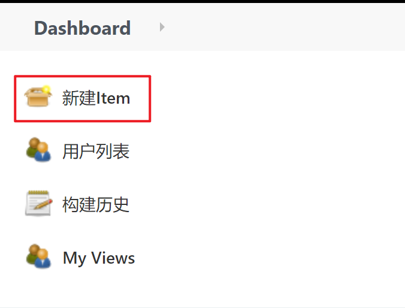

2. 填入项目名称，并选择「自由风格项目」

   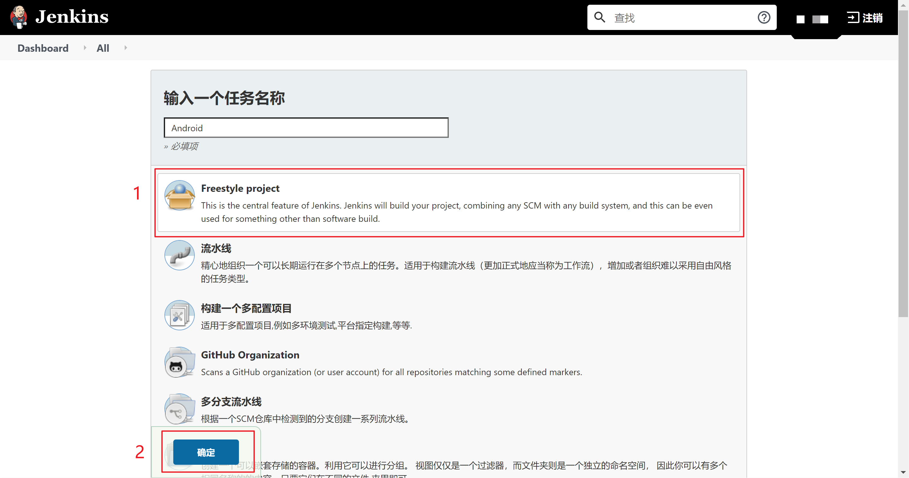
   
3. 接着就进入到了构建任务的配置页面，可以看到一共分为六个模块，这里我们将对这些模块分别进行配置。

   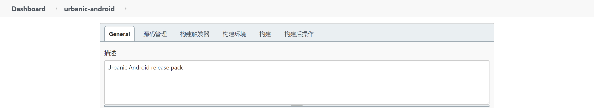

### 一、通用配置

在这里配置任务的描述文字，并可以对项目做如下的设置：

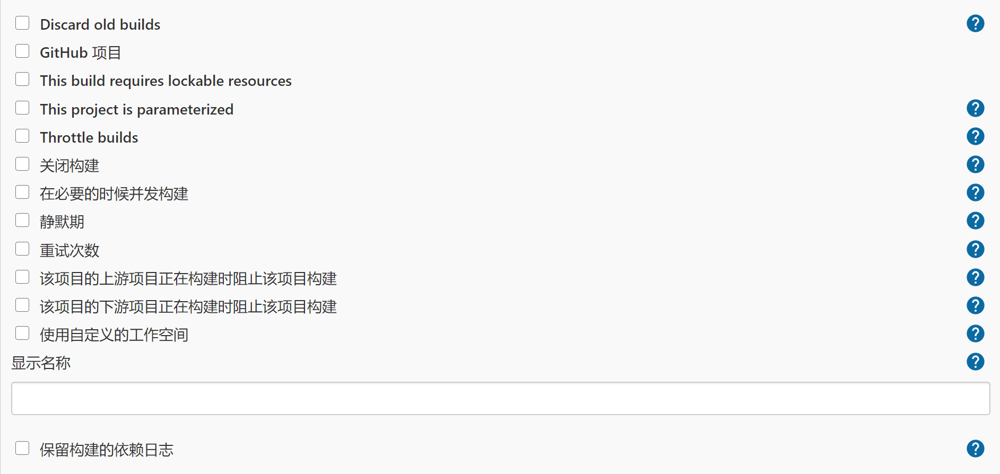

整个配置页面的所有 item 都可以通过点击后面的问号按钮查看详细说明。

### 二、源码管理

在这里设置代码拉取的仓库配置项。

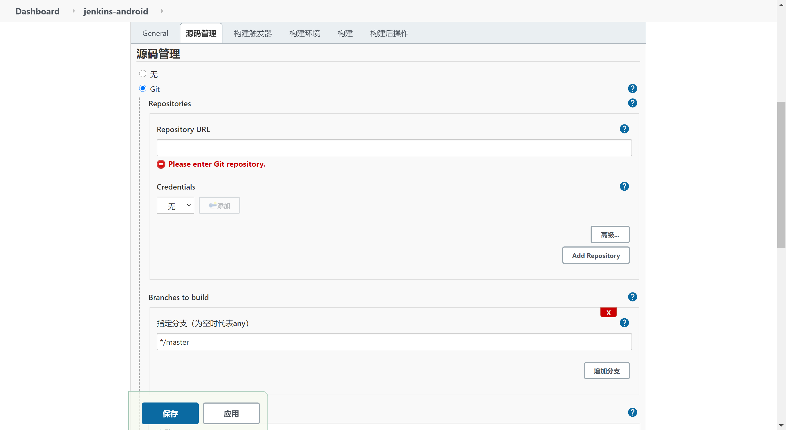

首先配置仓库地址，可以是 https 地址，也可以是 ssh 地址。需要在全局设置中配置相应的验证方式——用户名和密码的方式或者 ssh key 的方式。

接着指定代码拉取的分支名称。

如果有其他需求，则可以点击下方的「新增」按钮添加。例如，子模块等。

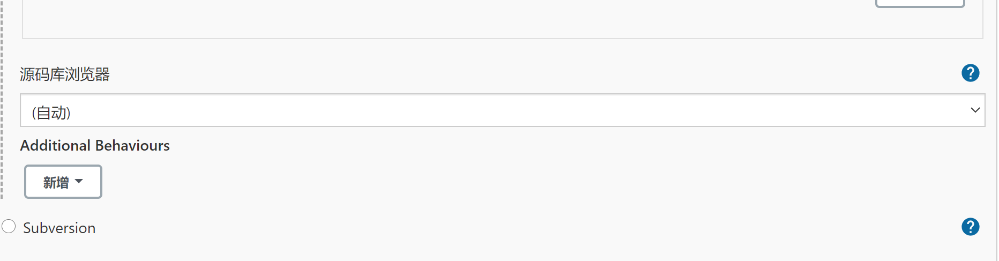

因为我的项目的 git 仓库配置了子模块，所以唠叨一下子模块的配置。

在 git 仓库的 root 目录编辑 `.gitmodules`，如下：

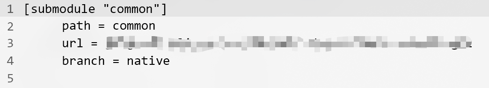

其中 url 指定子模块的仓库地址，branch 指定子模块的默认检出分支。

### 三、构建触发器

Jenkins 支持下面几种触发条件来触发 job。

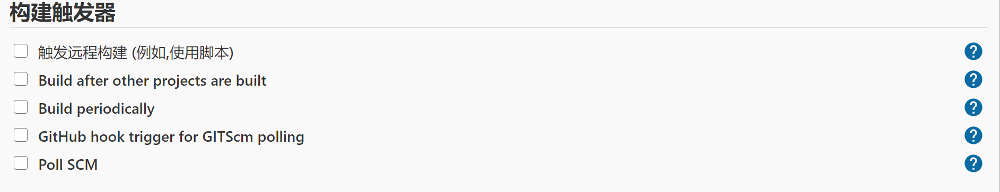

- 触发远程构建。

  可以通过脚本来触发此操作，例如我们可以通过 git hooks，当 push tags 时触发远程构建，说明如下：

  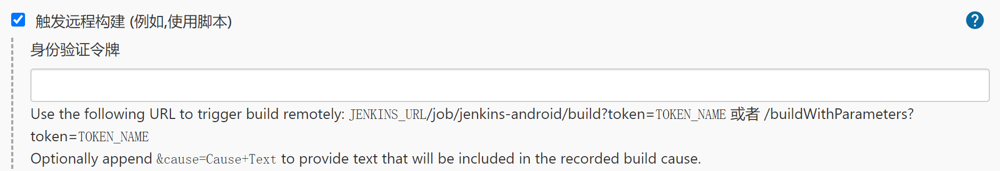

- Build after other projects are built

  说明很明晰了，当某个前驱任务构建完成后再构建此任务，有如下几个可选项：

  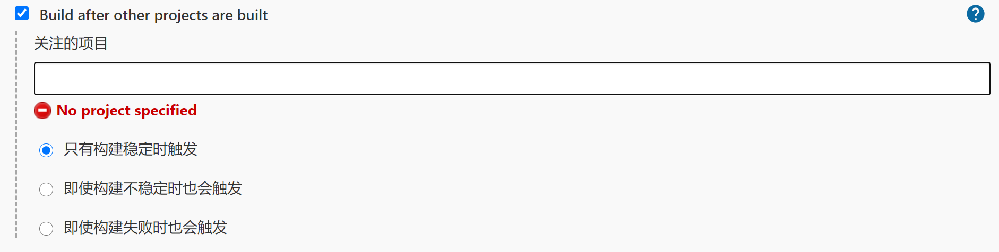

- Build periodically

  周期性构建项目。例如每两个小时或者每天的下午两点等。需要在下面的输入框中输入表示日程的代码，更多详细信息点击后面的问号按钮查看。

  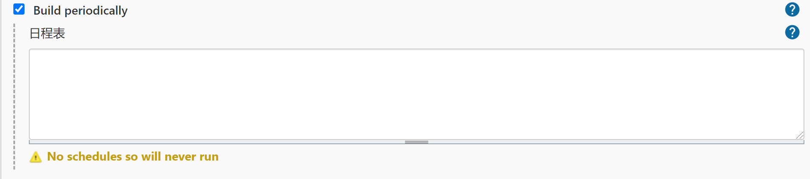

- GitHub hook trigger for GITScm polling

  Github hook 触发构建，例如某个 push 操作。

- Poll SCM

  定时检查源码变更。例如每隔五分钟检查代码是否有变更，有变更则进行构建。关于日程表的编写，参考上面的「Build periodically」。

### 四、构建环境

