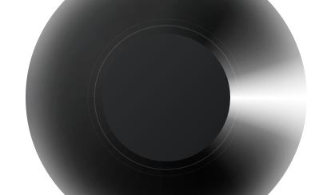

# 自定义刻度转盘


**RadioDialView.java**

```java
package com.qinggan.launcher.common.ui.haval.custom;

import android.content.Context;
import android.content.res.Resources;
import android.graphics.Bitmap;
import android.graphics.BitmapFactory;
import android.graphics.Canvas;
import android.graphics.Color;
import android.graphics.Paint;
import android.util.AttributeSet;
import android.util.Log;
import android.view.MotionEvent;
import android.view.View;

import com.qinggan.launcher.common.ui.haval.R;

/**
 * <p>自定义环形刻度盘<p/>
 *
 * <p>
 *   刻度每格6°
 *   水平刻度线透明度100%，上下50°渐变为0%
 *   所以每个刻度格透明度下降12%
 * </p>
 *
 * @author fengtao </br>
 * @date 19-7-24 </br>
 */
public class RadioDialView extends View implements View.OnTouchListener {

    private Context mContext;
    private Bitmap mBgBitmap;
    private Paint mPaint;


    /**
     * 每刻度衰减透明度值
     */
    private static final float ALPHA_DECLINE_PER_SCALE = 0.16f;

    /**
     * 两个长指针之间的刻度格数
     */
    private static final int LENGTH_LONG_POINTER = 5;

    /**
     * 基础短指针的偏移量
     */
    private double mBaseRadianOffset = 0d;

    /**
     * 直到上次旋转完成时，相对于初始位置的总的旋转量
     */
    private double mTotalRadianRotatedUtilLastTimes = 0d;

    /**
     * 本次旋转中旋转的角度
     */
    private double mRadianRotatedInCurrentTimes;

    // 单位刻度代表的弧度
    private final double mRadianPerScale = Math.PI / 30;
    private final double mAnglePerScale = 6;

    private float mLastX, mLastY;
    private float mCurrentX, mCurrentY;
    float mTouchStartX = 0f, mTouchStartY = 0f;

    private int mMarginEndPointerChannelChecked;
    private int mLengthPointerChannelChecked;
    private int mLengthChannelScaleLong;
    private int mLengthChannelScaleShort;
    private int mWidthChannelScale;

    /**
     * 长指针位置偏移量，范围：0~5
     */
    private int mLongPointerPositionOffset = 0;

    /**
     * 中点坐标
     */
    private int mCenterX, mCenterY;

    public RadioDialView(Context context) {
        super(context);
        init(context);
    }

    public RadioDialView(Context context, AttributeSet attrs) {
        super(context, attrs);
        init(context);
    }

    public RadioDialView(Context context, AttributeSet attrs,
                         int defStyleAttr) {
        super(context, attrs, defStyleAttr);
        init(context);
    }

    private void init(Context context) {
        mContext = context;
        mBgBitmap = BitmapFactory.decodeResource(mContext.getResources(), R.drawable.bg_radio_dial);

        mPaint = new Paint();
        mPaint.setAntiAlias(true);

        Resources resources = mContext.getResources();
        mMarginEndPointerChannelChecked = resources.getDimensionPixelSize(R.dimen.margin_end_pointer_channel_checked);
        mLengthPointerChannelChecked = resources.getDimensionPixelSize(R.dimen.length_pointer_channel_checked);
        mLengthChannelScaleLong = resources.getDimensionPixelSize(R.dimen.length_channel_scale_long);
        mLengthChannelScaleShort = resources.getDimensionPixelSize(R.dimen.length_channel_scale_short);
        mWidthChannelScale = resources.getDimensionPixelSize(R.dimen.width_channel_scale);


        mCenterX = mBgBitmap.getWidth() / 2;
        mCenterY = mBgBitmap.getHeight() / 2;


        setOnTouchListener(this);

        Log.d("pDbg", "init: " + calculateRadianOfRotating(0, 1, 1, 1));
    }

    @Override
    protected void onMeasure(int widthMeasureSpec, int heightMeasureSpec) {
        super.onMeasure(widthMeasureSpec, heightMeasureSpec);
        int widthMode = MeasureSpec.getMode(widthMeasureSpec);
        int heightMode = MeasureSpec.getMode(heightMeasureSpec);
        int widthSize = MeasureSpec.getSize(widthMeasureSpec);
        int heightSize = MeasureSpec.getSize(heightMeasureSpec);
        if (widthMode == MeasureSpec.AT_MOST) {
            widthSize = mBgBitmap.getWidth();
        }

        if (heightMode == MeasureSpec.AT_MOST) {
            heightSize = mBgBitmap.getHeight();
        }

        setMeasuredDimension(MeasureSpec.makeMeasureSpec(widthSize, widthMode), MeasureSpec.makeMeasureSpec(heightSize, heightMode));
    }

    @Override
    protected void onDraw(Canvas canvas) {
        super.onDraw(canvas);

        canvas.drawBitmap(mBgBitmap, 0, 0, mPaint);

        mPaint.setStrokeWidth(mWidthChannelScale);

        // 画刻度盘
        float endX = getY() + mBgBitmap.getWidth() - mMarginEndPointerChannelChecked;
        float startX = endX - mLengthPointerChannelChecked;
        int y = getMeasuredHeight() / 2;

        float radius = startX - mCenterX;

        int index = 0;
        int alpha = 255;
        double radian = 0d;
        while (alpha > 0) {
            double realRadianAbove = radian - mBaseRadianOffset;
            double realRadianBelow = radian + mBaseRadianOffset;

            double startXOffsetAbove = radius * Math.cos(realRadianAbove);
            double startYOffsetAbove = radius * Math.sin(realRadianAbove);
            double startXOffsetBelow = radius * Math.cos(realRadianBelow);
            double startYOffsetBelow = radius * Math.sin(realRadianBelow);

            double endXOffsetAbove, endYOffsetAbove, endXOffsetBelow, endYOffsetBelow;

            int lengthChannelScaleAbove = mLengthChannelScaleShort;
            int lengthChannelScaleBelow = mLengthChannelScaleShort;

            if ((index + mLongPointerPositionOffset) % LENGTH_LONG_POINTER == 0) {
                lengthChannelScaleAbove = mLengthChannelScaleLong;
                Log.e("pDbg", "onDraw: 1-index: " + index);
            }

            if ((index - mLongPointerPositionOffset) % LENGTH_LONG_POINTER == 0) {
                lengthChannelScaleBelow = mLengthChannelScaleLong;
                Log.e("pDbg", "onDraw: 2-index: " + index);
            }

            // 水平线上部指针
            endXOffsetAbove = (radius + lengthChannelScaleAbove) * Math.cos(realRadianAbove);
            endYOffsetAbove = (radius + lengthChannelScaleAbove) * Math.sin(realRadianAbove);

            // 水平线下部指针
            endXOffsetBelow = (radius + lengthChannelScaleBelow) * Math.cos(realRadianBelow);
            endYOffsetBelow = (radius + lengthChannelScaleBelow) * Math.sin(realRadianBelow);

            mPaint.setColor(Color.parseColor("#FFFFFF"));
            mPaint.setAlpha(alpha);

            // 画水平线下部的刻度线
            canvas.drawLine(mCenterX + (float) startXOffsetBelow, y + (float) startYOffsetBelow,
                    mCenterX + (float) endXOffsetBelow, y + (float) endYOffsetBelow, mPaint);

            // 画水平线上部的刻度线（不重复画水平线）
            if (index != 0) {
                canvas.drawLine(mCenterX + (float) startXOffsetAbove, y - (float) startYOffsetAbove,
                        mCenterX + (float) endXOffsetAbove, y - (float) endYOffsetAbove, mPaint);
            }

            radian += mRadianPerScale;
            alpha = (int) (255 * (1 - ALPHA_DECLINE_PER_SCALE * index));
            index++;
        }


        // 画标识的蓝色指针
        mPaint.setColor(Color.parseColor("#FF00CDFF"));
        mContext.getResources().getDimensionPixelSize(R.dimen.length_pointer_channel_checked);
        canvas.drawLine(startX, y, endX, y, mPaint);
    }

    @Override
    public boolean onTouch(View v, MotionEvent event) {
        switch (event.getAction()) {
            case MotionEvent.ACTION_DOWN:
                mCurrentX = event.getX();
                mCurrentY = event.getY();
                mTouchStartX = mCurrentX;
                mTouchStartY = mCurrentY;
                break;
            case MotionEvent.ACTION_MOVE:
                mLastX = mCurrentX;
                mLastY = mCurrentY;
                mCurrentX = event.getX();
                mCurrentY = event.getY();

                Log.i("pDbg",
                        "onTouch: mTouchStartX: " + mTouchStartX + " | mTouchStartY: " + mTouchStartY +
                                " | mCurrentX: " + mCurrentX + " | mCurrentY: " +
                                mCurrentY + " | mCenterX: " + mCenterX + " | mCenterY: " + mCenterY);
                double radian = calculateRadianOfRotating(mTouchStartX - mCenterX,
                        mTouchStartY - mCenterY, mCurrentX - mCenterX, mCurrentY - mCenterY);

                Log.d("pDbg", "onTouch: mRadianRotatedInCurrentTimes: " + mRadianRotatedInCurrentTimes);

                if (Double.valueOf(radian).isNaN()) {
                    radian = 0d;
                }

                if (mCurrentY < mTouchStartY) {
                    mRadianRotatedInCurrentTimes -= radian;
                } else {
                    mRadianRotatedInCurrentTimes += radian;
                }

                // 基础指针的偏移量
                mBaseRadianOffset = mRadianRotatedInCurrentTimes % mRadianPerScale;

                int temp = (int) ((mTotalRadianRotatedUtilLastTimes + mRadianRotatedInCurrentTimes) / mRadianPerScale);
                Log.v("pDbg", "onTouch: temp: " + temp);
                // 长指针位置偏移量，范围：0~5
                mLongPointerPositionOffset = temp % LENGTH_LONG_POINTER;

                Log.d("pDbg", "onTouch: radian: " + mRadianRotatedInCurrentTimes +
                        " | mBaseRadianOffset: " + mBaseRadianOffset +
                        " | mTotalRadianRotatedUtilLastTimes: " + mTotalRadianRotatedUtilLastTimes +
                        " | mLongPointerPositionOffset: " + mLongPointerPositionOffset);
                invalidate();
                break;
            case MotionEvent.ACTION_UP:
                mTotalRadianRotatedUtilLastTimes += mRadianRotatedInCurrentTimes;
                break;
            default:
                break;
        }
        return true;
    }
    /**
     * 计算两个向量的夹角
     * @param x1 向量1的X轴值
     * @param y1 向量1的Y轴值
     * @param x2 向量2的X轴值
     * @param y2 向量2的Y轴值
     * @return 两向量夹角的弧度值
     */
    private double calculateRadianOfRotating(float x1, float y1, float x2, float y2) {
        float vectorProduct = x1 * x2 + y1 * y2;
        double valueProduct = Math.sqrt(Math.pow(x1, 2) + Math.pow(y1, 2))
                * Math.sqrt(Math.pow(x2, 2) + Math.pow(y2, 2));
        Log.d("pDbg", "calculateRadianOfRotating: vectorProduct: " + vectorProduct + " | valueProduct: " + valueProduct);
        return Math.acos(vectorProduct / valueProduct);
    }
}

```


**dimen.xml**

```xml
    <dimen name="margin_end_pointer_channel_checked">24dp</dimen>
    <dimen name="length_pointer_channel_checked">40dp</dimen>
    <dimen name="length_channel_scale_long">32dp</dimen>
    <dimen name="length_channel_scale_short">18dp</dimen>
    <dimen name="width_channel_scale">2dp</dimen>
```


**drawable**

