# Flutter iOS 项目配置

flutter 作为一个跨平台的图形界面引擎，最大的优势就是它的跨平台特性，也就是说，我们开发的 app 不仅可以运行在 Android 平台，还可以运行在诸如 iOS、Windows、macOS 等各主流平台。我之前开发的应用程序是在 Android 平台调试的，在向 iOS 平台适配的过程中，遇到了很多的问题，这里做一个记录。

## Flavor

我的 app 之前是适配多环境的，在 Android 平台只需在 `build.grade` 文件中添加对应的 flavor 就可以了。但是iOS 平台可不是通过 gradle 编译代码的，那有什么办法呢？办法肯定是有的，只不过在 iOS 平台是有另外的手段——scheme。

我们新建了一个 flutter 模板项目，来演示这个过程。

打开项目下 ios 文件夹的位置，双击 xcworkspace 文件，默认使用 xcode 打开项目。

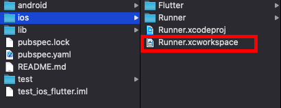

然后我们使用快捷键 `Command + B` 编译项目，如果未配置签名，则可能出现以下错误。

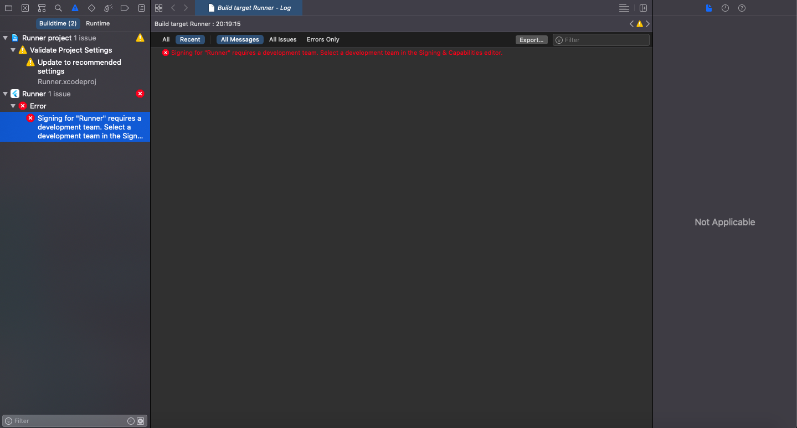

此时只需选择对应的开发者账号签名即可。

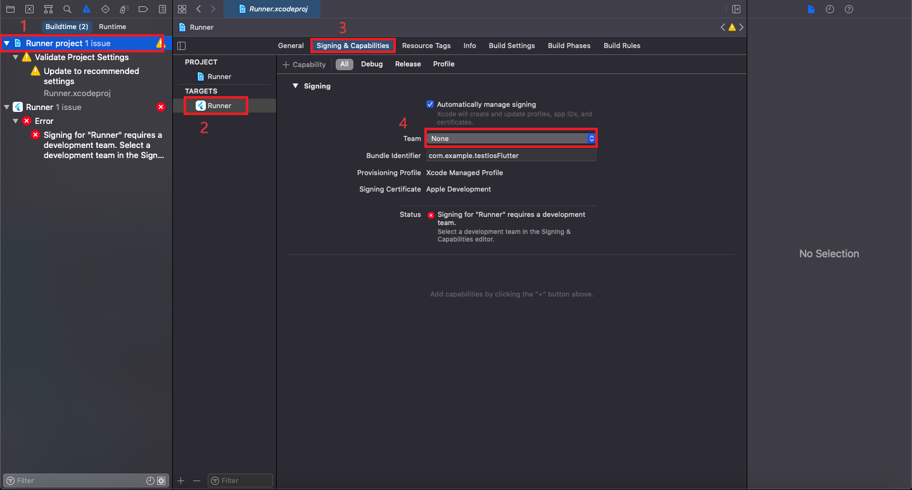

下面开始配置 flavor。

我们看到在左侧文件结构的 “Flutter” 文件夹下有几个 “xcconfig” 后缀的文件，现在我们也创建一个该文件。

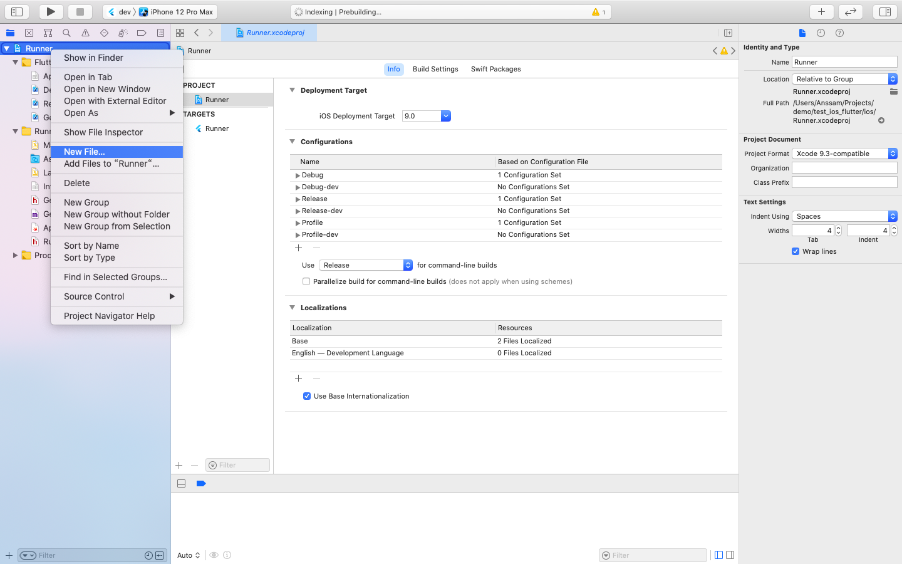

筛选 “configuration” 文件。

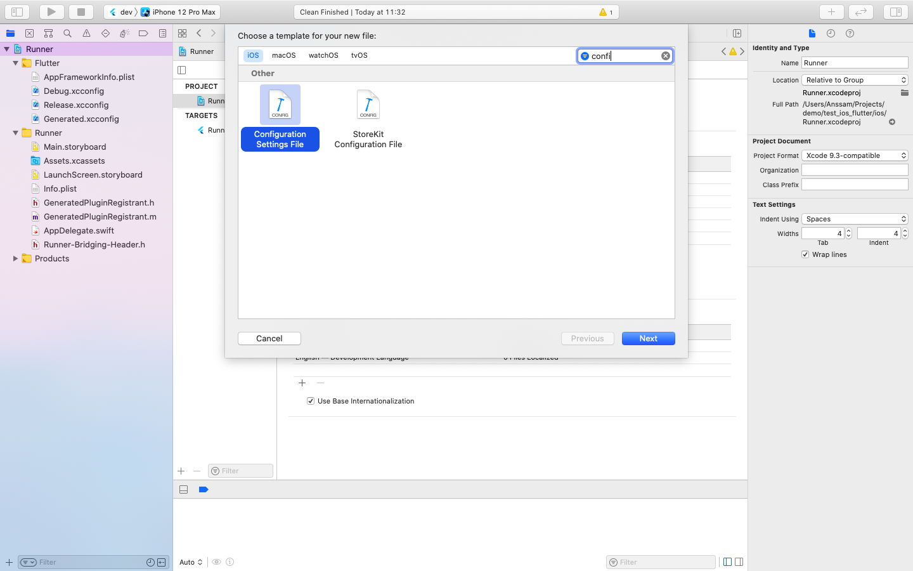

下一步，输入名称，然后点击右边的小箭头（如果你的小箭头还是未展开的状态）。

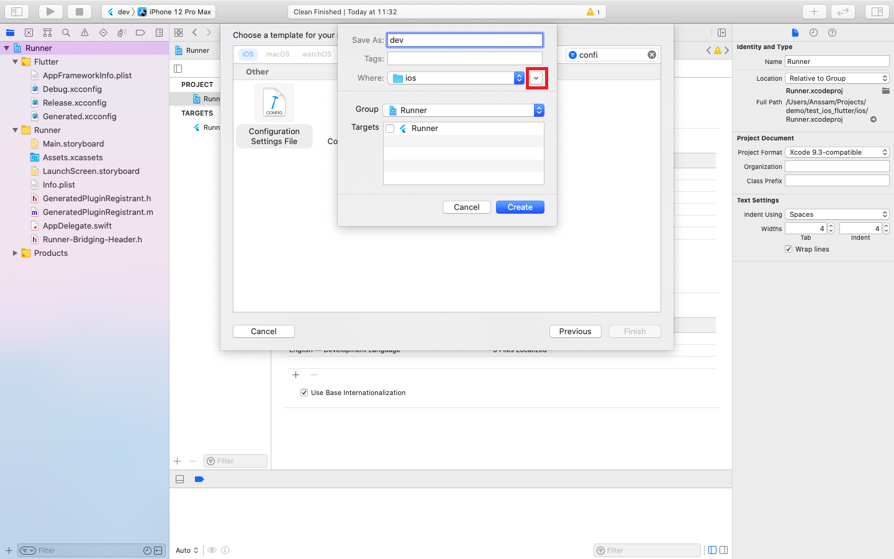

按如下配置，然后创建文件。

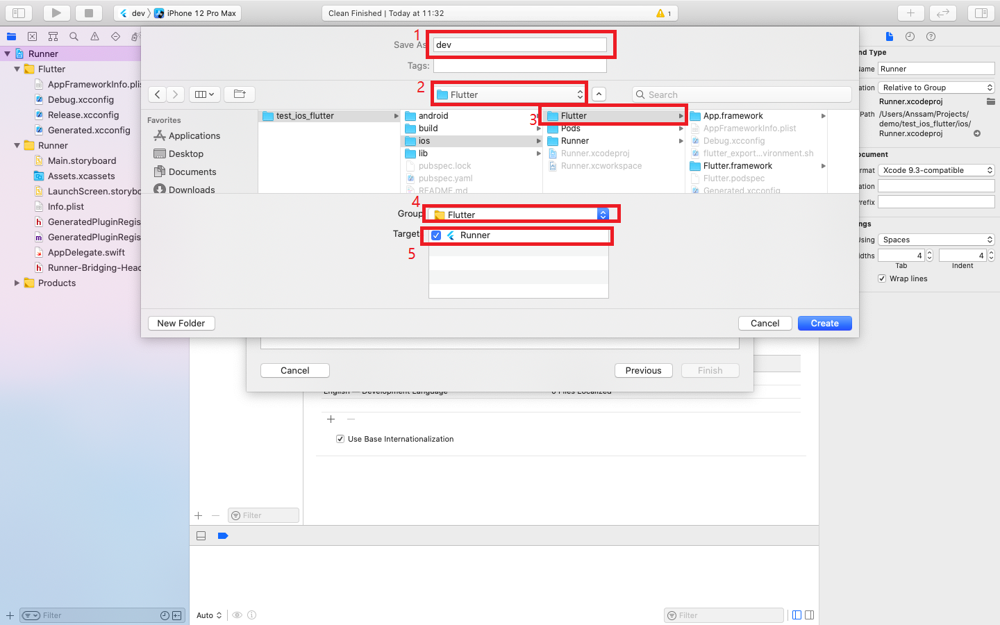

编辑刚刚创建的文件，导入相关文件。

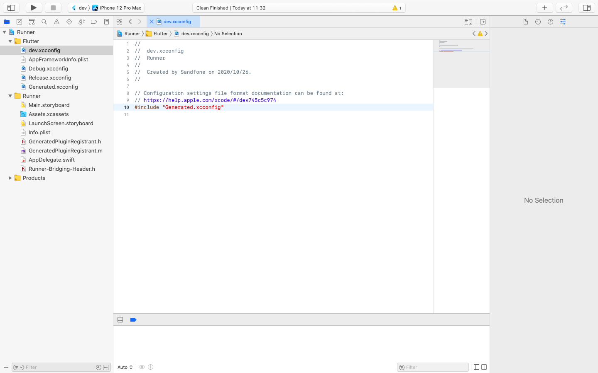

然后配置 Runner-> Configurations，将 dev 环境的 Runner 设置为 dev 文件，上面一栏不设置。

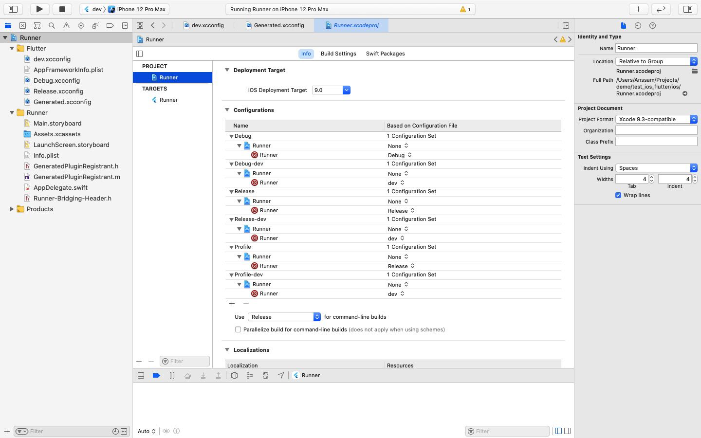

然后开始新建 scheme，点击停止按钮旁边的机型，在弹出菜单里选择“Manage Schemes”。

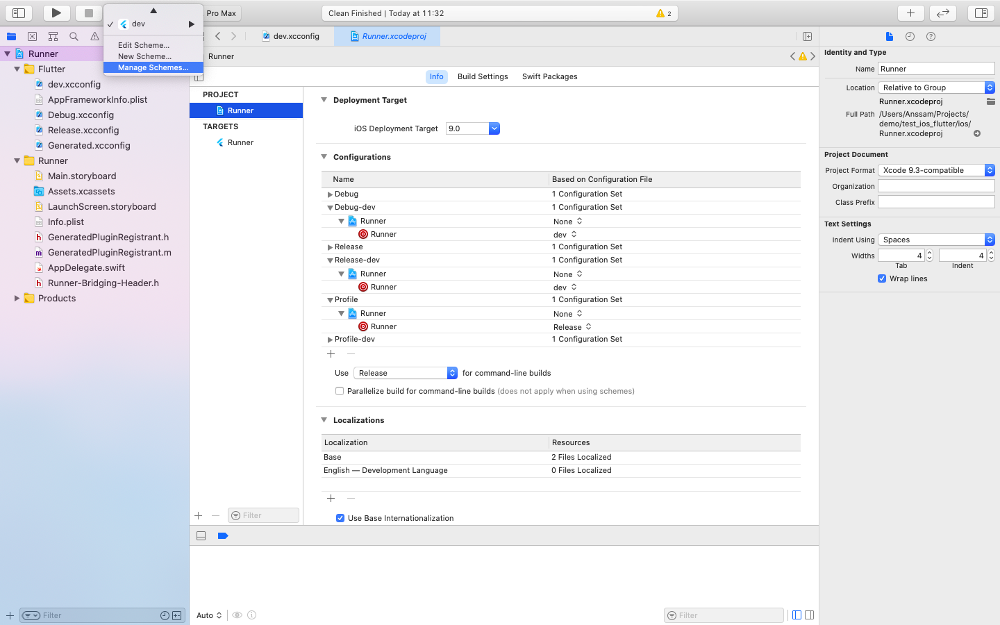

从现有的 scheme 复制一份模板。

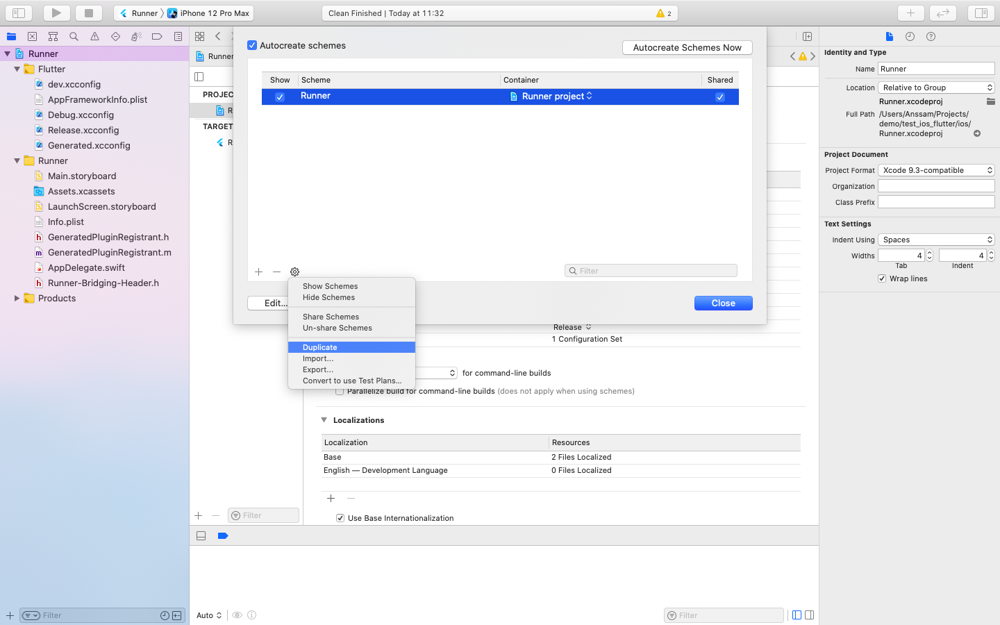

再选择需要的配置，只需要修改“Build Configuration”一栏，下面的“Profile”和“Archive”也是一样，勾选下面的“shared”。

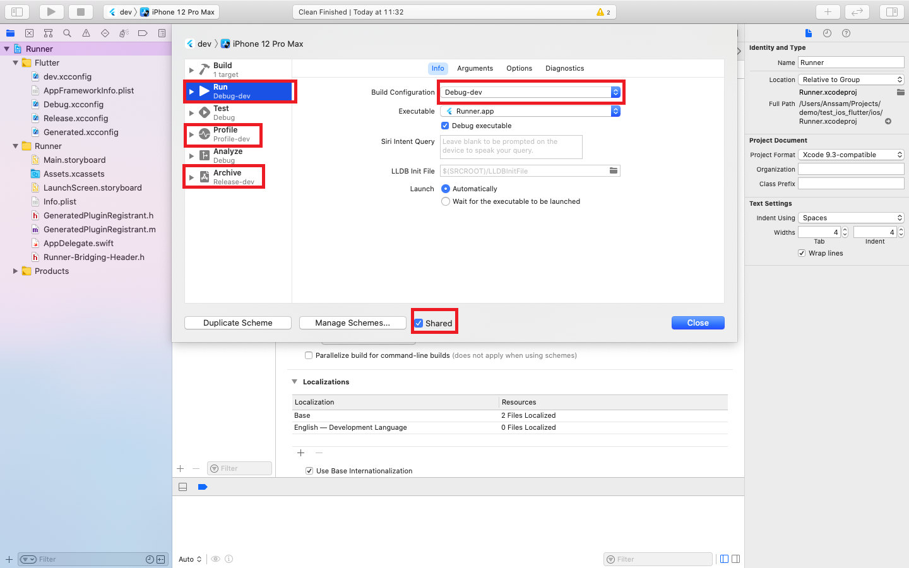

然后选择对应的 scheme 运行即可。

