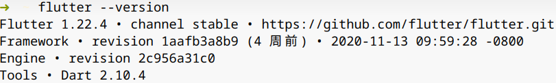
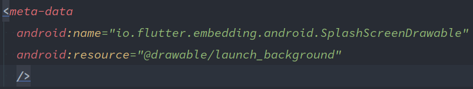

今天我们一起来探究 Flutter 在 Android 平台的启动过程。

首先通过 `flutter create` 命令创建一个模板项目，以该项目作为我们研究的对象。我的 Flutter 版本为 1.22.4。



首通过 `AndroidManifest.xml` 文件获知项目的 application 为 FlutterApplication，该 application 的 `onCreate()` 方法：

```java
// FlutterApplication
public void onCreate() {
    super.onCreate();
    FlutterInjector.instance().flutterLoader().startInitialization(this);
}
```

而该方法中会通过启动一个线程做一些诸如读取 Flutter engine 的 native 库以供接下来的 JNI 调用以及在 apk 文件中定位并解压 Dart 和 Flutter 相关资源到本地磁盘的操作

```java
// FlutterLoader
public void startInitialization(@NonNull Context applicationContext, @NonNull Settings settings) {
    // Do not run startInitialization more than once.
    if (this.settings != null) {
        return;
    }
    if (Looper.myLooper() != Looper.getMainLooper()) {
        throw new IllegalStateException("startInitialization must be called on the main thread");
    }

    // Ensure that the context is actually the application context.
    final Context appContext = applicationContext.getApplicationContext();

    this.settings = settings;

    initStartTimestampMillis = SystemClock.uptimeMillis();
    flutterApplicationInfo = ApplicationInfoLoader.load(appContext);
    VsyncWaiter.getInstance((WindowManager) appContext.getSystemService(Context.WINDOW_SERVICE))
        .init();

    // Use a background thread for initialization tasks that require disk access.
    Callable<InitResult> initTask =
        new Callable<InitResult>() {
        @Override
        public InitResult call() {
            // {@code initResources} 方法进行的就是资源文件定位和解压的工作
            ResourceExtractor resourceExtractor = initResources(appContext);

            if (FlutterInjector.instance().shouldLoadNative()) {
                System.loadLibrary("flutter");
            }

            // Prefetch the default font manager as soon as possible on a background thread.
            // It helps to reduce time cost of engine setup that blocks the platform thread.
            Executors.newSingleThreadExecutor()
                .execute(
                new Runnable() {
                    @Override
                    public void run() {
                        FlutterJNI.nativePrefetchDefaultFontManager();
                    }
                });

            if (resourceExtractor != null) {
                resourceExtractor.waitForCompletion();
            }

            return new InitResult(
                PathUtils.getFilesDir(appContext),
                PathUtils.getCacheDirectory(appContext),
                PathUtils.getDataDirectory(appContext));
        }
    };
    initResultFuture = Executors.newSingleThreadExecutor().submit(initTask);
}
```

接下来我们看 MainActivity，MainActivity 本身无任何代码，它继承自 FlutterActivity，需要注意的是，这里的 FlutterActivity 引自包 `io.flutter.embedding.android`，原本的 `io.flutter.app` 包内的 FlutterActivity 已被弃用。

```java
// FlutterActivity
@Override
protected void onCreate(@Nullable Bundle savedInstanceState) {
    switchLaunchThemeForNormalTheme();

    super.onCreate(savedInstanceState);

    lifecycle.handleLifecycleEvent(Lifecycle.Event.ON_CREATE);

    delegate = new FlutterActivityAndFragmentDelegate(this);
    delegate.onAttach(this);
    delegate.onActivityCreated(savedInstanceState);

    configureWindowForTransparency();
    setContentView(createFlutterView());
    configureStatusBarForFullscreenFlutterExperience();
}
```

在 `onCreate()` 方法中，我们创建了一个 FlutterActivityAndFragmentDelegate 类，这个类的作用如其名，是 FlutterActivity 和 FlutterFragment 的对外代言人，负责一切 FlutterActivity 和 FlutterFragment 的逻辑处理（Flutter 在版本1.12前分别使用 FlutterActivityDelegate 和 FlutterFragmentDelegate 类完成此类作用，在之后将二者弃用，并将所有的逻辑处理封装在此类中）。例如，`onAttach()` 方法的主要工作有：

- 创建和配置 Flutter engine（`setupFlutterEngine()`，读取命令行参数等操作）
- 创建平台间插件（Android 或 iOS 和 Flutter 之间的通讯，如音效、震动、屏幕方向和剪切板等）
- Flutter 渲染机制的初始化和绑定
- 注册第三方插件（包括我们使用的第三方库和自定义的插件，此时可以获得 Flutter engine 实例。）

而 `onActivityCreated()` 方法则主要进行一些状态恢复的工作。

`createFlutterView()` 方法就是创建 Flutter 视图的了，它调用了 FlutterActivityAndFragmentDelegate 的 `onCreateView()` 方法：

```java
// FlutterActivityAndFragmentDelegate

/**
 * Invoke this method from {@code Activity#onCreate(Bundle)} to create the content {@code View},
 * or from {@code Fragment#onCreateView(LayoutInflater, ViewGroup, Bundle)}.
 *
 * <p>{@code inflater} and {@code container} may be null when invoked from an {@code Activity}.
 *
 * <p>This method:
 *
 * <ol>
 *   <li>creates a new {@link FlutterView} in a {@code View} hierarchy
 *   <li>adds a {@link FlutterUiDisplayListener} to it
 *   <li>attaches a {@link FlutterEngine} to the new {@link FlutterView}
 *   <li>returns the new {@code View} hierarchy
 * </ol>
 */
@NonNull
View onCreateView(
    LayoutInflater inflater, @Nullable ViewGroup container, @Nullable Bundle savedInstanceState) {
    Log.v(TAG, "Creating FlutterView.");
    ensureAlive();

    if (host.getRenderMode() == RenderMode.surface) {
        FlutterSurfaceView flutterSurfaceView =
            new FlutterSurfaceView(
            host.getActivity(), host.getTransparencyMode() == TransparencyMode.transparent);

        // Allow our host to customize FlutterSurfaceView, if desired.
        host.onFlutterSurfaceViewCreated(flutterSurfaceView);

        // Create the FlutterView that owns the FlutterSurfaceView.
        flutterView = new FlutterView(host.getActivity(), flutterSurfaceView);
    } else {
        FlutterTextureView flutterTextureView = new FlutterTextureView(host.getActivity());

        // Allow our host to customize FlutterSurfaceView, if desired.
        host.onFlutterTextureViewCreated(flutterTextureView);

        // Create the FlutterView that owns the FlutterTextureView.
        flutterView = new FlutterView(host.getActivity(), flutterTextureView);
    }

    // Add listener to be notified when Flutter renders its first frame.
    flutterView.addOnFirstFrameRenderedListener(flutterUiDisplayListener);

    flutterSplashView = new FlutterSplashView(host.getContext());
    if (Build.VERSION.SDK_INT >= Build.VERSION_CODES.JELLY_BEAN_MR1) {
        flutterSplashView.setId(View.generateViewId());
    } else {
        // TODO(mattcarroll): Find a better solution to this ID. This is a random, static ID.
        // It might conflict with other Views, and it means that only a single FlutterSplashView
        // can exist in a View hierarchy at one time.
        flutterSplashView.setId(486947586);
    }
    flutterSplashView.displayFlutterViewWithSplash(flutterView, host.provideSplashScreen());

    Log.v(TAG, "Attaching FlutterEngine to FlutterView.");
    flutterView.attachToFlutterEngine(flutterEngine);

    return flutterSplashView;
}
```

通过设置背景是否为透明可以选择 Flutter UI 是以 SurfaceView 绘制还是以 TextureView 绘制（通过设置 Intent 的 extra，SurfaceView 和 TextureView 的区别自行百度），然后创建相应的 FlutterView。FlutterSplashView 是在 FlutterView 渲染出第一帧之前显示的界面，默认为空，可通过修改 drawable 资源文件夹下的 `launch_background.xml` 文件实现，也可以通过修改 manifest 的如下 meta-data 完成。



既然 FlutterView 渲染前的准备工作和临时界面都已准备好，那么下面就可以开始 FlutterView 的渲染工作了。 `flutterView.attachToFlutterEngine()` 负责连接 FlutterView 和前面初始化完成的 FlutterEngine，并开始正式的渲染工作以及从 FlutterView 向 FlutterEngine 转发交互事件，例如触摸事件、无障碍和键盘事件等。

```java
public void attachToFlutterEngine(@NonNull FlutterEngine flutterEngine) {
    // ...

    this.flutterEngine = flutterEngine;

    // Instruct our FlutterRenderer that we are now its designated RenderSurface.
    FlutterRenderer flutterRenderer = this.flutterEngine.getRenderer();
    isFlutterUiDisplayed = flutterRenderer.isDisplayingFlutterUi();
    renderSurface.attachToRenderer(flutterRenderer);
    flutterRenderer.addIsDisplayingFlutterUiListener(flutterUiDisplayListener);

    // 初始化键盘、触控等相关各组件……

    // Push View and Context related information from Android to Flutter.
    // 将字体缩放比例、是否24小时制和明暗模式等系统配置项以 MethodChannel 的方法发送给 Flutter
    sendUserSettingsToFlutter();
    // 本地化配置
    localizationPlugin.sendLocalesToFlutter(getResources().getConfiguration());
    // 将视图矩阵参数通过 FlutterJNI 的方式发送给 Flutter
    sendViewportMetricsToFlutter();

    flutterEngine.getPlatformViewsController().attachToView(this);

    // Notify engine attachment listeners of the attachment.
    for (FlutterEngineAttachmentListener listener : flutterEngineAttachmentListeners) {
        listener.onFlutterEngineAttachedToFlutterView(flutterEngine);
    }

    // If the first frame has already been rendered, notify all first frame listeners.
    // Do this after all other initialization so that listeners don't inadvertently interact
    // with a FlutterView that is only partially attached to a FlutterEngine.
    if (isFlutterUiDisplayed) {
        flutterUiDisplayListener.onFlutterUiDisplayed();
    }
}
```

