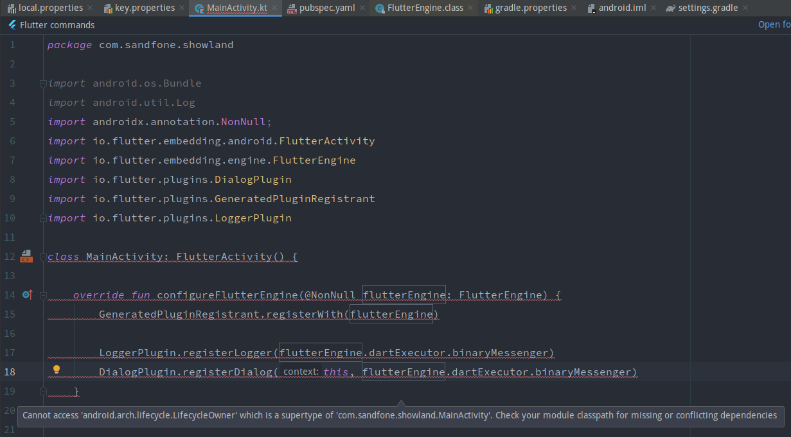
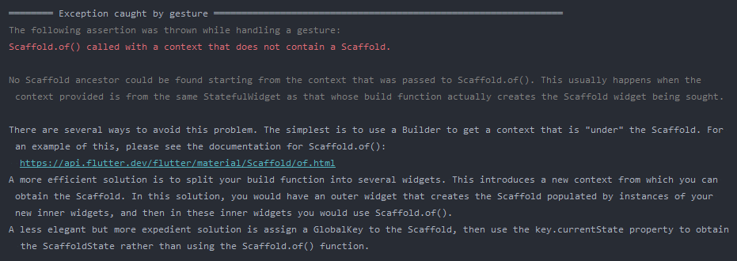

# Flutter 踩坑

- **MainActivity 报错**

  直接贴图

  

  这好像是一个bug，是由于和 kotlin 插件不兼容导致的。

  解决办法：将`MainActivity.kt`改写成`MainActivity.java`，此异常警告即可消除，而且 **flutter platform Channel 不起作用的 bug 也会得到解决**

- **TextField**

  1. TextField 里的文字垂直方向不居中，设置`textAlignVertical: TextAlignVertical.center`无果。

     解决办法：在 InputDecoration 里设置水平方向的间距：`contentPadding: EdgeInsets.symmetric(horizontal: 18)`。

  2. TextField suffixIcon 设置右边距：用`Padding`包裹，但是需要注意的是，如果设置了`suffixIconConstraints`，在设置宽高的时候需要考虑到设置的 padding 的值，否则图片将被淹没。

  ```dart
  Container(
        color: Color(0xFFF1F2F7),
        child: Padding(
          padding: EdgeInsets.symmetric(vertical: 16),
          child: Column(
            children: <Widget>[
              Row(
                mainAxisSize: MainAxisSize.max,
                crossAxisAlignment: CrossAxisAlignment.center,
                children: <Widget>[
                  
                  // ...
                    
                  Expanded(
                    child: Align(
                      alignment: Alignment.centerRight,
                      child: Container(
                        height: 36,
                        width: 300,
                        padding: EdgeInsets.fromLTRB(0, 0, 16, 0),
                        child: TextField(
                          maxLines: 1,
                          decoration: InputDecoration(
                            // 就是这里需要设置一个 contentPadding，而且是水平方向的
                            contentPadding: EdgeInsets.symmetric(horizontal: 18),
                            fillColor: Colors.white,
                            filled: true,
                            hintText: "搜索客户姓名/开单人/服务单号/纸单号",
                            hintStyle: TextStyle(
                              color: Color(0xFFCCCCCC),
                              fontSize: 12,
                            ),
                            suffixIcon: Padding(
                              padding: EdgeInsets.fromLTRB(0, 0, 8, 0),
                              child: Image.asset(
                                "assets/images/icon_search.png",
                              ),
                            ),
                            suffixIconConstraints: BoxConstraints(
                              // 这里的最大宽度要计算上图标的宽度和上面设置的 suffixIcon 的 padding
                              maxWidth: 26,
                              maxHeight: 18,
                            ),
                            border: OutlineInputBorder(
                              borderRadius: BorderRadius.circular(18),
                              borderSide: BorderSide(
                                color: Color(0xFFDCDFE6),
                                width: 1,
                              ),
                            ),
                          ),
                          textAlignVertical: TextAlignVertical.center,
                        ),
                      ),
                    ),
                  ),
                ],
              ),
            ],
          ),
        ),
      )
  ```

- **Provider**

  ```dart
  class Selector<A, S> extends Selector0<S> {
    /// {@macro provider.selector}
    Selector({
      Key key,
      @required ValueWidgetBuilder<S> builder,
      @required S Function(BuildContext, A) selector,
      ShouldRebuild<S> shouldRebuild,
      Widget child,
    })  : assert(selector != null),
          super(
            key: key,
            shouldRebuild: shouldRebuild,
            builder: builder,
            selector: (context) => selector(context, Provider.of(context)),
            child: child,
          );
  }
  ```

  在使用 Provider 来管理状态时，如果需要过滤数据改变时是否刷新视图，则会选择`Selector`。Selector 需要传一个闭包做参数（如上代码块），闭包的参数是个规范的泛型，返回值是另一个规范的泛型。如果此闭包的入参是自定义的 Model 类型，并将此 Model 原封返回。而在其父类 Selector0 中，可见 shouldRebuild 闭包的两个参数 previous 和 next 是指向同一个对象的，所以当 selected（也就是闭包中的 next）数据改变时，previous 指向的数据也会改变。所以这就导致 shouldRebuild 闭包中无法判断数据是否改变。只有 selector 闭包返回不可变对象时，shouldRebuild 闭包中才可以进行判断。

  ```dart
  @override
    Widget buildWithChild(BuildContext context, Widget child) {
      final selected = widget.selector(context);
  
      var shouldInvalidateCache = oldWidget != widget ||
          (widget._shouldRebuild != null &&
              widget._shouldRebuild.call(value, selected)) ||
          (widget._shouldRebuild == null &&
              !const DeepCollectionEquality().equals(value, selected));
      if (shouldInvalidateCache) {
        value = selected;
        oldWidget = widget;
        cache = widget.builder(
          context,
          selected,
          child,
        );
      }
      return cache;
    }
  ```

  但是如果返回基本数据类型，假如在 builder 闭包中需要数据不止一个，则需要多个 Provider 才可以解决此问题。
  
  解决方法：利用集合封装多组数据，如`Tuple`，[参见](https://github.com/rrousselGit/provider/issues/169#issuecomment-514588941)
  
  ```dart
  Selector<Foo, Tuple2<String, int>>(
    selector: (_, foo) => Tuple2(foo.myString, foo.myInt),
    builder: (_, tuple, __) {
      print(tuple.item1);
      print(tuple.item2);
      return Something();
    } 
  )
  ```
  
- **ListView 或者 GridView 包裹在 Row 或者 Column 中无法滚动**

  原因：Row 和 Column 的默认主轴长度是无限，ListView/GridView 无法检测到内容溢出，所以无法触发滚动事件。

  解决办法：ListView/GridView 外包裹 Expanded 或者 SizedBox 等限定宽高的容器，使其溢出时能检测到，从而触发滚动事件。

- ~~GridView item 无法动态更新的问题（build 方法中没有动态更新数据源，导致每次拿到的数据源还是旧的，所以没有刷新）。~~

- `GestureDetector`或者`InkWell`包裹`TextFeild`时，GestureDetector 和 InkWell 的点击事件无法捕获。

  解决办法：在 TextField 和 GestureDetector/InkWell 之间再嵌套一个 `AbsorbPointer`。

- **`showDialog` 如何动态刷新？**

  调用`showDialog` 方法显示一个对话框，当需要在`AlertDialog`中刷新组件状态时，直接调用`setState`方法是不会触发界面重绘的，

  解决办法：AlertDialog 的`content`部分以`StatefulBuilder`包裹或者其内容以自定义 StatefulWidget 的形式定义（但是我自己的代码使用这种方法依然没有效果）。

  
  
- **Scrollable view embeded  滚动控件的嵌套**

  如一个 ScrollView 嵌套着一个 ListView

  [解决方法](https://stackoverflow.com/questions/45270900/how-to-implement-nested-listview-in-flutter/53543135#53543135)

  

- **Constraint 容器设置最小和最大尺寸后尺寸总是最大的**

  如 `Container` ，进行如下设置

  ```dart
  Container(
      constraints: BoxConstraints(
          maxHeight: 200,
          minHeight: 100,
      ),
      child: ListView.builder(),
  )
  ```

  而 Container 总是无法收缩。

  原因分析：这是因为 child 是“扩张型”控件，即总是默认占据最大可用空间。所以父容器总是被撑大到 maxWidth 和 maxHeight。

  解决办法：使用“收缩型”控件，如 `DecratedBox`，或者 `ListView` 和 `GrdiView` 等添加 `shrinkWrap: true,` 属性。

  ``` dart
  Container(
      constraints: BoxConstraints(
          maxHeight: 200,
          minHeight: 100,
      ),
      child: ListView.builder(
          shrinkWrap: true,
      ),
  )
  ```

- **ListView 或 GridView 包裹内容**

  只需添加两条属性：

  ```dart
  ListView.builder(
    shrinkWrap: true,
    physics: ClampingScrollPhysics(),
  )
  ```

- **在 ViewTree 上调用 ViewTree 的节点的成员方法**

  如我们在 Scaffold 设置一个 drawer，想通过 Scaffold 的 `openDrawer()` 方法，但是在其子节点上该如何做到呢？

  一个方式是使用 GolabalKey 来捕获 Scaffold 的状态，然后调用其 `openDrawer()` 方法，但是我们还有一个更好的方法，就是使用 `Scaffold.of(context).openDrawer()` 方法来获取 Scaffold 实例并打开抽屉，但是如果直接调用会报错如下：

  
  
  错误说明里很清楚地给出了原因和解决办法。因为我们传递的 context 对象是 Scaffold 外的 `build()` 方法中的参数，所对应的是此 `build()` 方法所对应的 Widget 的上下文环境，此时 Scaffold 还没有创建或挂载到 ViewTree 上，所以此 context 是无法找到 Scaffold 的。解决方法是在 Scaffold 节点的下端，调用方法所在节点的上端之间包裹 Builder，获取到 Builder 所在节点的 context，此时就能找到 Scaffold 了，然后也可以顺利地调用 `Scaffold.of(context).openDrawer()` 方法了。
  
- **CachedNetworkImage 的 placeHolder 无法显示**

  CachedNetworkImage 控件需要在 imageUrl 属性的值为 null 或空字符串时才会显示 placeHolder 构造器中构造的内容，所以对于拼接的 url，不要直接在 imageUrl 后拼接，先判断拼接后的 url 是否合法，如果不合法，则传入空字符串，此时就会显示 placeHolder。
  
- **同级元素相对定位（待解决）**

- **for each**

  在使用 `for each` 时要特别注意，`for each` 函数中的 `continue` 和 `return` 等流程关键字都会产生预期之外的效果
  
- **`Text` 中英混排时的截断问题（待解决）**

  这是 flutter（落笔时版本1.22）的一个设计上的问题，它截断是根据软换行符来的，而不会对一个完整的字符串进行中间的截断

  解决办法：`.replaceAll("", "\u{200B}")` （“u200b” 是一个零宽度的空格，解决思路就是在每个字符中间插入一个软换行符）