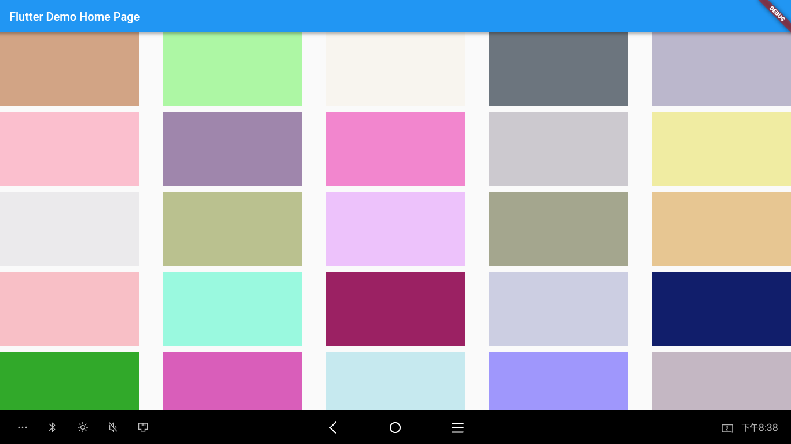

# 	GridView 你怎么那么皮——从需求出发，如何让 GridView 的尺寸不再难以控制


ListView 和 GridView 是我们在开发过程中经常使用的控件。前者用来绘制一个具有动态 item 的固定方向的列表，后者用来显示一个宫格的瀑布流。它们的 item 是一个个独立的布局，我们可以对其自定义。

在 Android 中，我们既可以根据其父控件的尺寸约束对 item 进行尺寸规范，也可以根据各个 item 间的相互关系动态规划 item 尺寸。

flutter 中也有 ListView 和 GridView ，而今天，我想重点说说这个 GridView 。

## 邂逅

我初接触 flutter 的 GridView 是在做一个平板项目的时候，用它来展示一个账单列表，每个账单因为场景需要，需指定其宽高。因为在 GridView 中没有找到设置宽高的属性，我尝试固定其item 的宽高，但显示出来完全不是预料中的效果。在查阅资料后，发现了childAspectRatio 属性，设置之后也总是和我的预期不符——要么宽度过了，要么高度不够。后来接连的几个使用到 GridView 的场景也完全不能得心应手，就像抓一条泥鳅，别提多难受了。

打开 GridView 的源码，我们看看它到底是怎么处理这个逻辑的。

## 窥见

GridView 继承于`BoxScrollView`，有5个构造方法，其中4个是代理构造方法，它们分别如下：

```dart
GridView({
    Key key,
    Axis scrollDirection = Axis.vertical,
    bool reverse = false,
    ScrollController controller,
    bool primary,
    ScrollPhysics physics,
    bool shrinkWrap = false,
    EdgeInsetsGeometry padding,
    @required this.gridDelegate,
    bool addAutomaticKeepAlives = true,
    bool addRepaintBoundaries = true,
    bool addSemanticIndexes = true,
    double cacheExtent,
    List<Widget> children = const <Widget>[],
    int semanticChildCount,
  }) : assert(gridDelegate != null),
       childrenDelegate = SliverChildListDelegate(
         children,
         addAutomaticKeepAlives: addAutomaticKeepAlives,
         addRepaintBoundaries: addRepaintBoundaries,
         addSemanticIndexes: addSemanticIndexes,
       ),
       super(
         key: key,
         scrollDirection: scrollDirection,
         reverse: reverse,
         controller: controller,
         primary: primary,
         physics: physics,
         shrinkWrap: shrinkWrap,
         padding: padding,
         cacheExtent: cacheExtent,
         semanticChildCount: semanticChildCount ?? children.length,
       );
```

```dart
GridView.builder({
    Key key,
    Axis scrollDirection = Axis.vertical,
    bool reverse = false,
    ScrollController controller,
    bool primary,
    ScrollPhysics physics,
    bool shrinkWrap = false,
    EdgeInsetsGeometry padding,
    @required this.gridDelegate,
    @required IndexedWidgetBuilder itemBuilder,
    int itemCount,
    bool addAutomaticKeepAlives = true,
    bool addRepaintBoundaries = true,
    bool addSemanticIndexes = true,
    double cacheExtent,
    int semanticChildCount,
  }) : assert(gridDelegate != null),
       childrenDelegate = SliverChildBuilderDelegate(
         itemBuilder,
         childCount: itemCount,
         addAutomaticKeepAlives: addAutomaticKeepAlives,
         addRepaintBoundaries: addRepaintBoundaries,
         addSemanticIndexes: addSemanticIndexes,
       ),
       super(
         key: key,
         scrollDirection: scrollDirection,
         reverse: reverse,
         controller: controller,
         primary: primary,
         physics: physics,
         shrinkWrap: shrinkWrap,
         padding: padding,
         cacheExtent: cacheExtent,
         semanticChildCount: semanticChildCount ?? itemCount,
       );
```

```dart
const GridView.custom({
    Key key,
    Axis scrollDirection = Axis.vertical,
    bool reverse = false,
    ScrollController controller,
    bool primary,
    ScrollPhysics physics,
    bool shrinkWrap = false,
    EdgeInsetsGeometry padding,
    @required this.gridDelegate,
    @required this.childrenDelegate,
    double cacheExtent,
    int semanticChildCount,
    DragStartBehavior dragStartBehavior = DragStartBehavior.start,
  }) : assert(gridDelegate != null),
       assert(childrenDelegate != null),
       super(
         key: key,
         scrollDirection: scrollDirection,
         reverse: reverse,
         controller: controller,
         primary: primary,
         physics: physics,
         shrinkWrap: shrinkWrap,
         padding: padding,
         cacheExtent: cacheExtent,
         semanticChildCount: semanticChildCount,
         dragStartBehavior: dragStartBehavior,
       );
```

```dart
GridView.count({
    Key key,
    Axis scrollDirection = Axis.vertical,
    bool reverse = false,
    ScrollController controller,
    bool primary,
    ScrollPhysics physics,
    bool shrinkWrap = false,
    EdgeInsetsGeometry padding,
    @required int crossAxisCount,
    double mainAxisSpacing = 0.0,
    double crossAxisSpacing = 0.0,
    double childAspectRatio = 1.0,
    bool addAutomaticKeepAlives = true,
    bool addRepaintBoundaries = true,
    bool addSemanticIndexes = true,
    double cacheExtent,
    List<Widget> children = const <Widget>[],
    int semanticChildCount,
    DragStartBehavior dragStartBehavior = DragStartBehavior.start,
  }) : gridDelegate = SliverGridDelegateWithFixedCrossAxisCount(
         crossAxisCount: crossAxisCount,
         mainAxisSpacing: mainAxisSpacing,
         crossAxisSpacing: crossAxisSpacing,
         childAspectRatio: childAspectRatio,
       ),
       childrenDelegate = SliverChildListDelegate(
         children,
         addAutomaticKeepAlives: addAutomaticKeepAlives,
         addRepaintBoundaries: addRepaintBoundaries,
         addSemanticIndexes: addSemanticIndexes,
       ),
       super(
         key: key,
         scrollDirection: scrollDirection,
         reverse: reverse,
         controller: controller,
         primary: primary,
         physics: physics,
         shrinkWrap: shrinkWrap,
         padding: padding,
         cacheExtent: cacheExtent,
         semanticChildCount: semanticChildCount ?? children.length,
         dragStartBehavior: dragStartBehavior,
       );
```

```dart
GridView.extent({
    Key key,
    Axis scrollDirection = Axis.vertical,
    bool reverse = false,
    ScrollController controller,
    bool primary,
    ScrollPhysics physics,
    bool shrinkWrap = false,
    EdgeInsetsGeometry padding,
    @required double maxCrossAxisExtent,
    double mainAxisSpacing = 0.0,
    double crossAxisSpacing = 0.0,
    double childAspectRatio = 1.0,
    bool addAutomaticKeepAlives = true,
    bool addRepaintBoundaries = true,
    bool addSemanticIndexes = true,
    List<Widget> children = const <Widget>[],
    int semanticChildCount,
    DragStartBehavior dragStartBehavior = DragStartBehavior.start,
  }) : gridDelegate = SliverGridDelegateWithMaxCrossAxisExtent(
         maxCrossAxisExtent: maxCrossAxisExtent,
         mainAxisSpacing: mainAxisSpacing,
         crossAxisSpacing: crossAxisSpacing,
         childAspectRatio: childAspectRatio,
       ),
       childrenDelegate = SliverChildListDelegate(
         children,
         addAutomaticKeepAlives: addAutomaticKeepAlives,
         addRepaintBoundaries: addRepaintBoundaries,
         addSemanticIndexes: addSemanticIndexes,
       ),
       super(
         key: key,
         scrollDirection: scrollDirection,
         reverse: reverse,
         controller: controller,
         primary: primary,
         physics: physics,
         shrinkWrap: shrinkWrap,
         padding: padding,
         semanticChildCount: semanticChildCount ?? children.length,
         dragStartBehavior: dragStartBehavior,
       );
```

我们发现每个构造函数除了一些基本的诸如水平方向间距和垂直方向间距外，主要都在构造两个对象——`final SliverGridDelegate gridDelegate`和`final SliverChildDelegate childrenDelegate`，那它们就是 GridView 的重点。

源码分别对两个对象的作用做了注释：

1. childrenDelegate

   > A delegate that provides the children for the [GridView].

   这是构造 GridView 子控件的主要对象。

2. gridDelegate

   > A delegate that controls the layout of the children within the [GridView].

   这是控制 GridView 的布局的主要对象。

构造出来的 childrenDelegate 和 gridDelegate 的唯一引用的地方在 GridView 的`buildChildLayout`方法，该方法返回一个 SliverGrid 即 Widget 对象，该对象的入参就是 childrenDelegate 和 gridDelegate，所以其实 GridView 就是对 SliverGrid 的封装。

我们先看 childrenDelegate，因为 gridDelegate 后面会和它串起来。

在 SliverGrid 中，childrenDelegate 被向上传递给父类对象`SliverMultiBoxAdaptorWidget`，而类中引用 childrenDelegate 的唯一作用就是用来预测最大滚动距离。

我们再回头看 `buildChildLayout` 这个方法，它继承自父类，在父类 BoxScrollView 中被 `buildSlivers` 方法搜引用。

```dart
@override
  List<Widget> buildSlivers(BuildContext context) {
    Widget sliver = buildChildLayout(context);
    EdgeInsetsGeometry effectivePadding = padding;
    if (padding == null) {
      final MediaQueryData mediaQuery = MediaQuery.of(context, nullOk: true);
      if (mediaQuery != null) {
        // Automatically pad sliver with padding from MediaQuery.
        final EdgeInsets mediaQueryHorizontalPadding =
            mediaQuery.padding.copyWith(top: 0.0, bottom: 0.0);
        final EdgeInsets mediaQueryVerticalPadding =
            mediaQuery.padding.copyWith(left: 0.0, right: 0.0);
        // Consume the main axis padding with SliverPadding.
        effectivePadding = scrollDirection == Axis.vertical
            ? mediaQueryVerticalPadding
            : mediaQueryHorizontalPadding;
        // Leave behind the cross axis padding.
        sliver = MediaQuery(
          data: mediaQuery.copyWith(
            padding: scrollDirection == Axis.vertical
                ? mediaQueryHorizontalPadding
                : mediaQueryVerticalPadding,
          ),
          child: sliver,
        );
      }
    }

    if (effectivePadding != null)
      sliver = SliverPadding(padding: effectivePadding, sliver: sliver);
    return <Widget>[ sliver ];
  }
```

该方法将构造的 SliverGrid 进行一些包装，然后塞到一个 List 中返回。

再向上搜索，ScrollView 的 `build` 方法中拿到了这个返回值，

```dart
@override
  Widget build(BuildContext context) {
    final List<Widget> slivers = buildSlivers(context);
    final AxisDirection axisDirection = getDirection(context);

    final ScrollController scrollController =
        primary ? PrimaryScrollController.of(context) : controller;
    final Scrollable scrollable = Scrollable(
      dragStartBehavior: dragStartBehavior,
      axisDirection: axisDirection,
      controller: scrollController,
      physics: physics,
      semanticChildCount: semanticChildCount,
      viewportBuilder: (BuildContext context, ViewportOffset offset) {
        return buildViewport(context, offset, axisDirection, slivers);
      },
    );
    final Widget scrollableResult = primary && scrollController != null
        ? PrimaryScrollController.none(child: scrollable)
        : scrollable;

    if (keyboardDismissBehavior == ScrollViewKeyboardDismissBehavior.onDrag) {
      return NotificationListener<ScrollUpdateNotification>(
        child: scrollableResult,
        onNotification: (ScrollUpdateNotification notification) {
          final FocusScopeNode focusScope = FocusScope.of(context);
          if (notification.dragDetails != null && focusScope.hasFocus) {
            focusScope.unfocus();
          }
          return false;
        },
      );
    } else {
      return scrollableResult;
    }
  }
```

这里还是给 slivers 套了一些壳，然后返回。这里一直出现一个词——sliver，至于这个是个什么东西，后面再单独记录。

后面的调用流程就深入到 framework 了，其调用流程如下：

ScrollView # build  <=  StatelessElement # build  <=  ComponentElement # build  <=  ComponentElement # performRebuild  <=  Element # performRebuild  <=  Element # rebuild...

可见，SliverGrid 被层层包裹一些必要的外壳后，最终被挂载在视图树上并显示，那么真正的显示内容是在何处构建完成的呢？这就要看 childrenDelegate 的初始化了，我们以代理构造函数 `GridView.builder` 为例，可以看到它被初始化：

```dart
childrenDelegate = SliverChildBuilderDelegate(
         itemBuilder,
         childCount: itemCount,
         addAutomaticKeepAlives: addAutomaticKeepAlives,
         addRepaintBoundaries: addRepaintBoundaries,
         addSemanticIndexes: addSemanticIndexes,
       )
```

所以 SliverChildBuilderDelegate 的内部构建过程就是 SliverGrid 的显示内容被构造的过程啦。

```dart
@override
  Widget build(BuildContext context, int index) {
    assert(builder != null);
    if (index < 0 || (childCount != null && index >= childCount))
      return null;
    Widget child;
    try {
      child = builder(context, index);
    } catch (exception, stackTrace) {
      child = _createErrorWidget(exception, stackTrace);
    }
    if (child == null)
      return null;
    final Key key = child.key != null ? _SaltedValueKey(child.key) : null;
    if (addRepaintBoundaries)
      child = RepaintBoundary(child: child);
    if (addSemanticIndexes) {
      final int semanticIndex = semanticIndexCallback(child, index);
      if (semanticIndex != null)
        child = IndexedSemantics(index: semanticIndex + semanticIndexOffset, child: child);
    }
    if (addAutomaticKeepAlives)
      child = AutomaticKeepAlive(child: child);
    return KeyedSubtree(child: child, key: key);
  }
```

上面的方法将我们 GridView 中的 item 构造出来，然后经过层层调用，其过程大概如下：

SliverChildBuilderDelegate # build  <=  SliverMultiBoxAdaptorElement # _build  <=  SliverMultiBoxAdaptorElement # createChild  <=  RenderSliverMultiBoxAdaptor # _createOrObtainChild  <=  RenderSliverMultiBoxAdaptor # insertAndLayoutChild  <=  RenderSliverGrid # performLayout

RenderSliverGrid 的 `performLayout` 方法中的代码是关键代码，我们好好阅读一下。

```dart
@override
void performLayout() {
  final SliverConstraints constraints = this.constraints;
  childManager.didStartLayout();
  childManager.setDidUnderflow(false);

  final double scrollOffset = constraints.scrollOffset + constraints.cacheOrigin;
  assert(scrollOffset >= 0.0);
  final double remainingExtent = constraints.remainingCacheExtent;
  assert(remainingExtent >= 0.0);
  final double targetEndScrollOffset = scrollOffset + remainingExtent;

  final SliverGridLayout layout = _gridDelegate.getLayout(constraints);

  final int firstIndex = layout.getMinChildIndexForScrollOffset(scrollOffset);
  final int targetLastIndex = targetEndScrollOffset.isFinite ?
    layout.getMaxChildIndexForScrollOffset(targetEndScrollOffset) : null;

  if (firstChild != null) {
    final int oldFirstIndex = indexOf(firstChild);
    final int oldLastIndex = indexOf(lastChild);
    final int leadingGarbage = (firstIndex - oldFirstIndex).clamp(0, childCount) as int;
    final int trailingGarbage = targetLastIndex == null
      ? 0
      : ((oldLastIndex - targetLastIndex).clamp(0, childCount) as int);
    collectGarbage(leadingGarbage, trailingGarbage);
  } else {
    collectGarbage(0, 0);
  }

  final SliverGridGeometry firstChildGridGeometry = layout.getGeometryForChildIndex(firstIndex);
  final double leadingScrollOffset = firstChildGridGeometry.scrollOffset;
  double trailingScrollOffset = firstChildGridGeometry.trailingScrollOffset;

  if (firstChild == null) {
    if (!addInitialChild(index: firstIndex, layoutOffset: firstChildGridGeometry.scrollOffset)) {
      // There are either no children, or we are past the end of all our children.
      final double max = layout.computeMaxScrollOffset(childManager.childCount);
      geometry = SliverGeometry(
        scrollExtent: max,
        maxPaintExtent: max,
      );
      childManager.didFinishLayout();
      return;
    }
  }

  RenderBox trailingChildWithLayout;

  for (int index = indexOf(firstChild) - 1; index >= firstIndex; --index) {
    final SliverGridGeometry gridGeometry = layout.getGeometryForChildIndex(index);
    final RenderBox child = insertAndLayoutLeadingChild(
      gridGeometry.getBoxConstraints(constraints),
    );
    final SliverGridParentData childParentData = child.parentData as SliverGridParentData;
    childParentData.layoutOffset = gridGeometry.scrollOffset;
    childParentData.crossAxisOffset = gridGeometry.crossAxisOffset;
    assert(childParentData.index == index);
    trailingChildWithLayout ??= child;
    trailingScrollOffset = math.max(trailingScrollOffset, gridGeometry.trailingScrollOffset);
  }

  if (trailingChildWithLayout == null) {
    firstChild.layout(firstChildGridGeometry.getBoxConstraints(constraints));
    final SliverGridParentData childParentData = firstChild.parentData as SliverGridParentData;
    childParentData.layoutOffset = firstChildGridGeometry.scrollOffset;
    childParentData.crossAxisOffset = firstChildGridGeometry.crossAxisOffset;
    trailingChildWithLayout = firstChild;
  }

  for (int index = indexOf(trailingChildWithLayout) + 1; targetLastIndex == null || index <= targetLastIndex; ++index) {
    final SliverGridGeometry gridGeometry = layout.getGeometryForChildIndex(index);
    final BoxConstraints childConstraints = gridGeometry.getBoxConstraints(constraints);
    RenderBox child = childAfter(trailingChildWithLayout);
    if (child == null || indexOf(child) != index) {
      child = insertAndLayoutChild(childConstraints, after: trailingChildWithLayout);
      if (child == null) {
        // We have run out of children.
        break;
      }
    } else {
      child.layout(childConstraints);
    }
    trailingChildWithLayout = child;
    assert(child != null);
    final SliverGridParentData childParentData = child.parentData as SliverGridParentData;
    childParentData.layoutOffset = gridGeometry.scrollOffset;
    childParentData.crossAxisOffset = gridGeometry.crossAxisOffset;
    assert(childParentData.index == index);
    trailingScrollOffset = math.max(trailingScrollOffset, gridGeometry.trailingScrollOffset);
  }

  final int lastIndex = indexOf(lastChild);

  assert(childScrollOffset(firstChild) <= scrollOffset);
  assert(debugAssertChildListIsNonEmptyAndContiguous());
  assert(indexOf(firstChild) == firstIndex);
  assert(targetLastIndex == null || lastIndex <= targetLastIndex);

  final double estimatedTotalExtent = childManager.estimateMaxScrollOffset(
    constraints,
    firstIndex: firstIndex,
    lastIndex: lastIndex,
    leadingScrollOffset: leadingScrollOffset,
    trailingScrollOffset: trailingScrollOffset,
  );

  final double paintExtent = calculatePaintOffset(
    constraints,
    from: leadingScrollOffset,
    to: trailingScrollOffset,
  );
  final double cacheExtent = calculateCacheOffset(
    constraints,
    from: leadingScrollOffset,
    to: trailingScrollOffset,
  );

  geometry = SliverGeometry(
    scrollExtent: estimatedTotalExtent,
    paintExtent: paintExtent,
    maxPaintExtent: estimatedTotalExtent,
    cacheExtent: cacheExtent,
    // Conservative to avoid complexity.
    hasVisualOverflow: true,
  );

  // We may have started the layout while scrolled to the end, which
  // would not expose a new child.
  if (estimatedTotalExtent == trailingScrollOffset)
    childManager.setDidUnderflow(true);
  childManager.didFinishLayout();
}
```

我们注意到这里有个对象 `layout`，它的赋值语句是 `final SliverGridLayout layout = _gridDelegate.getLayout(constraints);`，怎么样，有没有感觉有个东西很熟悉，没错，这里的 `_gridDelegate` 正是我们前面 GridView 中见到的两个 `@required` 之一。到这里，childrenDelegate 和 gridDelegate 就串联起来了。那我们就看看 `getLayout` 里究竟返回了什么东西。我们以 `SliverGridDelegateWithMaxCrossAxisExtent` 为例，看看源码。

```dart
@override
SliverGridLayout getLayout(SliverConstraints constraints) {
  assert(_debugAssertIsValid());
  final int crossAxisCount = (constraints.crossAxisExtent / (maxCrossAxisExtent + crossAxisSpacing)).ceil();
  final double usableCrossAxisExtent = constraints.crossAxisExtent - crossAxisSpacing * (crossAxisCount - 1);
  final double childCrossAxisExtent = usableCrossAxisExtent / crossAxisCount;
  final double childMainAxisExtent = childCrossAxisExtent / childAspectRatio;
  return SliverGridRegularTileLayout(
  crossAxisCount: crossAxisCount,
  mainAxisStride: childMainAxisExtent + mainAxisSpacing,
  crossAxisStride: childCrossAxisExtent + crossAxisSpacing,
  childMainAxisExtent: childMainAxisExtent,
  childCrossAxisExtent: childCrossAxisExtent,
  reverseCrossAxis: axisDirectionIsReversed(constraints.crossAxisDirection),
  );
}
```

这里计算了次轴方向（如每一行）的元素数目（`crossAxisCount`）、减去元素间次轴方向的间距后可用的空间大小（`usableCrossAxisExtent`）、次轴方向每个元素可用的空间大小（`childCrossAxisExtent`）、元素在主轴方向的大小（`childMainAxisExtent`）等，通过这些数据对列表的子元素进行尺寸测绘。这里我们就明白了，为什么 GrdiView 这么皮，因为自始至终，children 的布局都没有行进明确的尺寸限制，而是根据可用空间对元素的大小和位置进行动态排布。

所以回到最开始的 GridView 本身，它就是依靠两个助手——`childrenDelegate` 和 `gridDelegate`——“横行霸道”，前者帮助处理 children 绘制和布局方面的业务，后者帮忙处理 children 尺寸测绘方面的业务。两助手在手，天下任我走！

## 回想

那么再回头看最初的诉求，有没有办法写一个固定宽高，剩余空间均匀分布的 GridView 呢？我们尝试一下。

首先经过上面的分析，我们知道 gridDelegate 是布局的关键，那么我们可以尝试继承 SliverGridDelegate，来重写它的布局。

```dart
import 'package:flutter/rendering.dart';

class SliverGridDelegateWithFixedSize extends SliverGridDelegate {

  final double width;
  final double height;
  final double mainAxisSpacing;
  final double minCrossAxisSpacing;

  SliverGridDelegateWithFixedSize(
    this.width,
    this.height, {
    this.mainAxisSpacing = 0.0,
    this.minCrossAxisSpacing = 0.0,
  });

  @override
  SliverGridLayout getLayout(SliverConstraints constraints) {

    int crossAxisCount = constraints.crossAxisExtent ~/ width;
    double crossAxisSpacing =
        (constraints.crossAxisExtent - width * crossAxisCount) /
            (crossAxisCount - 1);

    while (crossAxisSpacing < minCrossAxisSpacing) {
      crossAxisCount -= 1;
      crossAxisSpacing =
          (constraints.crossAxisExtent - width * crossAxisCount) /
              (crossAxisCount - 1);
    }

    return SliverGridRegularTileLayout(
      crossAxisCount: crossAxisCount,
      mainAxisStride: height + mainAxisSpacing,
      crossAxisStride: width + crossAxisSpacing,
      childMainAxisExtent: height,
      childCrossAxisExtent: width,
      reverseCrossAxis: axisDirectionIsReversed(constraints.crossAxisDirection),
    );
  }

  @override
  bool shouldRelayout(SliverGridDelegateWithFixedSize oldDelegate) {
    return oldDelegate.width != width
        || oldDelegate.height != height
        || oldDelegate.mainAxisSpacing != mainAxisSpacing;
  }

}
```

这里的布局参考了 SliverGridDelegate 的两个子类 SliverGridDelegateWithFixedCrossAxisCount 和 SliverGridDelegateWithMaxCrossAxisExtent。好的，我们使用上面的 GridDelegate 来构建一个界面。

```dart
@override
Widget build(BuildContext context) {
    return Container(
        child: GridView.builder(
            gridDelegate: FixedSizeGridDelegate(240, 128, mainAxisSpacing: 10),
            itemCount: _blocks.length,
            itemBuilder: (context, index) => _blocks[index],
        ),
    );
}
```

效果如下（设备分辨率为 1366 * 768）：



好啦，我们的预期就算完成啦，如果还有其他的需求，也可以试着向这个方向尝试哦。