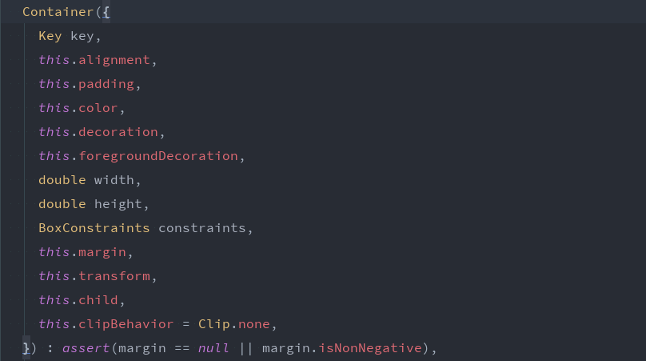

# Key——那么熟悉又那么陌生

## 一、Key


我们平时一定接触过很多的 Widget，比如 Container、Row、Column 等，它们在我们绘制界面的过程中发挥着重要的作用。但是不知道你有没有注意到，在几乎每个 Widget 的构造函数中，都有一个共同的参数，它们通常在参数列表的第一个，那就是 Key。



但是在我们构造这些 Widget 的时候，又很少指定并传入wfdh这个参数，那么这个参数究竟是干嘛的呢？它又有什么作用呢？

我们先来看看 Key 这个类吧，它是个虚拟类，有子类 `LocalKey` 和 `GlobalKey`，它们也是虚拟类，又有各自的子类。


它们有什么区别呢？具体有什么使用场景呢？带着这些疑问，我们继续向下看。

## 二、煮个栗子

我们首先看一个 demo：有两个色块和一个按钮，点击按钮后，两个色块会进行交换。


代码部分，两个无状态的色块 Widget，点击按钮后，交换 Widget 在 List 中的位置并进行刷新。

```dart
final List<Widget> _statelessTiles = [
  StatelessColorBlock(),
  StatelessColorBlock(),
];

_swapTiles() {
  setState(() {
    _statelessTiles.insert(1, _statelessTiles.removeAt(0));
  });
}

@override
Widget build(BuildContext context) {
  return Scaffold(
    appBar: AppBar(
      title: Text(widget.title),
    ),
    body: Row(
      children: _statelessTiles,
    ),
    floatingActionButton: FloatingActionButton(
      onPressed: _swapTiles,
      child: Icon(Icons.swap_horizontal_circle),
    ),
  );
}
```

代码运行效果良好，且符合我们的预期。但是，如果我们把色块 Widget 由 StatelessWidget 变更为 StatefulWidget，并把颜色属性存储在 State 中，那么情况又如何呢？此时发现，无论我们怎么点击交换按钮，色块的位置或者颜色都不会再交换了。但是如果将颜色的属性存储在 Widget 中而不是 State 中，那么此时的交换效果又变得正常了。这是什么原因呢？

我们知道，Flutter 中 Widget 并不是最终绘制在屏幕上的对象，它只是用来配置和储存测绘数据的一种媒介以及构建真正的图像和用户交互的桥梁，而 Element 则是视图树的骨架，标识了各个控件在视图树上的一种树形结构的关系，而真正被绘制到屏幕上的则是 RenderObject。

那么，第一个例子中的两个色块为什么可以交换呢？


左边是我们布局的视图结构，framework 会构造出与之一一相对应的 Element 的结构关系。当我们交换两个色块后，左边的 WIdget 关系中，两个 Widget 的树型相对位置发生变化，此时通过 `setState` 方法通知 framework 视图树可能有变化需要刷新，Element 树就会被遍历来和 Widget 树一一进行对比是否还相等，包括类中的属性和成员。当发现表示颜色的属性不再相对应相等时，就可以知道视图树发生了改变，需要进行刷新，Element 树会重新和 Widget 树进行对应构造，屏幕上的两个色块交换的效果就会被绘制出来。


简而言之，界面之所以会刷新，就是因为 framework 发现了视图树产生变化，所以知道自己需要刷新进行重新绘制。其中重点就是 framework 能够发现视图树的变化。

那为什么我们换用 StatefulWidget 并将颜色属性存储在 State 中后就无法进行交换了呢？原因恰恰就是在于 framework 此时已经无法发现视图树产生变化了。


这种情况下，Widget 和 Element 树和之前的情况大体相同，但是不同的是，现在每个小色块 Widget 都关联一个 State，用来管理它们的状态，而颜色属性就储存在 State 中。Element 树有和 Widget 树一一对应的 Element 节点，但是 Element 并没有用来管理状态的 State。

在我们点击按钮进行交换后，同样的，Widget 的树中的位置发生变化，然后 `setState` 方法通知 framework 可能有视图树的变化需要注意，Element 被指派去和 Widgewfdhwfdhwfdhwfdht 树进行比对，但是由于 StatefulColorBlock 中不存储任何状态值（或者说不存在任何能够区别的不相同的状态值），所以 Element 遍历后长抒一口气：“没有不一样的地方，不需要进行树的更新，继续划水……”，本着偷懒的原则，视图树并没有接收到需要刷新的指令，就不做任何处理工作，尽管实质上它们的 State 已经不同，但是这并不能引起刷新机制的注意，因此带来的结果就是无论我们怎么点击交换按钮，界面都纹丝不动，不会进行任何更新。


至此，对于将颜色属性存储在 Widget 中而不是 State 中的交换效果正常的原理也就显而易见了。

那么，对于上面说的颜色无法交换的情况甚或其他各种类似的情况，我们在开发中该怎么处理呢？

就在此时，Key 作为一个 Key，它闪亮登场了。

我们稍微修改一下我们上面不生效的代码。

```dart
final List<Widget> _statelessTiles = [
  StatefulColorBlock(UniqueKey()),
  StatefulColorBlock(UniqueKey()),
];

_swapTiles() {
  setState(() {
    _statefulTiles.insert(1, _statefulTiles.rwfdhemoveAt(0));
  });
}

@override
Widget build(BuildContext context) {
  return Scaffold(
    appBar: AppBar(
      title: Text(widget.title),
    ),
    body: Row(
      children: _statefulTiles,
    ),
    floatingActionButton: FloatingActionButton(
      onPressed: _swapTiles,
      child: Icon(Icons.swap_horizontal_circle),
    ),
  );
}
```

再次点击按钮，噔噔，两个色块又可以交换啦。

我们试着用上面分析出的结论举一反三。因为每个 Widget 被指定了生成的不同的 UniqueKey，所以 Element 树在比对 Widget 树的时候，发现了无法对应的 Key，所以判定视图树的结构发生了变化，有必要进行刷新，所以会对两个色块进行重绘，所以我们就能看到色块交换的效果啦。

## 三、品，你细品

flutter 源码在 Key 类上的注释文档开门见山地说明了，Key 是 Widget、Element 和 SemanticsNode 的“身份证”。帮助它们进行lwlwlwlwlw有效的区分。而且 Key 是视图树的更新策略的重要依据。下面摘录 Widget 类中对成员 key 的注解。

> Controls how one widget replaces another widget in the tree.
>
> If the [runtimeType] and [key] properties of the two widgets are
> [operator==], respectively, then the new widget replaces the old widget by
> updating the underlying element (i.e., by calling [Element.update] with the
> new widget). Otherwise, the old element is removed from the tree, the new
> widget is inflated into an element, and the new element is inserted into the
> tree.
>
> In addition, using a [GlobalKey] as the widget's [key] allows the element
> to be moved around the tree (changing parent) without losing state. When a
> new widget is found (its key and type do not match a previous widget in
> the same location), but there was a widget with that same global key
> elsewhere in the tree in the previous frame, then that widget's element is
> moved to the new location.
>
> Generally, a widget that is the only child of another widget does not need
> an explicit key.

大概翻译一下。

Key 控制着 Widget 在视图树上的替换规则。如果两个 Widget 的 runtimeType 和 Key 都是相等的（用 `==` 操作符比较结果为真），那么新的 Widget 会通过更新其下的 Element（通过调用 `Element.update` 并传入新的 Widget 的方式）。否则，旧的 Element 就会被从视图树上删除，新的 Widget 挂载到新的 Element，新的 Element 再被插入视图树上。

另外，如果用 GlobalKey 作为 Widget 的 Key，能够使该 Widget 在整个视图树上移动（其父节点会发生变更）而不丢失状态。如果有一个新的 Widget，它和原先在此位置的 Widget 的 Key 或者类型不相同，但是在前一帧有一个和它相同的 GlobalKey 的 Widget，位置在其他地方，那么那个前一帧的 Widget 所依附的 Element 就会移动到新的 Widget 所在的视图树的位置。

对 Key 的工作原理有了一个大致的了解，那么我们再详细看看 Key 的那些实现的子类们。

- UniqueKey

  只和它自己判定相等的 Key，它不能被 const 修饰构造函数，因为如果被 const 关键字修饰，那么它的所有实例都将是同一个，违背只能和它自己相等的原则。

- ValueKey

  可以指定其值的 Key，其值被泛型约束。当且仅当两个 ValueKey 能被 == 操作符判定相等，它们才是相等的。

- PageStorageKey

  它是 ValueKey 的子类，也可以指定一个被泛型约束的值。正如其名，它和 PageStorage 类密切相关。PageStorage 是一个保存和恢复值的 Widget 子类。而 PageStorageKey 正是用来在 widget 重建之后找回和恢复存储的值。在每个路由中，有一个存储数据的 Map，而该 Map 的 Key 正是由 PageStorageKey 所定义的值来决定的。所以，PageStorage 创建时所传入的值不应该随着 widget 的重建发生变化。

- ObjectKey

  ObjectKey 和 ValueKey 很类似，也是传入一个值，并通过其值来比较二者是否相等。但是它们有两个不同点。

  1. ObjectKey 的 value 不是泛型约束的，而是一个 Object 对象；

  2. 二者的重载操作符方法 `==` 内容不一样。

     ```dart
     // ValueKey
     @override
     bool operator ==(Object other) {
         if (other.runtimeType != runtimeType)
             return false;
         return other is ValueKey<T>
             && other.value == value;
     }
     
     // ObjectKey
     @override
     bool operator ==(Object other) {
         if (other.runtimeType != runtimeType)
             return false;
         return other is ObjectKey
             && identical(other.value, value);
     }
     ```

     `==` 是比较两个对象是否相等，包括各个属性及其值都相等，而 `identical()` 是比较两个引用是否指向同一个对象。

上面是 LocalKey 的子类们，下面我们再看看 GlobalKey 的子类们。在尝试了解 GlobalKey 的子类之前，我们先来看看这个虽然是虚拟类但其实比起其实现的子类可能更重要的父类。下面摘录 GlobalKey 的注释文档。

>  A key that is unique across the entire app.
>
> Global keys uniquely identify elements. Global keys provide access to other
>  objects that are associated with those elements, such as [BuildContext].
>  For [StatefulWidget]s, global keys also provide access to [State].
>
>  Widgets that have global keys reparent their subtrees when they are moved
>  from one location in the tree to another location in the tree. In order to
>  reparent its subtree, a widget must arrive at its new location in the tree
>  in the same animation frame in which it was removed from its old location in
>  the tree.
>
>  Global keys are relatively expensive. If you don't need any of the features
>  listed above, consider using a [Key], [ValueKey], [ObjectKey], or
>  [UniqueKey] instead.
>
>  You cannot simultaneously include two widgets in the tree with the same
>  global key. Attempting to do so will assert at runtime.

GlobalKey 在整个 app 都是唯一的。

GlobalKey 唯一地标识一个 element，它提供了通往与 element 相关类的通道，比如 BuildContext 类，对于 StatefulWidget，比如 State。

拥有 GlobalKey 的对象在从视图树上的一个位置移动到另一个位置时会重新“认祖”，而为了其子树的重新构建，拥有 GlobalKey 的 element 在从原来的位置被删除到在新的位置“扎根”需要在一个动画帧内完成。

GlobalKey 是高昂的，如果你不是真的需要它，尽量考虑使用 Key、ValueKey、ObjectKey 或 UniqueKey 代替。

视图树上的两个 widget 不可能同时拥有同样的 GlobalKey，如果尝试如此，会无法通过 assert 语句的断言。

我们这里需要注意三点：

1. GlobalKey 在整个 app 都是唯一的；
2. 指定 GlobalKey 的对象，能够在整个视图树上的任意节点间移动（而不丢失状态）；
3. GlobalKey 能够获取 element 的相关类。

我们着重解释3，因为2就是3的结果。

注意到 GlobalKey 中有一个静态对象 `static final Map<GlobalKey, Element> _registry = <GlobalKey, Element>{}`，它是 GlobalKey 和 Element 的键值对，而其数据的填充是在 `_register()` 中。

```dart
void _register(Element element) {
    assert(() {
      if (_registry.containsKey(this)) {
        assert(element.widget != null);
        assert(_registry[this].widget != null);
        assert(element.widget.runtimeType != _registry[this].widget.runtimeType);
        _debugIllFatedElements.add(_registry[this]);
      }
      return true;
    }());
    _registry[this] = element;
  }
```

而 `_register()` 方法在 Element 的 `mount()` 中被调用。所以通过这个存储下来的 element，GlobalKey 就可以拿到所有与其相关的对象——BuildContext、Element、Widget 以及 State 等。

好了，聊了这么多的 GlobalKey，下面看看它的两个子类。

- LabeledGlobalKey

  在 GlobalKey 的基础上增加了一个 `_debugLabel` 属性，用来在 log 等输出做调试用，而且 GlobalKey 的工厂构造函数返回的其实就是 LabeledGlobalKey。

- GlobalObjectKey

  联想 ObjectKey 和 LocalKey 的关系，它可以看做自己指定 value 的 GlobalKey，但是这就可能造成因指定了相同的 value 而导致的冲突问题，解决方法是构造其私有的子类。

   ```dart
   class _MyKey extends GlobalObjectKey {
     const _MyKey(Object value) : super(value);
   }
   ```

## 四、适合的才是最好的

经过上面对各种 Key 的介绍，其各自适用场景也很明显了。因为 GlobalKey 代价高昂，所以除非在一些需要在不同视图树节点同步 widget、element 和 State 的属性的情况下，尽量使用 LocalKey，而各个 LocalKey 的不同特性又决定了它们不同的使用场景。

Key 在整个 flutter 的结构体系中很小，我们对他最陌生又最熟悉。搞懂它的作用，那我们在下次点开 widget 的构造函数时，发现躺在参数列表第一个的 Key，我们也可以微微一笑：我认识你。

（以上部分内容来自[Flutter 官方 YouTube 介绍视频](https://www.youtube.com/watch?v=kn0EOS-ZiIc)和 Flutter 源码注释文档）