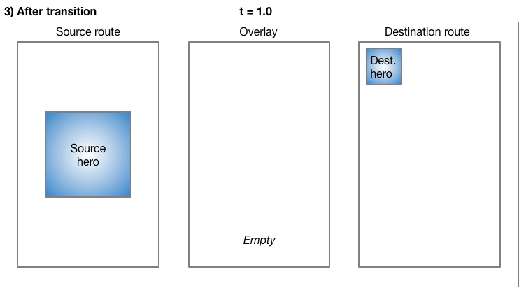

# 好看的皮囊千篇一律，有趣的动画让人放不下手机

## 初话动画


动画，一直是前端程序设计中无法避免的一环。它不像基础组件和网络请求组件等那样必不可少，但是开发当中如果没有动画，那么我们的程序可能无法成为一款优秀的作品。没错，动画是让你的程序能被称为优秀的其中不可或缺的一步。

一般的动画分为几种——逐帧动画、补间动画、基于物理的动画等。

逐帧动画通常是某一动作的多个瞬间定格的连续播放，即一系列可以连贯起来的图片在一定时间内按一定的次序逐张循环渲染在屏幕上，造成一种连续动作的视觉效果，有点类似于电影的播放。这种动画的优点是实现复杂的动画比较容易，只要切取连续的设计好的图片就可以实现几乎所有的动画，但是其缺点也很明显，比如多张图片导致软件打包后比较大、内存占用高、复杂的动画切图数量过多会导致资源占用巨大、灵活性不高等。

补间动画中的“补间”是“介于两者之间”的简称。在补间动画中，定义了开始点和结束点、时间线以及定义转换时间和速度的曲线。然后由框架计算如何从开始点过渡到结束点。而在基于物理的动画中，运动被模拟为与真实世界的行为相似。例如，当你掷球时，它在何处落地，取决于抛球速度有多快、球有多重、距离地面有多远。 类似地，将连接在弹簧上的球落下（并弹起）与连接到绳子上的球放下的方式也是不同。基于物理的动画，是在补间动画的基础上进行的一系列数据的计算后的加强。

在具体看这些动画之前，我们先了解一下 Flutter 中与动画相关的几个重要的类。

- Tween
- Animation
- CurvedAnimation
- AnimationController
- Hero

## 借代码再谈动画

这里我们先明确一个概念，Flutter 中的补间动画和 Android 的属性动画很像，它们不直接对图形对象进行操作，而是将动画抽象成一种数字化的概念，对图形对象的控制部分由用户自己来实现。简单点说就是在动画的过程中，动画核心库会给我们输出一串数字，我们根据这串数字通过计算来决定图形对象的位移、透明度、尺寸等图形属性。

1. **Tween**

   `Tween` 继承自类 `Animatable`，我们先不管其父类，`Tween` 有两个成员变量——`begin` 和 `end`，它们的类型是泛型限制的 dynamic 类型。`Tween` 的构造函数对这两个变量进行赋值。它还有两个成员方法：

   ```dart
   /// Returns the value this variable has at the given animation clock value.
   ///
   /// The default implementation of this method uses the [+], [-], and [*]
   /// operators on `T`. The [begin] and [end] properties must therefore be
   /// non-null by the time this method is called.
   @protected
   T lerp(double t) {
     assert(begin != null);
     assert(end != null);
     return begin + (end - begin) * t as T;
   }
   
   /// Returns the interpolated value for the current value of the given animation.
   ///
   /// This method returns `begin` and `end` when the animation values are 0.0 or
   /// 1.0, respectively.
   ///
   /// This function is implemented by deferring to [lerp]. Subclasses that want
   /// to provide custom behavior should override [lerp], not [transform] (nor
   /// [evaluate]).
   ///
   /// See the constructor for details about whether the [begin] and [end]
   /// properties may be null when this is called. It varies from subclass to
   /// subclass.
   @override
   T transform(double t) {
     if (t == 0.0)
       return begin;
     if (t == 1.0)
       return end;
     return lerp(t);
   }
   ```

   `transform()` 方法根据传入的 double 类型参数返回一个泛型约束的值。其值由 `lerp()` 方法——根据进度输出该进度下的对应值——生成。所以它本质上是一个获取中间值的方法。我们不妨这里把传入的值记为**进度**，代表了动画进行的进度情况，把返回的值记为**属性**，代表了在该进度下的对应的一种属性。

   下面看一下 `Tween` 的父类。`Animatable` 类中自实现了三个方法。

   - ```dart
     T evaluate(Animation<double> animation) => transform(animation.value);
     ```

     通过 `Animation` 的 `value` （double 类型）成员获取中间状态值。

   - ```dart
     Animation<T> animate(Animation<double> parent) {
       return _AnimatedEvaluation<T>(parent, this);
     }
     ```

     它返回了一个对象，我们一探究竟。

     ```dart
     class _AnimatedEvaluation<T> extends Animation<T> with AnimationWithParentMixin<double> {
       _AnimatedEvaluation(this.parent, this._evaluatable);
     
       @override
       final Animation<double> parent;
     
       final Animatable<T> _evaluatable;
     
       @override
       T get value => _evaluatable.evaluate(parent);
     
       @override
       String toString() {
         return '$parent\u27A9$_evaluatable\u27A9$value';
       }
     
       @override
       String toStringDetails() {
         return '${super.toStringDetails()} $_evaluatable';
       }
     }
     ```

     可以看到它也是继承自 `Animation`，有两个成员变量——`parent` 和 `_evaluatable`，根据 `animate()` 方法知道，`parent` 也是一个 `Animation` 对象，`_evaluatable` 对象是 `Animatable` 传入的其自身，通过它，可以得到 `Animatable` 的**属性**，通过 getter `value` 暴露出去。

     这里再重新审视 `animate()` 这个方法，给它一个总结——<span style="border-bottom:2px solid;">它输入一个存储**进度**的 `Animation<double>`，输出一个记录该记录下**属性**的 `Animation<T>`</span>。

   - ```dart
     Animatable<T> chain(Animatable<double> parent) {
       return _ChainedEvaluation<T>(parent, this);
     }
     ```

     其入参是一个 `Animatable<double>` 对象，和 `Animatable` 自身传入 `_ChainedEvaluation`  的构造方法中，返回值是一个 `Animatable<T>`。

     再进入 `_ChainedEvaluation` 类中。

     ```dart
     class _ChainedEvaluation<T> extends Animatable<T> {
       _ChainedEvaluation(this._parent, this._evaluatable);
     
       final Animatable<double> _parent;
       final Animatable<T> _evaluatable;
     
       @override
       T transform(double t) {
         return _evaluatable.transform(_parent.transform(t));
       }
     
       @override
       String toString() {
         return '$_parent\u27A9$_evaluatable';
       }
     }
     ```

     重点看其中的 `transform()` 方法，它通过两次 `Animatable` 的嵌套调用 `transform()` 方法，实现从**进度** -> **值** -> 另一个**值**的正如其名的链式过程。

   

2. **Animation**

   这是一个抽象类，继承了 `Listenable` 类，实现了 `ValueListenable` 接口。

   同样，先看其成员变量。它有两个成员变量，一个是 `status`，是类 `AnimationStatus` 的对象，另一个是泛型约束的 `value`， 继承自 `ValueListenable` 接口。

   `AnimationStatus` 是一个枚举，可以看到它记录着动画的一些状态。

   ```dart
   // Examples can assume:
   // AnimationController _controller;
   
   /// The status of an animation
   enum AnimationStatus {
     /// The animation is stopped at the beginning
     dismissed,
   
     /// The animation is running from beginning to end
     forward,
   
     /// The animation is running backwards, from end to beginning
     reverse,
   
     /// The animation is stopped at the end
     completed,
   }
   ```

   这里我们知道了，`Animation` 类的作用是存储动画相关值。它的成员方法中有一个 `drive()`：

   ```dart
   // 注释太多，这里省略，需要了解的自行查阅
   @optionalTypeArgs
   Animation<U> drive<U>(Animatable<U> child) {
     assert(this is Animation<double>);
     return child.animate(this as Animation<double>);
   }
   ```

   这个方法的参数是上面介绍的 `Animatable`，通过调用其 `animate()`方法，实现上面介绍的从一个储存**进度**的 `Animation` 的类返回一个存储**属性**的 `Animation` 类。

3. **CurvedAnimation**

   它继承自 `Animation`，所以可知，它的作用也是存储动画的状态和相关值。正如其名，它返回 `value` 之前多了一步 `Curve` 类（由构造方法传入）的作用。`Curve` 同样是一个抽象类，成员方法 `transform` 的作用正是实现值的转换。`transform` 方法通过调用`transformInternal()` 方法，实现对各种 `Curve` 类的扩展子类中实现的方法调用，实现状态值转换。拿 `SawTooth` 举例，它的运动效果如下：
   
   <video src="好看的皮囊千篇一律，有趣的动画让人放不下手机.assets/curve_sawtooth.mp4"></video>
   
   它的 `transformInternal()` 方法如下：
   
   ```dart
   @override
   double transformInternal(double t) {
     t *= count;
     return t - t.truncateToDouble();
   }
   ```
   
   所以正是借助这种变换，可以使动画过程不再局限于线性，有了更多的组合方式，动画构建起来也更加灵活。
   
4. **AnimationController**

   `AnimationContrller`类又是 `Animation` 类的一个子类。它的主要功能有下面几个：

   - 以一个特定的值开始动画
   - 设置动画值的上下限

   - 控制一个动画正向或反向播放，异或控制动画停止
   - 通过物理模拟创建一个 fling 动画

   `AnimationController` 的构造函数中需要传入一个 `TickerProvider vsync` 参数，`TickerProvider` 的主要职责是创建另一个类 `Ticker`。

   Flutter应用在启动时都会绑定一个 `SchedulerBinding`，通过 `SchedulerBinding` 可以给每一次屏幕刷新添加回调，而 `Ticker` 就是通过 `SchedulerBinding` 来添加屏幕刷新回调，这样一来，每次屏幕刷新都会调用 `TickerCallback`。使用 `Ticker`（而不是 `Timer`）来驱动动画会防止屏幕外动画（动画的 UI 不在当前屏幕时,如锁屏时）消耗不必要的资源，因为 Flutter 中屏幕刷新时会通知到绑定的 `SchedulerBinding`，而 `Ticker` 是受 `SchedulerBinding` 驱动的，由于锁屏后屏幕会停止刷新,所以 `Ticker` 就不会再触发。

   如果是在 `State` 中创建 `AnimationController`，那么可以使用 `TickerProviderStateMixin` 和 `SingleTickerProviderStateMixin`，如果 `State` 类只需要一个 `Ticker`，那么后者会比前者更加高效。

   那么我们看一看 `AnimationController` 的几个功能的实现。

   ```dart
   AnimationController({
       double value,
       this.duration,
       this.reverseDuration,
       this.debugLabel,
       this.lowerBound = 0.0,
       this.upperBound = 1.0,
       this.animationBehavior = AnimationBehavior.normal,
       @required TickerProvider vsync,
     })
   ```

   `AnimationController` 在其构造函数中可以设置动画值的下限（`lowerBound`）和上限（`upperBound`）。

   通过 `forward({ double from })`（其中这个“from”就是指定的动画开始值）函数，开始正向启动动画。通过“`forward()` => `_animateToInternal()` => `_startSimulation()`”的调用链，最终调用 `_ticker.start()` 函数，使得 `Ticker` 开始运转，而 `Ticker` 的每一帧都会回调其 `_tick()` 方法，在该方法中，`_value` 值通过时间被计算出来的数值赋值，就这样，`AnimationController` 完成了动画的向前推进。

   好了，上面大概就是 `AnimationController` 的动画驱动过程了，当然反向动画原理是相同的。但是在探究上面的动画启动过程中，我们还注意到一个类——`Simulation`。这是一个用来动态模拟物体运动状态的类，物体运动状态包括了距离（`x()`），速度（`dx()`）和是否完成（`isDone()`）。上面分析的动画思想让我们知道，在动画运行过程中，只要给定一个特定的时间值，这些状态就应该是已知的。如 `AnimationController#_animateToInternal()` 方法中采用的默认的线性插值的模型类`_InterpolationSimulation`，这些状态的计算就是按线性比例的算法计算出来的。

   ```dart
   class _InterpolationSimulation extends Simulation {
     _InterpolationSimulation(this._begin, this._end, Duration duration, this._curve, double scale)
       : assert(_begin != null),
         assert(_end != null),
         assert(duration != null && duration.inMicroseconds > 0),
         _durationInSeconds = (duration.inMicroseconds * scale) / Duration.microsecondsPerSecond;
   
     final double _durationInSeconds;
     final double _begin;
     final double _end;
     final Curve _curve;
   
     @override
     double x(double timeInSeconds) {
       final double t = (timeInSeconds / _durationInSeconds).clamp(0.0, 1.0) as double;
       if (t == 0.0)
         return _begin;
       else if (t == 1.0)
         return _end;
       else
         return _begin + (_end - _begin) * _curve.transform(t);
     }
   
     @override
     double dx(double timeInSeconds) {
       final double epsilon = tolerance.time;
       return (x(timeInSeconds + epsilon) - x(timeInSeconds - epsilon)) / (2 * epsilon);
     }
   
     @override
     bool isDone(double timeInSeconds) => timeInSeconds > _durationInSeconds;
   }
   ```

   所以如果需要对动画运行的模型做一些改变，除了上面说到的 `CurvedAnimation` 类，这里也可以做到。而 `fling()` 方法正式通过这种形式定制 `SpringSimulation` 类来完成的非线性模型。
   
5. **Hero**

   这是一个封装了的转场动画。
   
   先看一个官方的界面跳转的例子。无 Hero 动画跳转代码如下：
   
   ```dart
   class MainScreen extends StatelessWidget {
     @override
     Widget build(BuildContext context) {
       return Scaffold(
         appBar: AppBar(
           title: Text('Main Screen'),
         ),
         body: GestureDetector(
           onTap: () {
             Navigator.push(context, MaterialPageRoute(builder: (_) {
               return DetailScreen();
             }));
           },
           child: Image.network(
             'https://picsum.photos/250?image=9',
           ),
         ),
       );
     }
   }
   
   class DetailScreen extends StatelessWidget {
     @override
     Widget build(BuildContext context) {
       return Scaffold(
         body: GestureDetector(
           onTap: () {
             Navigator.pop(context);
           },
           child: Center(
             child: Image.network(
               'https://picsum.photos/250?image=9',
             ),
           ),
         ),
       );
     }
   }
   ```
   
   可以看到这也是我们通常的用法。效果如下：
   
   <video src="好看的皮囊千篇一律，有趣的动画让人放不下手机.assets/no_hero_animation.mp4"></video>
   
   而采用了 Hero 动画后：
   
   ```dart
   import 'package:flutter/material.dart';
   
   void main() => runApp(HeroApp());
   
   class HeroApp extends StatelessWidget {
     @override
     Widget build(BuildContext context) {
       return MaterialApp(
         title: 'Transition Demo',
         home: MainScreen(),
       );
     }
   }
   
   class MainScreen extends StatelessWidget {
     @override
     Widget build(BuildContext context) {
       return Scaffold(
         appBar: AppBar(
           title: Text('Main Screen'),
         ),
         body: GestureDetector(
           child: Hero(
             tag: 'imageHero',
             child: Image.network(
               'https://picsum.photos/250?image=9',
             ),
           ),
           onTap: () {
             Navigator.push(context, MaterialPageRoute(builder: (_) {
               return DetailScreen();
             }));
           },
         ),
       );
     }
   }
   
   class DetailScreen extends StatelessWidget {
     @override
     Widget build(BuildContext context) {
       return Scaffold(
         body: GestureDetector(
           child: Center(
             child: Hero(
               tag: 'imageHero',
               child: Image.network(
                 'https://picsum.photos/250?image=9',
               ),
             ),
           ),
           onTap: () {
             Navigator.pop(context);
           },
         ),
       );
     }
   }
   ```
   
   效果：
   
   <video src="好看的皮囊千篇一律，有趣的动画让人放不下手机.assets/hero_animation.mp4"></video>
   
   可以看到一个比较明显的动画效果（由于我的设备运行比较卡顿，理想情况可能效果更加流畅），就好像 app 中的图片在两个界面中横跨了。
   
   这一整个视觉上完整的过程其实可以分为三步：
   
   - 在 Overlay 层创建一个源 Hero 控件的副本，其大小、形状和所在屏幕的相对位置都完全一样。当页面将要进行跳转时，将源 Hero 推到后台运行隐藏，只显示 Overlay 层的副本。
   
     
   
   - 页面开始向目标页面跳转，Overlay 层的 Hero 元素也要向目标 Hero 所在的位置和目标 Hero 的大小和形状进行渐变过渡。这中间的过渡动画都通过 Hero 的 `createRectTween` 属性来控制副本 Hero 元素的举行边界来完成。
   
     
   
   - 当 Overlay 的副本 Hero 到达目的 Hero 的所在位置和变换为目标 Hero 的大小形状时，动画完成。此时，1.销毁 Overlay 层的 Hero 副；2.在新的界面的相应位置显示目标 Hero；3.源 Hero 被存储到原先的页面中。
   
     

## 让动画飞一会儿

多说无益，下面我们根据上面的理论来写个小 demo。

```dart
import 'package:flutter/material.dart';
import 'package:flutter/widgets.dart';
import 'package:test_flutter/main.dart';

class AnimationSample extends StatefulWidget {
  @override
  State<AnimationSample> createState() => _AnimationSampleState();

}

class _AnimationSampleState extends State<AnimationSample> with SingleTickerProviderStateMixin {

  Tween<double> _tween = Tween<double>(begin: 0.0, end: 128.0);

  Animation<double> _animation;

  AnimationController _animationController;

  double _borderLength = 0.0;

  @override
  void initState() {
    super.initState();

    _animationController = AnimationController(duration: Duration(seconds: 5), vsync: this);

    _animation = _tween.animate(_animationController);

    _animationController.addListener(() {
      setState(() {
        _borderLength = _animation.value;
      });
    });
  }

  @override
  Widget build(BuildContext context) {
    return Scaffold(
      body: Center(
        child: Container(
          width: _borderLength,
          height: _borderLength,
          child: Block(''),
        ),subclass
      ),
      floatingActionButton: FloatingActionButton(
        onPressed: () {
          _animationController.forward();
        },
        child: Icon(Icons.play_arrow),
      ),
    );
  }

}
```

这里的代码很简单，就是动态地改变一个色块的大小。效果如下：

  <video src="好看的皮囊千篇一律，有趣的动画让人放不下手机.assets/S00908-23043482.mp4"></video>

这里的原理是，`Tween#animate()` 方法返回一个 `Animation`（实际上是 `_AnimatedEvaluation`，`Animation` 的子类）对象，这样该 `Animation` 类的 value getter 获取到的就是通过 `transform()` 方法将 `AnimationController` 的 value 转化为 `Tween` 的 value，因为 `AnimationController` 的值默认是从 0.0 到 1.0，所以翻到上面 `Tween` 那一节的 `transform()` 方法实现的地方（参数 t 即是 `AnimationController` 的 value），可以看到就实现了完美的转换。当执行`AnimationController#forward()` 方法时，`AnimationController` 的 value 在每一帧被重新赋值（默认0.0到1.0之间），`ChangeNotifier` 机制就通知所有的 value 监听者进行更新，所以 `Tween` 的值也在进行逐帧刷新了。

下面我们稍微更改一下代码：

```dart
import 'package:flutter/material.dart';
import 'package:flutter/widgets.dart';
import 'package:test_flutter/main.dart';

class AnimationSample extends StatefulWidget {
  @override
  State<AnimationSample> createState() => _AnimationSampleState();

}

class _AnimationSampleState extends State<AnimationSample> with SingleTickerProviderStateMixin {

  AnimationController _animationController;

  double _borderLength = 0.0;

  @override
  void initState() {
    super.initState();

    _animationController = AnimationController(
        duration: Duration(seconds: 5),
        vsync: this,
        lowerBound: 0.0,
        upperBound: 128.0);

    _animationController.addListener(() {

      setState(() {
        _borderLength = _animationController.value;
      });
    });
  }

  @override
  Widget build(BuildContext context) {
    return Scaffold(
      body: Center(
        child: Container(
          width: _borderLength,
          height: _borderLength,
          child: Block(''),
        ),
      ),
      floatingActionButton: FloatingActionButton(
        onPressed: () {
          _animationController.forward();
        },
        child: Icon(Icons.play_arrow),
      ),
    );
  }

}
```

我们删除了 `Tween` 相关的部分，这里只对 `AnimationController` 的 value 进行动画化，然后对其监听，这样也可以获得每一帧的 value。运行代码，效果和上面一致。

### 总结

好了，动画的东西就这么多，体会将逻辑层和实现层分离的思想，对逻辑层进行精心设计，图形相关的实现层的东西交给开发者，不仅可以减少耦合、提高抽象性，还可以满足不同的需要和灵活的需求。在初窥动画的奥秘之后，需要做的就是让这些可爱的动画在你的应用中动起来吧。