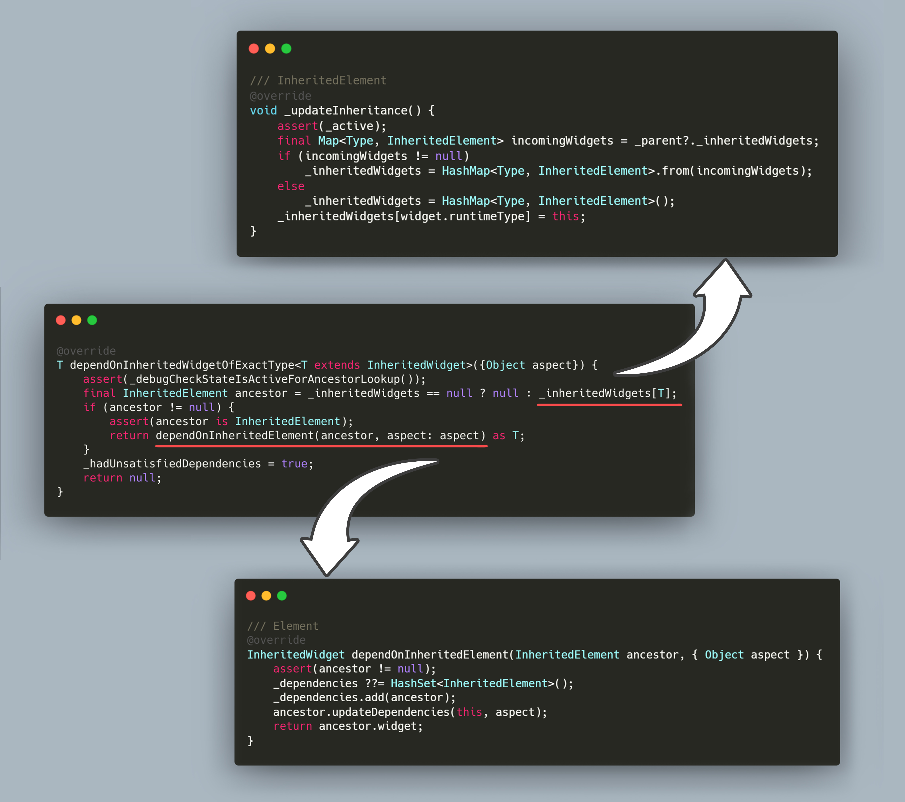
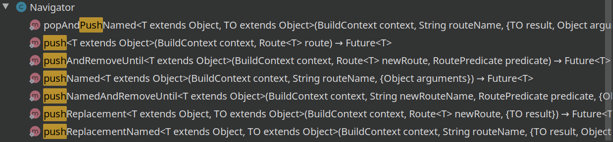
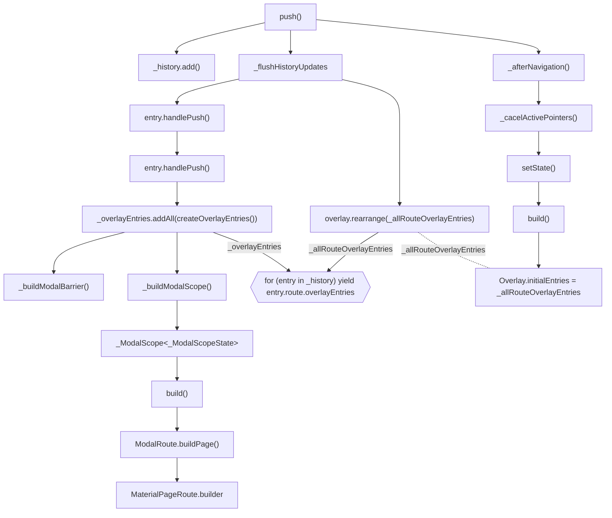
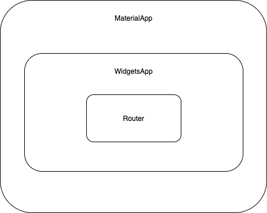

# 敢问路在何方——Flutter 路由初探


在开始之前，我们先介绍一个貌似毫不相关的概念，至于原因，一是因为后面的某个概念和它具有相关性，二是因为这个概念太简单，不足以以一整篇篇幅来介绍它，所以不如就在这里顺带着介绍一下。

## InheritedWidget

一句话总结 `InheritedWidget` 就是「在视图树上更有效的向下传递信息的 widget」。

```dart
abstract class InheritedWidget extends ProxyWidget {
  const InheritedWidget({ Key key, Widget child })
    : super(key: key, child: child);

  @override
  InheritedElement createElement() => InheritedElement(this);

  @protected
  bool updateShouldNotify(covariant InheritedWidget oldWidget);
}
```

`updateShouldNotify()` 方法用来控制对其实现的子类是否在 rebuild 过程中同样进行 rebuild，例如，当此 widget 的数据并未改变时，可能并不需要对其进行更新。

所以，相比于一般的 widget，它主要多了个在视图树上实现「信息传递」的功能，那它的信息传递的功能又是如何实现的呢——借助 `BuildContext` 类，我们线看一个例子。

```dart
class FrogColor extends InheritedWidget {
  const FrogColor({
    Key key,
    @required this.color,
    @required Widget child,
  }) : assert(color != null),
       assert(child != null),
       super(key: key, child: child);

  final Color color;

  static FrogColor of(BuildContext context) {
    return context.dependOnInheritedWidgetOfExactType<FrogColor>();
  }

  @override
  bool updateShouldNotify(FrogColor old) => color != old.color;
}
```

`of()` 方法接收 `BuildContext` 参数，并返回参数的 `dependOnInheritedWidgetOfExactType()` 方法调用结果，而该方法的实现在 `BuildContext` 类的子类 `Element` 类中。



这个从视图树上按名称摘果子的过程并不难理解。好了，关于 `InheritedWidget` 的部分我们就了解这么多，下面回归本篇的核心主旨——路由部分。

## 从 Navigator 1.0 开始

`Navigator` 以栈的方式管理着它的家族控件们。正如在 Android 中通过一个栈来管理 `Activity`，每个 `Activity` 作为一个单独的页面的原则， Flutter 中也以栈的方式管理着我们需要的页面，不过每个页面不再是 `Activity`，而变成了 route。

说到 `Navigator`，我们可以在脑海中形成这样一种画像，在桌子上摞着一叠图纸，我们能看到最上面的那一张画了些什么，但是无法其他在下面的图纸的内容。如果现在把最上面的那张图纸拿开，原先自上而下的第二张此刻就变成了最上面的那张图纸，此时我们看到画像就还是新的最上面的那幅。那再放置一张新的画像在这一摞图画之上，可见的图画就又被更新了。


当我们需要添加新的「图画」时，只需要使用 `Navigator` 的 `push` 系列方法就可以了，`push` 系列方法有好些个，忽略其他的附加操作，它们可以分为两类—— `push` 和 `pushNamed`。



### 1.`push`

```dart
Navigator.of(context).push(MaterialPageRoute(builder: (context) => SignUpPage()));
```

这句代码并不特别，是跳转一个新界面的一般做法。`MaterialPageRoute` 是 `Route` 的子类，`builder` 参数返回新界面的 `Widget` 实例。

`Navigator` 是 `StatefulWidget` 的子类，对应的 `State` 为 `NavigatorState`。`Navigator.of(context)` 方法返回 `NavigatorState` 实例，和上面 `InheritedWidget` 类似，借助 `BuildContext` 的 `findRootAncestorStateOfType()` 方法在 Element 树上寻找对应的 `StatefulElement`，返回可以和泛型指定的 `State` 类型匹配的 `State` 对象。

在深入 `push()` 方法之前，我们先借助 devtools 了解一下 Flutter 页面的层级结构，能够帮助我们更好地理解下面的流程。

<details>
    <summary>由于图片太长，请点击查看</summary>
    
</details>
接下来就是调用 `Navigator` 的 `push()` 方法了，这部分的逻辑比较复杂，我尝试着按我的理解绘制了一张流程图，对照着来理解整个过程。



`push()` 方法接受 `Route` 型的参数，并在方法内将其封装为 `_RouteEntry` 型。`Navigator` 类有一个成员 `_history`，是一个 `OverlayEntry` 对象的集合，`push()` 方法将封装好的 `_RouteEntry` 对象添加到 `_history` 列表中。之后 `push()` 方法调用 `_RouteEntry` 的 `handlePush()` 方法，创建 「\_ModalBarrir」 和 「\_ModalScope」，它们都是 Widget 对象，前者是用来隔绝不同界面之间的交互操作（例如手势操作），后者是对我们目标跳转页面的封装。最后 `push()`  方法调用 `_afterNavigation()` 方法刷新 `Navigator`，致使 `build()` 方法被调用，在此方法中，`Navigator` 通过 `GlobalKey` 获取到全局的 `Overlay` 对象，并将被 `_OverlayEntryWidget` 对象包裹的 「\_ModalScope」页面更新到 `Overlay` 中，这样我们的界面就可以显示在页面层级中了。

### 2. `pushNamed`

`MaterialApp` 中支持通过 `onGenerateRoute` 参数来构建路由表。它是一个方法，形式为 `Route<dynamic> Function(RouteSettings settings)`，根据传入的 `RouteSettings` 对象参数，返回对应的 `Route` 实例。`RouteSettings` 类拥有两个成员变量分别为 `final String name` 和 `final Object arguments`。而 `Navigator` 和 `NavigatorState` 的 `pushNamed()` 方法参数接收的正是这两个对象。

```dart
Future<T> pushNamed<T extends Object>(
    String routeName, {
        Object arguments,
    }) {
    return push<T>(_routeNamed<T>(routeName, arguments: arguments));
}
```

可以看到 `pushNamed()` 方法最终调用还是上面介绍的 `push()` 方法，但是参数则通过 `_routeName()` 方法来构建。

```dart
Route<T> _routeNamed<T>(String name, { @required Object arguments, bool allowNull = false }) {
    
    // ...
    
    final RouteSettings settings = RouteSettings(
        name: name,
        arguments: arguments,
    );
    Route<T> route = widget.onGenerateRoute(settings) as Route<T>;
    if (route == null && !allowNull) {
        route = widget.onUnknownRoute(settings) as Route<T>;
    }
    return route;
}
```

使用 flutter 命令行运行 `flutter run --route=/signup` 查看 demo。

### 3. `pop`

当调用 `pop()` 方法时，会将页面栈早上层的页面视图弹出，显示出下面一张的视图。

在这个过程中，`_flushHistoryUpdates()` 方法依然发挥着重要的作用，通过 `_RouteEntry.currentState` 变量控制弹出的过程，分别为`pop`、`poping`、`remove`、`removing`、`dispose`、`disposed`，并在这些过程中移除 `NavigatorState._history` 中的对应的 `_RouteEntry` 实例，在刷新视图时，`Overlay` 得到更新，被移除的实例会将包裹的页面移除 Overlay 层。

那么在这个过程中，前一个页面的数据是如何传递到后一个页面的呢？


在经过上面的调用后，`pop()` 方法的参数 `result` 被传递到 `Route.didComplete()` 方法。

```dart
void didComplete(T result) {
    _popCompleter.complete(result ?? currentResult);
}
```

`_popCompleter` 对象是 `Completer` 类的实例，而 `_popCompleter` 的 `future` 属性在 `NavigatorState.push()` 方法调用时被返回。

```dart
/// Route
Future<T> get popped => _popCompleter.future;

/// NavigatorState
Future<T> push<T extends Object>(Route<T> route) {
    // ...
    return route.popped;
}
```

所以后一个页面调用 `pop()` 方法返回的结果能被前一个页面在调用 `push()` 方法后以 `Future` 的形式接收到，诸如下面的形式：

```dart
Navigator.of(context).push(MaterialPageRoute(builder: (context) => SignUpPage()))
    .then((value) => print("the result from next page: $value"));
```

## 再到 Navigator 2.0

### 一、用法介绍

`Navigator` 到目前为止，一切都运行良好，但是它的局限也很明显。首先，**它无法一次性压入多个页面**；其次，它只能弹出最上层的页面，对于某些场景下弹出下层页面的需求则无法满足。所以 Navigator 2.0 就应运而生了。

在 Flutter 迭代到 1.22 版本后，关于 Navigator 的部分添加了一些新的 api：

- `Page` —— 抽象的「页面」的概念，对 `Route` 配置选项的一种描述；
- `Router` —— 管家角色，应用中页面打开或关闭的调度员，监听来自于系统的路由信息（如启动路由、新路由加入或者系统返回按钮的消息等）；
- `RouteInformationProvider` —— 更改路由获取到的页面的名字；
- `RouteInfomationParser` —— 接收来自 `RouteInfomationProvider` 的 `RouteInfomation` 并将其转化为泛型约束的数据类型；
- `RouterDelegate` —— 输入来自 `RouteInformationParser` 的数据，负责将提供的 navigator 页面插入视图树，同时接受监听更新视图；
- `BackButtonDispatcher` —— 监听返回按钮事件。

Navigator 2.0 的概念和之前介绍过的 Flutter 视图树比较相似——`Widget` 保存着视图的配置，通过 `Widget` 对象创建对应的 `Element` 和 `RenderObject`——`Page` 对象是关于路由的配置的抽象的概念，而通过它的 `createRoute()` 方法创建 `Route` 对象。

#### 1. `Page`

`Page` 是一个页面的抽象，继承自 `RouteSettings` 类，通过 `name` 属性来标识页面。正如 `Widget` 到 `Element` 通过 `createElement()` 方法，`Page` 中也有一个方法 `createRoute()` 用来创建 `Route` 实例。

通过上面 Navigator 1.0 的分析，我们知道 `Route` 是 Flutter 路由进行页面切换的载体，包裹着真正的页面在栈中「腾挪闪转」，从而实现页面切换的功能。

#### 2. `RouterInformationProvider`

这个类通过它的 `value` 属性传递值给 `RouteInformationParser` 类的 `parseRouteInformation` 方法，该值即 `RouteInformation` 对象，储存路由的地址，通过该地址可以控制页面跳转。

例如当我们在浏览器的地址栏输入 「/index」后缀作为新的跳转地址后，`RouteInformationParser` 类的 `parseRouteInformation` 方法即可接收到 `location` 属性存储有 「/index」值的 `RouteInformation` 对象。

#### 3. `RouteInformationParser`

该类提供了两个方法，分别是 `parseRouteInformation` 和 `restoreRouteInformation`。

 `parseRouteInformation` 方法接收地址信息—— `RouteInformation` ，然后返回 `Future<T>` 类型对象，「T」是一个约定的任意类型，返回的 `Future<T>` 类型将在 `RouterDelegate` 类的 `setNewRoutePath` 方法被接收，可以在该方法中真正实现页面添加跳转的逻辑。

通常该方法的调用来自浏览器地址栏输入地址后跳转，而我们通过 navigator 实现的界面跳转不会导致该方法被调用。

`restoreRouteInformation` 方法用来恢复浏览历史页面，比如我们需要做「前进」或「后退」的功能而保持浏览器地址栏中的地址不变，则可以通过 `Router` 类的 `navigate()` 方法强制上报路由信息从而触发该方法。该方法返回的 `RouteInformation` 对象被  `parseRouteInformation`  方法接收和处理。

#### 4. `RouterDelegate`

该类是处理路由地址的主要类，页面的压入与弹出都在这个类中进行。

首先，这个类通过 `setNewRoutePath` 方法接收新的路由地址，然后对新的地址进行查找（一般在用户自己维护的路由表中），将对应的页面压入栈。其次，该类提供了 `build` 方法，`Router` 对象会调用该方法获取视图树对象，所以该方法中应当返回能代表当前视图树的 `Widget` 对象，以供系统对显示视图进行更新。

#### 5. `Router`

管理页面的管家。它不仅负责页面的构建，还负责业务逻辑的处理与分发。

上面介绍到 Navigator 2.0 的思想在于把一部分的页面栈的操作权限下放给用户，在 App 中，如果我们需要对页面栈进行排序、插入、多页面插入、删除、多页面删除，或者对浏览器更新与加载方式等进行操作时，需要用到上面介绍的一些对象，这些对象都在 `Router` 中持有引用，所以我们就可以使用 `Router` 对象获取到这些对象的引用，而 `Router` 对象可以通过其静态方法 `of()` 获取。

大致的介绍就这么多，用法可以看这个 [demo](https://dartpad.dev/bf810e6de3156553a15e9db473934167)[^ 注]。下面简单串一下系统的运行流程。

### 二、原理分析

首先 `MaterialApp.router()` 构造方法会传入 `routeInformationParser` 和 `routerDelegate` 等对象，`_MateiralAppState` 对象在 `build()` 方法中调用 `_buildWidgetApp()` 方法构造 `WidgetsApp` 对象，因为 `routerDelegate` 对象是必填字段，所以 `bool get _usesRouter => widget.routerDelegate != null;` 字段为 `true`，会通过 `WidgetsApp.router` 构造函数构造，然后在 `_WidgetsAppState` 类的 `build()` 方法中构造 `Router` 对象，所以它的层级结构如下（当然，它们之间还穿插着其他的包装类）：



`Router` 类继承自 `StatefulWidget`，那么老规矩，还是看 `_RouterState` 的 `build()` 方法：

```dart
Widget build(BuildContext context) {
  return _RouterScope(
    routeInformationProvider: widget.routeInformationProvider,
    backButtonDispatcher: widget.backButtonDispatcher,
    routeInformationParser: widget.routeInformationParser,
    routerDelegate: widget.routerDelegate,
    routerState: this,
    child: Builder(
      // We use a Builder so that the build method below
      // will have a BuildContext that contains the _RouterScope.
      builder: widget.routerDelegate.build,
    ),
  );
}
```

可见，最终还是会调用 `RouterDelegate` 的 `build()` 方法来创建页面，该方法由开发者实现。

我们对该方法的实现如下：

```dart
@override
Widget build(BuildContext context) {
    return Navigator(
        key: navigatorKey,
        pages: List.of(_pages),
        onPopPage: (route, result) {
            if (_pages.length > 1 && route.settings is MyPage) {
                final MyPage<dynamic>? removed = _pages.lastWhere(
                    (element) => element.name == route.settings.name,
                );
                if (removed != null) {
                    _pages.remove(removed);
                    notifyListeners();
                }
            }

            return route.didPop(result);
        },
    );
}
```

`Navigator` 都很熟悉了，但是这里的用法又和上面介绍的两种用法都不一样。

这里通过 `Navigator` 的 `pages` 属性，将页面列表 `List<Page>` 传递进去，当视图配置有变更时，触发视图更新，此方法被调用，然后通过比较 `pages` 是否已产生变化，来决定是否更新页面，最终会调用 `Navigator` 的 `_updatePages` 方法。这个方法的内容有点多，我们就不做具体说明了，只大概说一下它的工作流程。

这个方法比较新的 `pages` 列表和旧的 `_history` 列表（元素为 `_RouteEntry` 类型），然后产生新的 `_history` 列表。这个方法大致和 `RenderObjectElement.updateChildren()` 方法流程相同。

需要注意的是，这个方法全程在围绕着两个列表进行——旧的路由列表 `_history` 以及新的页面列表 `widget.pages`，我们把前者称为「oldEntries」，把后者称为 「newPages」，通过两个列表共同比对，剔除 oldEntries 中非 `Page` 型的节点，而用 newPages 中的节点更新对应的 oldEntries 的节点。

1. 首先从 List 头开始同步节点，并记录非 `Page` 的路由，直到匹配完所有的节点。
2. 从 List 尾部开始遍历，但不同步节点，直到不再有匹配的节点，然后最后同步所有的节点，之所以这么做，是因为我们想以从头到尾的顺序来同步这些节点。此时，我们将旧 List 和新 List 缩小到节点不再匹配的位置。
3. 遍历旧列表被收缩的部分，获得一个存储 `Key` 值的 List。
4. 正向遍历新 List 被收缩的部分（即去除已遍历两端的中间部分）：
   - 对无 `Key` 元素创建 `_RouteEntry` 对象并将其记录为 `transitionDelegate`（转场页面）；
   - 同步有 `Key` 的元素列表（如果存在的话）。
5. 再次遍历旧 List 被收缩的部分，并记录 `_RouteEntry` 和非 `Page` 路由（需要从 `transitionDelegate` 中被移除）。
6. 从列表尾部再次遍历，同步节点状态，并记录非 `Page` 页面。
7. 根据 `transitionDelegate` 配置转场效果。
8. 将非 `Page` 路由重新填充回新的 `_history`。

更新过 `_history` 之后，剩下的流程就和 Navigator 1.0 中介绍的相同了——通过 `Overlay` 对象更新页面栈，完成页面显示和切换的需求。

Navigator 2.0 的思路就是将页面的排列和更替通过一个 `Page` 列表—— `pages` 完全交给开发者，开发者只需要维护好 `pages`，转化为真正可显示的界面的过程就交给 Flutter engine 即可。


[^ 注]: 本文中关于 Navigator 2.0 的部分理解学习了[这篇文章](https://juejin.cn/post/6932115520405635079)，demo 也是根据文章中的 demo 参考而得。


