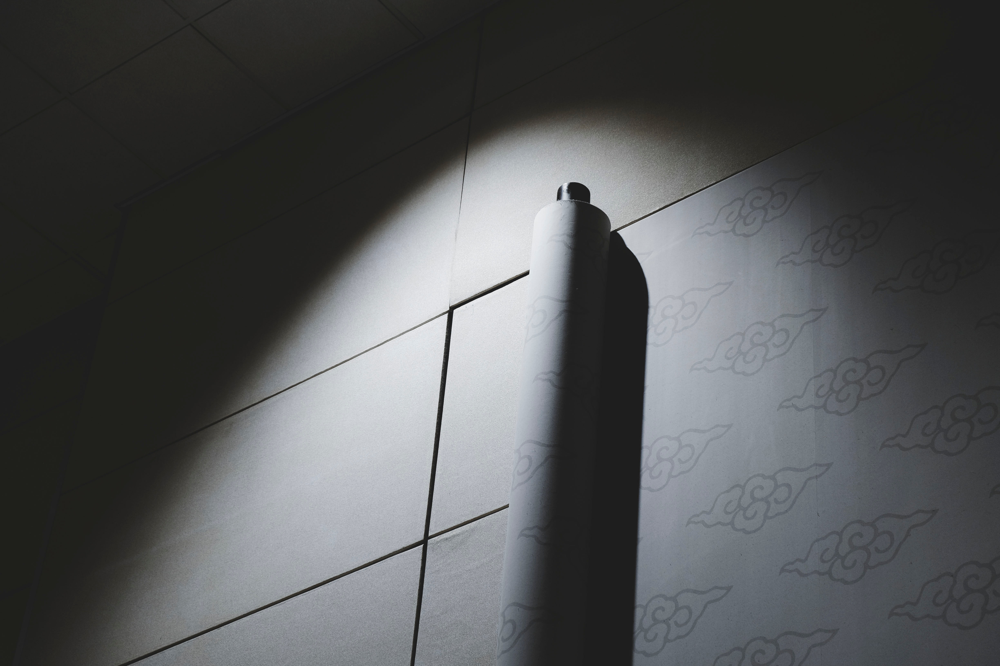
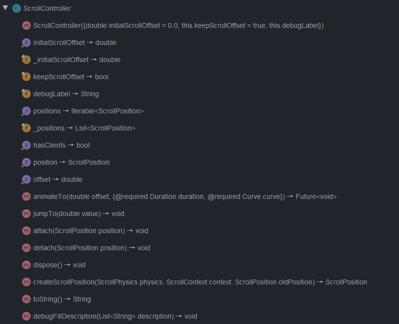
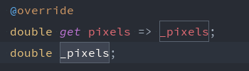
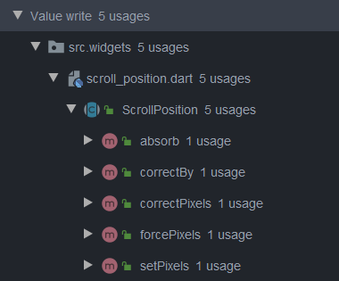
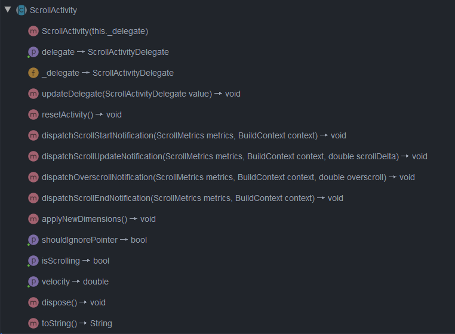
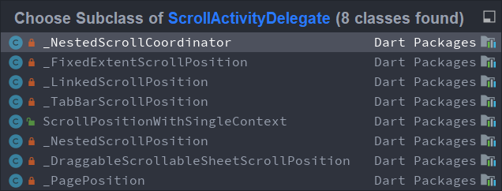
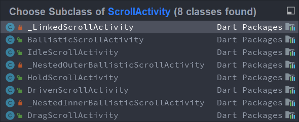

# 滚动三剑客



滚动操作在 UI 交互设计中是不可或缺的，因为我们的显示设备大小毕竟有限，没有办法一次性展示所有的信息，所以只有借助于滚动操作，才可以向用户展示更多的内容。

在 Flutter 中，同样有许多滚动相关的 widget，像 `SingleChildScrollView`、`ListView`  和 `GridView` 等，都是可滚动 widget。它们的使用也很普遍。所以掌握它们的用法是很有必要的。我们比较熟悉的滚动相关类应该非 `ScrollController` 莫属了。那么就从第一位最被人熟知的剑客说起。

## ScrollController

顾名思义，ScrollController 的作用是控制一个可滚动的控件。一个 ScrollController 可以被用于多个可滚动控件，但是当我们通过 `ScrollController#offset` 来获取滚动量时，这时就要求此 ScrollController 只能被一个可滚动控件绑定，否则就会抛出断言异常。

我们首先看一下 ScrollController 的结构。



从上图可以看到，它的方法不多，主要功能就是对外暴露位置接口，其次就是可以通过 `animateTo()` 和 `jumpTo()` 方法设置可滚动控件滚动到指定位置。那么从它的这两个主要使命出发，我们看看它都是怎么实现的。

- `offset`

  `double get offset => position.pixels;`

  offset 是一个 get 方法，真正返回的是 position 的 pixels 成员的值，而这个 position，从上面的结构图里，可以看到它是一个 ScrollPosition 的类型，至于这个 ScrollPosition 类的作用和实现是什么样的，先按下不表，继续往下看。

- `animateTo()` 和 `jumpTo()`

  ```dart
  Future<void> animateTo(
      double offset, {
      @required Duration duration,
      @required Curve curve,
  }) {
      assert(_positions.isNotEmpty, 'ScrollController not attached to any scroll views.');
      final List<Future<void>> animations = List<Future<void>>(_positions.length);
      for (int i = 0; i < _positions.length; i += 1)
          animations[i] = _positions[i].animateTo(offset, duration: duration, curve: curve);
      return Future.wait<void>(animations).then<void>((List<void> _) => null);
  }
  
  void jumpTo(double value) {
      assert(_positions.isNotEmpty, 'ScrollController not attached to any scroll views.');
      for (final ScrollPosition position in List<ScrollPosition>.from(_positions))
          position.jumpTo(value);
  }
  ```

  这两个方法的作用都是滚动到指定的位置，区别就是 `animateTo()` 方法是伴随着动画滚动到目的位置，而 `jumpTo` 方法则不伴随动画，直接跳转到目的位置，它们都借助 ScrollPosition 对象来完成。

可以看到，上面几个方法的实现中，都是使用了 position 的对应方法。那么与位置相关的数据的管理看来都是由 ScrollPosition 类来完成的了。在深入了解 ScrollPosition之前，我们先看看 ScrollPosition 对象是如何创建的。

```dart
ScrollPosition createScrollPosition(
    ScrollPhysics physics,
    ScrollContext context,
    ScrollPosition oldPosition,
) {
    return ScrollPositionWithSingleContext(
        physics: physics,
        context: context,
        initialPixels: initialScrollOffset,
        keepScrollOffset: keepScrollOffset,
        oldPosition: oldPosition,
        debugLabel: debugLabel,
    );
}
```

上面的方法创建了一个 ScrollPositionWithSingleContext 对象，ScrollPositionWithSingleContext 类是 ScrollPosition 的子类，很多的操作都是在它内部实现的。好了，下面我们就来揭开 ScrollPosition 的神秘面纱。

## ScrollPosition

官方文档对它的描述是：决定滚动视图的哪一部分内容是可见的。从上面 ScrollController 也可以知道，滚动视图的滚动位置等属性以及使滚动视图滚动到指定位置等操作都是由 ScrollPosition 完成。那就先分别看看 ScrollController 里的属性获取和操作方法具体是怎么实现的。

- pixels

  ScrollController 的 offset 属性获取的就是 ScrollPosition 的 pixels 值，它指向私有变量 `_pixels`。

  

  _pixels 的值写入的地方有下面几个：

  

  先跳过这一部分，再看看两外两个操作方法。

- `jumpTo()`

  ```dart
  @override
  void jumpTo(double value) {
      goIdle();
      if (pixels != value) {
          final double oldPixels = pixels;
          // 设置当前的滚动像素数
          // （另外，根据上面的图，这个方法会更新 ScrollPosition 的 pixels，
          // 同即 ScroController 的 offset）
          forcePixels(value);
          // 处理位置跳转前的回调
          didStartScroll();
          // 处理位置变化回调
          didUpdateScrollPositionBy(pixels - oldPixels);
          // 处理滚动完成回调
          didEndScroll();
      }
      goBallistic(0.0);
  }
  ```

  `goIdle()` 方法将当前的滚动状态置为闲置。

  ```dart
  @override
  void goIdle() {
      beginActivity(IdleScrollActivity(this));
  }
  ```

  至于状态的管理和设置方法，我们在介绍第三个剑客的时候再接着说。

  而 `goBallistic()` 方法则是处理诸如滚动到最大程度后的回弹等状态。

  ```dart
  @override
  void goBallistic(double velocity) {
      assert(pixels != null);
      final Simulation simulation = physics.createBallisticSimulation(this, velocity);
      if (simulation != null) {
      	beginActivity(BallisticScrollActivity(this, simulation, context.vsync));
      } else {
      	goIdle();
  	}
  }
  ```

- `animateTo()`

  ```dart
  @override
  Future<void> animateTo(
      double to, {
          @required Duration duration,
          @required Curve curve,
      }) {
      // 如果目的位置和现在的位置接近到一个程度，那么直接跳转到目的位置，而不需要再启动动画过程
      if (nearEqual(to, pixels, physics.tolerance.distance)) {
          // Skip the animation, go straight to the position as we are already close.
          jumpTo(to);
          return Future<void>.value();
      }
  
      final DrivenScrollActivity activity = DrivenScrollActivity(
          this,
          from: pixels,
          to: to,
          duration: duration,
          curve: curve,
          vsync: context.vsync,
      );
      beginActivity(activity);
      return activity.done;
  }
  ```

上面可以看到位置的变换最终都是通过 `beginActivity()` 方法保存和更新一系列的滚动状态。这个 ScrollActivity 正是第三位剑客。

## ScrollActivity

照例，我们先来看看这个类的结构。



通过类的结构，我们也可以很清晰地看到这个类地基本功能。它有4个成员变量：`delegate`、`shouldIgnorePointer`、`isScrolling` 和 `velocity`，其中 `delegate` 是 ScrollActivityDelegate 类型，一个虚拟类，它的子类有如下这些，除了第一个，它们又都是类 ScrollPositionWithSingleContext 的子类，而 ScrollPositionWithSingleContext 类又是 ScrollPosition 的子类，所以 `delegate` 就是一个 ScrollPosition 对象。`shouldIgnorePointer` 对象的作用根据文档的翻译一下就是“滚动视图在进行此滚动活动时是否应该忽视触摸事件”。其他两个就很好理解了。



ScrollActivity 是一个抽象类，所以它的真正用法不在于它本身，而在于其子类的定制化，那看看它的子类有哪些。



其中的 IdleScrollActivity 我们在 ScrollPosition 的 `goIdle()` 方法中已经见过，它其实模拟的就是一个没有滚动时的滚动活动，用来标识一个滚动视图闲置的状态。再比如，DrivenScrollActivity（ScrollPosition 的 `animateTo()` 方法创建的就是这个 ScrollActivity），模拟一种动画驱动的滚动状态；HoldScrollActivity 模拟的是没有做任何工作，释放掉后就可转换为 IdelScrollActivity，通常模拟滚动视图已经被触摸但还未被拖拽的状态，等。

## 总结

三剑客大致介绍完了，它们基本是 ScrollController -> ScrollPosition -> ScrollActivity 的一个创建过程，并且在创建过程中持有对方的对象实例。ScrollController 更主要的功能是对用户暴露接口，主要的工作由 ScrollPosition 搭配 ScrollActivity 完成。

梳理了一下这三个滚动相关的重要机制后，我们可以发现，flutter 其实是把滚动过程给抽象成了不同的部分，这三个类只是对滚动过程的一种抽象，真正的滚动和滚动过程中的视图更新和绘制并不由它们负责。