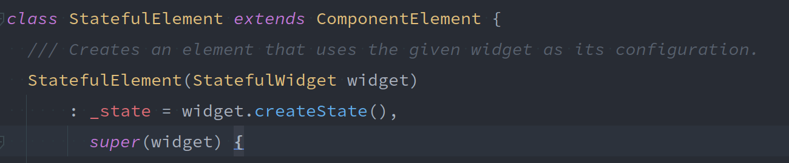
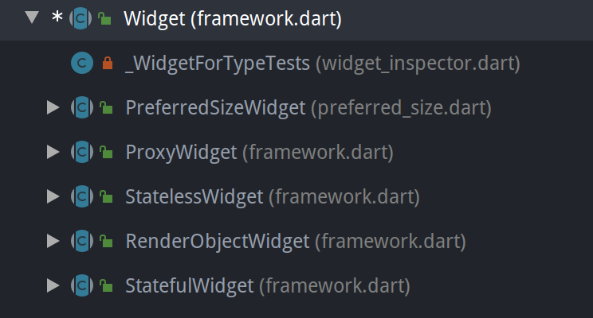

# 背靠大树好乘凉——Flutter 视图渲染机制探究之三棵树


Flutter 在维基百科中的介绍中第一句就是“Flutter is an open-source UI software development kit created by Google”，可见，它是一个以 UI 为主的开发环境，那 UI 就是它的重中之重。那么，作为一个 UI 开发套件，它究竟是如何工作的呢？或者说，它究竟是怎么把我们的代码转化为一个个的界面，渲染在设备的方寸屏幕之上呢？

## 三棵树——视图创建

### Widget 和 Element

试想一下，如果公司的 UI 给了你一个界面，让你完成它，那么你会如何开始？是不是首先确定这是一个静态的（stateless）还是动态的（stateful）页面？如果是静态的，那么自定义一个 StatelessWidget 的子类，然后重写其 `build()` 方法，在 `build()` 方法中，我们只需构造出我们的页面（Widget 对象），然后将其返回方法外即可。如果是动态的，那么需要自定义 StatefulWidget 和 State 的子类，这里先按下不表，后面我们再和它们有一个深入的认识。

那么可想而知，flutter 就是把我们在 `build()` 方法中深耕细作的图形相关的代码拿去画出了形形色色的按钮、文字等这些真实可见的图形，那么它究竟是如何在“神不知鬼不觉”的情况下完成这一切的呢？

我们以 StatelessWidget 的 `build()` 方法为源头出发，看看它创造出来的 widget 到底去了哪里，做了什么。

```dart
/// StatelessElement  
@override
Widget build() => widget.build(this);
```

```dart
/// ComponentElement（StatelessElement 的父类）
@override
void performRebuild() {
    // ...
    Widget built;
    try {
        // ...
        built = build();
        // ...
    } catch (e, stack) {
        _debugDoingBuild = false;
        built = ErrorWidget.builder(
            _debugReportException(
                ErrorDescription('building $this'),
                e,
                stack,
                informationCollector: () sync* {
                    yield DiagnosticsDebugCreator(DebugCreator(this));
                },
            ),
        );
    } finally {
        // ...
    }
    try {
        _child = updateChild(_child, built, slot);
        assert(_child != null);
    } catch (e, stack) {
        built = ErrorWidget.builder(
            _debugReportException(
                ErrorDescription('building $this'),
                e,
                stack,
                informationCollector: () sync* {
                    yield DiagnosticsDebugCreator(DebugCreator(this));
                },
            ),
        );
        _child = updateChild(null, built, slot);
    }

    // ...
}
```

我们创建的 widget 作为参数传递给 `updateChild()` 方法。

```dart
/// Element
@protected
Element updateChild(Element child, Widget newWidget, dynamic newSlot) {
    if (newWidget == null) {
        if (child != null)
            deactivateChild(child);
        return null;
    }
    Element newChild;
    if (child != null) {
        bool hasSameSuperclass = true;
        // ...
        // Widget 和 Element 的类型（Stateless 或 Stateful 等）没有变化且 widget 没有变更
        if (hasSameSuperclass && child.widget == newWidget) {
            if (child.slot != newSlot)
                updateSlotForChild(child, newSlot);
            newChild = child;
        } else if (hasSameSuperclass && Widget.canUpdate(child.widget, newWidget)) {
            /// Widget 和 Element 的类型（Stateless 或 Stateful 等）没有变化
            /// 且新旧 widget 的运行时类型和 key 是相同的（canUpdate() 方法的内容）
            if (child.slot != newSlot)
                updateSlotForChild(child, newSlot);
            child.update(newWidget);
            assert(child.widget == newWidget);
            assert(() {
                child.owner._debugElementWasRebuilt(child);
                return true;
            }());
            newChild = child;
        } else {
            /// 对于刚创建的 widget，因为之前还没有挂载过，所以要走这里先进行挂载
            deactivateChild(child);
            assert(child._parent == null);
            newChild = inflateWidget(newWidget, newSlot);
        }
    } else {
        newChild = inflateWidget(newWidget, newSlot);
    }

    //...

    return newChild;
}
```

上面的方法中我添加了一些注释，所以下面将要进行的就是将我们创建的 widget 挂载到 flutter 已有的视图树上，看看具体操作了些什么：

```dart
/// Element
@protected
Element inflateWidget(Widget newWidget, dynamic newSlot) {
    assert(newWidget != null);
    final Key key = newWidget.key;
    if (key is GlobalKey) {
        final Element newChild = _retakeInactiveElement(key, newWidget);
        if (newChild != null) {
            assert(newChild._parent == null);
            assert(() {
                _debugCheckForCycles(newChild);
                return true;
            }());
            newChild._activateWithParent(this, newSlot);
            final Element updatedChild = updateChild(newChild, newWidget, newSlot);
            assert(newChild == updatedChild);
            return updatedChild;
        }
    }
    /// newWidget 是我们创建的 StatelessWidget 子类，通过参数传递过来，
    /// 这里通过 newWidget 创建了一个 Element类。
    final Element newChild = newWidget.createElement();
    assert(() {
        _debugCheckForCycles(newChild);
        return true;
    }());
    /// 这一步将新创建的 element 挂载到 Element 树上
    newChild.mount(this, newSlot);
    assert(newChild._debugLifecycleState == _ElementLifecycle.active);
    return newChild;
}
```

`mount()` 方法是将创建的 element 挂载到 Element 树上，看方法：

```dart
/// Element
void mount(Element parent, dynamic newSlot) {
    // ...
    _parent = parent;
    _slot = newSlot;
    _depth = _parent != null ? _parent.depth + 1 : 1;
    _active = true;
    if (parent != null) // Only assign ownership if the parent is non-null
        _owner = parent.owner;
    final Key key = widget.key;
    if (key is GlobalKey) {
        key._register(this);
    }
    _updateInheritance();
    // ...
}
```

通过一种类似链式的赋值，将新的 element 链接到树的尾端。但是这里有一个问题，就是新创建的 element 将 `_parent` 变量指向了原 Element 树的末端节点，这仅仅是单向的链，父节点的 `_child` 变量并没有指向新的 element，那么如何向下遍历呢？我们将上面的方法倒着再走一遍，新创建的 element 被返回，那么它又被用来做什么呢？一路向上，看到 ComponentElement 的`performRebuild()` 方法，这里返回的 element 被赋值给父节点的 `_child` 变量，至此，双向链接完成。

还有一个变量需要在这里提前关注一下，就是这个“slot”，到目前为止，它好像一直在伴随着我们走过各个方法，但是好像并没有实际的作用。其实我们后面主要研究的几乎所有方法都能看到它的身影，不过既然暂时没有发挥到它的作用，那我们就先记住有这么个东西，而且赋值给了 Element 的`_slot` 成员，后面在它需要发挥作用的时候，我们会继续介绍这个同行者。

一条完整的 Element 树有了，那这棵树是怎么渲染到屏幕上的呢？我们暂时先不管，继续看看 StatefulWidget 的“种树”过程。

StatefulWidget 和 StatelessWidget 有一点不一样的地方在于，StatefulWidget 的 `build()` 方法是在 State 中的，StatefulWidget 通过 `createState()` 方法创建 State，我们看看调用关系：



可以看到，StatefulElement 持有 State，那明确了这一点之后，再看 State 的 `build()` 方法的调用关系：

```dart
/// StatefulElement
@override
Widget build() => _state.build(this);
```

StatefulElement 和 StatelessElement 一样，同属于 ComponentElement 的子类。所以我们上面看到的 ComponentElement 的 `performRebuild()` 方法调用 `build()` 方法的过程同样适用于它，后面的流程就和 StatelessWidget 一样了。

介绍到这里，我们已经揭开了两棵树的神秘面纱——Widget 树和 Element 树，目前来看，它们是一一对应的。在 Element 类的成员变量中就有一个 Widget 实例 `_widget`，它会在 Element 创建时和调用 `update()` 时被赋值，这也侧面佐证了二者的一一对应关系。那么第三棵树究竟是什么呢？

### RenderObject

我们在 Android studio 里打开 Widget 类的源码，然后打开 Hierarchy（可以双击 Shift 或者使用快捷键 Ctrl + Shift + A 搜索，也可以使用你的快捷键打开），我们看到 Widget 的直接子类有下面几个，我们注意到，除了刚刚已经接触的 StatelessWidget 和 StatefulWidget，还有其他几个陌生的子类。



其中 PreferredSizeWidget 和 ProxyWidget 是对 Widget 某方面需求的简单封装，各拓展了一个属性，所以在一定程度上可以认为等同于 Widget，那还有一个 RenderObjectWidget，这个类是干什么的呢？我们看看它的源码：

```dart
/// RenderObjectWidgets provide the configuration for [RenderObjectElement]s,
/// which wrap [RenderObject]s, which provide the actual rendering of the
/// application.
abstract class RenderObjectWidget extends Widget {
  /// Abstract const constructor. This constructor enables subclasses to provide
  /// const constructors so that they can be used in const expressions.
  const RenderObjectWidget({ Key key }) : super(key: key);

  /// RenderObjectWidgets always inflate to a [RenderObjectElement] subclass.
  @override
  @factory
  RenderObjectElement createElement();

  /// Creates an instance of the [RenderObject] class that this
  /// [RenderObjectWidget] represents, using the configuration described by this
  /// [RenderObjectWidget].
  ///
  /// This method should not do anything with the children of the render object.
  /// That should instead be handled by the method that overrides
  /// [RenderObjectElement.mount] in the object rendered by this object's
  /// [createElement] method. See, for example,
  /// [SingleChildRenderObjectElement.mount].
  @protected
  @factory
  RenderObject createRenderObject(BuildContext context);

  /// Copies the configuration described by this [RenderObjectWidget] to the
  /// given [RenderObject], which will be of the same type as returned by this
  /// object's [createRenderObject].
  ///
  /// This method should not do anything to update the children of the render
  /// object. That should instead be handled by the method that overrides
  /// [RenderObjectElement.update] in the object rendered by this object's
  /// [createElement] method. See, for example,
  /// [SingleChildRenderObjectElement.update].
  @protected
  void updateRenderObject(BuildContext context, covariant RenderObject renderObject) { }

  /// A render object previously associated with this widget has been removed
  /// from the tree. The given [RenderObject] will be of the same type as
  /// returned by this object's [createRenderObject].
  @protected
  void didUnmountRenderObject(covariant RenderObject renderObject) { }
}
```

可以看到，相比于 StatelessWidget 和 StatefulWidget，它多了三个方法，分别是 `createRenderObject()`、`updateRenderObject()` 和 `didUnmountRenderObject()`，我们先研究创建的过程。

RenderObjectElement 的 `mount()` 方法调用了 `createRenderObject()` 方法（这里可以看到对于 RenderObjectWidget，同样有 RenderObjectElement 与之对应）：

```dart
/// RenderObjectElement
@override
void mount(Element parent, dynamic newSlot) {
    super.mount(parent, newSlot);
    // ...
    _renderObject = widget.createRenderObject(this);
    // ...
    attachRenderObject(newSlot);
    _dirty = false;
}
```

创建的 RenderObject 对象赋值给 `_renderObject` 对象存储起来，紧接着执行 `attachRenderObject()` 方法：

```dart
/// RenderObjectElement
@override
void attachRenderObject(dynamic newSlot) {
    assert(_ancestorRenderObjectElement == null);
    _slot = newSlot;
    _ancestorRenderObjectElement = _findAncestorRenderObjectElement();
    _ancestorRenderObjectElement?.insertRenderObjectChild(renderObject, newSlot);
    final ParentDataElement<ParentData> parentDataElement = _findAncestorParentDataElement();
    if (parentDataElement != null)
        _updateParentData(parentDataElement.widget);
}
```

`_findAncestorRenderObjectElement()` 方法的作用是向上寻找第一个 RenderObjectElement 对象的实例：

```dart
/// RenderObjectElement
RenderObjectElement _findAncestorRenderObjectElement() {
    Element ancestor = _parent;
    while (ancestor != null && ancestor is! RenderObjectElement)
        ancestor = ancestor._parent;
    return ancestor as RenderObjectElement;
}
```

这里我们就可以知道一点，RenderObject 并不和 Element 树一一对应，也就不和 Widget 树对应了，我们可以这样理解，我们创建的 StatelessWidget 和 StatefulWidget 更大程度上是一个容器，它们并不是实际的可见的视图元素，而只是对一组可见的视图元素的排列组合，规定了排列位置和大小等，所以它们并不需要实际渲染出来，而那些继承了 RenderObjectWidget 的 widget 才是需要渲染的，也才会在 RenderObject 树上有与之相对应的节点。

好了，言归正传，然后调用第一个 RenderObjectElement 祖先的 `insertRenderObjectChild()` 方法，该方法现在以重写的方式实现，那么我们看两个比较常用的 RenderObjectElement 的子类——SingleChildRenderObjectElement 和 MultiChildRenderObjectElement 的实现。首先是 SingleChildRenderObjectElement：

```dart
/// SingleChildRenderObjectElement
@override
void insertRenderObjectChild(RenderObject child, dynamic slot) {
    final RenderObjectWithChildMixin<RenderObject> renderObject = this.renderObject as RenderObjectWithChildMixin<RenderObject>;
    assert(slot == null);
    assert(renderObject.debugValidateChild(child));
    renderObject.child = child;
    assert(renderObject == this.renderObject);
}
```

需要注意的是，这里的“this”是第一个 RenderObjectElement 类型的祖先，所以 `this.renderObject` 也是祖先（父）RenderObject，child 则是我们创建的 RenderObject 实例。通过给 RenderObject 的 child 成员赋值实现前面和 Element 一样的链接。

而在 MultiChildRenderObjectElement 的方法中，则通过 ContainerRenderObjectMixin 这个 mixin 来进行插入操作：

```dart
/// MultiChildRenderObjectElement
@override
void insertRenderObjectChild(RenderObject child, IndexedSlot<Element> slot) {
    final ContainerRenderObjectMixin<RenderObject, ContainerParentDataMixin<RenderObject>> renderObject =
        this.renderObject as ContainerRenderObjectMixin<RenderObject, ContainerParentDataMixin<RenderObject>>;
    assert(renderObject.debugValidateChild(child));
    renderObject.insert(child, after: slot?.value?.renderObject);
    assert(renderObject == this.renderObject);
}
 
/// ContainerRenderObjectMixin 实际上就是 RenderObject
mixin ContainerRenderObjectMixin<ChildType extends RenderObject, ParentDataType extends ContainerParentDataMixin<ChildType>> on RenderObject {
	/// ...   
}
```

这里的关键代码是 `renderObject.insert(child, after: slot?.value?.renderObject)`，但是在理解 `insert()` 方法的实现之前，我们要先搞清楚传递的第二个参数 `after: slot?.value?.renderObject` 到底是神么。Slot 我们在上面也提醒读者要对它保留一点印象，因为它真的跟着我们走了一路。一路走来，它神秘又低调，但现在，它不再低调，因为它终于要发挥它的作用了，随着我们对它的研究，它也终将不再神秘。我们首先看 Element 类对它的注释：

```dart
/// Information set by parent to define where this child fits in its parent's
/// child list.
///
/// Subclasses of Element that only have one child should use null for
/// the slot for that child.
dynamic get slot => _slot;
dynamic _slot;
```

哦，孩子的父节点用来判断孩子的位置的，之所以强调“孩子的”，是为了表明它是存储在孩子的对象空间中的，用来找到相对于父节点来说孩子的合适位置。那这么听来，父节点应该有不止一个孩子喽，不然一个位置哪有什么合适和不合适之说呢。确实如此，对于单孩子的节点来说，这个变量一般为 null，对于多孩子的节点，这个变量才变得有意义。

上溯到 MultiChildRenderObjectElement 的 `mount()` 方法：

```dart
/// MultiChildRenderObjectElement
@override
void mount(Element parent, dynamic newSlot) {
    super.mount(parent, newSlot);
    _children = List<Element>(widget.children.length);
    Element previousChild;
    for (int i = 0; i < _children.length; i += 1) {
        final Element newChild = inflateWidget(widget.children[i], IndexedSlot<Element>(i, previousChild));
        _children[i] = newChild;
        previousChild = newChild;
    }
}

@protected
Element inflateWidget(Widget newWidget, dynamic newSlot) {
    // ...
    newChild.mount(this, newSlot);
    // ...
    return newChild;
}

@immutable
class IndexedSlot<T> {
  /// Creates an [IndexedSlot] with the provided [index] and slot [value].
  const IndexedSlot(this.index, this.value);

  /// Information to define where the child occupying this slot fits in its
  /// parent's child list.
  final T value;

  /// The index of this slot in the parent's child list.
  final int index;
 
  /// ...
}
```

Slot 就是 `IndexedSlot<Element>(i, previousChild)` 了，它的 `value` 指向上一个兄弟节点。那么 `after` 就是 `child` 的上一个兄弟RenderObject，明确了这一点，我们就可以继续往下看`renderObject.insert()` 方法的实现了：

```dart
/// ContainerRenderObjectMixin
ChildType? _firstChild;
ChildType? _lastChild;
/// [child] 新创建的 RenderObject 类，
/// [after] 新创建的 RenderObject 需要插入其后的父节点
void _insertIntoChildList(ChildType child, { ChildType? after }) {
    final ParentDataType childParentData = child.parentData as ParentDataType;
    // ...
    _childCount += 1;
    assert(_childCount > 0);
    if (after == null) {
        // insert at the start (_firstChild)
        childParentData.nextSibling = _firstChild;
        if (_firstChild != null) {
            final ParentDataType _firstChildParentData = _firstChild!.parentData as ParentDataType;
            _firstChildParentData.previousSibling = child;
        }
        _firstChild = child;
        _lastChild ??= child;
    } else {
        // ...
        final ParentDataType afterParentData = after.parentData as ParentDataType;
        if (afterParentData.nextSibling == null) {
            // insert at the end (_lastChild); we'll end up with two or more children
            assert(after == _lastChild);
            childParentData.previousSibling = after;
            afterParentData.nextSibling = child;
            _lastChild = child;
        } else {
            // insert in the middle; we'll end up with three or more children
            // set up links from child to siblings
            childParentData.nextSibling = afterParentData.nextSibling;
            childParentData.previousSibling = after;
            // set up links from siblings to child
            final ParentDataType childPreviousSiblingParentData = childParentData.previousSibling!.parentData as ParentDataType;
            final ParentDataType childNextSiblingParentData = childParentData.nextSibling!.parentData as ParentDataType;
            childPreviousSiblingParentData.nextSibling = child;
            childNextSiblingParentData.previousSibling = child;
            assert(afterParentData.nextSibling == child);
        }
    }
}
```

这里的代码逻辑就很清晰了，将多个孩子以及兄弟关系都清楚地链接起来，RenderObject 的树就是在这样的开枝散叶中成长起来的。

## 欣欣向荣——视图更新

我们上面探究了创建三棵树的节点并插入到树中的过程，正是在这种机制的保证下，我们的三棵树才得以茁壮成长，我们也才得以凭借我们自己的代码创造出我们自己的参天大树。但是为了保证大树的欣欣向荣，我们就要修剪枯枝，将空间和养分留给新芽。所以对于那些已经过时的或者状态已经不再正确的“树枝”和“树叶”，我们要如何更新它们呢？

通常我们在 State 中使用`setState()` 方法来进行 StatefulWidget 的更新，那么我们就从这个方法入手，研究在我们手动调用了这个方法之后，Flutter 到底做了那些事。

```dart
/// State
@protected
void setState(VoidCallback fn) {
    assert(fn != null);
    // ...
    final dynamic result = fn() as dynamic;
    // ...
    _element.markNeedsBuild();
}
```

`setState()` 方法中传入的回调函数会首先被执行，接着会将 StatefulWidget 对应的 StatefulElement 标记为需要重新构建。

```dart
/// Element
void markNeedsBuild() {
    // ...
    if (dirty)
        return;
    _dirty = true;
    owner.scheduleBuildFor(this);
}
```

接着，将 `_dirty` 属性修改为 true，这个变量用来标识此 element 是否需要重新构建，然后调用 BuildOwner 的 `scheduleBuildFor()` 方法。这里先简要地介绍一下 BuildOwner 这个类，老规矩还是看一下官方的注释：

> Manager class for the widgets framework.
>
> This class tracks which widgets need rebuilding, and handles other tasks that apply to widget trees as a whole, such as managing the inactive element list for the tree and triggering the "reassemble" command when necessary during hot reload when debugging.
> 
> The main build owner is typically owned by the [WidgetsBinding], and is driven from the operating system along with the rest  of the build/layout/paint pipeline.
> 
>Additional build owners can be built to manage off-screen widget trees.
> 
> To assign a build owner to a tree, use the [RootRenderObjectElement.assignOwner] method on the root element of the widget tree.

可见，这个类是用来管理视图框架的一些诸如 rebuild、inactive 状态等功能的。它会在 WidgetBinding 中创建并赋予给根节点，然后根据视图树向下传递给每一个节点，所以在整棵视图树中，它的实例只有一个。更多相关的知识点大家可以自己研究。

回到 `scheduleBuildFor()` 方法：

```dart
/// BuildOwner

/// Adds an element to the dirty elements list so that it will be rebuilt
/// when [WidgetsBinding.drawFrame] calls [buildScope].
void scheduleBuildFor(Element element) {
    // ...
    if (element._inDirtyList) {
        // ...
        _dirtyElementsNeedsResorting = true;
        return;
    }
    // 当还没有安排刷新脏数据时就给安排上
    // 如果当前处于两个刷新帧之间，这个方法最终会调用 [window.scheduleFrame]方法，为下一帧做准备
    if (!_scheduledFlushDirtyElements && onBuildScheduled != null) {
        _scheduledFlushDirtyElements = true;
        onBuildScheduled();
    }
    _dirtyElements.add(element);
    element._inDirtyList = true;
    // ...
}
```

通过 `_dirtyElements.add(element)` 将所有需要更新的节点登记在册之后，在接收到下一个 Vsync 信号进行视图刷新的时候，就会对这些脏节点按照在树的深度排序进行依次刷新。这些都在 `WidgetsBinding.drawFrame()` 方法中完成，但我们暂时不进入这个方法详细研究，我们看它的调用方法：

```dart
void buildScope(Element context, [ VoidCallback callback ]) {
    // ...
    Timeline.startSync('Build', arguments: timelineArgumentsIndicatingLandmarkEvent);
    try {
      _scheduledFlushDirtyElements = true;
      // ...
      _dirtyElements.sort(Element._sort);
      _dirtyElementsNeedsResorting = false;
      int dirtyCount = _dirtyElements.length;
      int index = 0;
      while (index < dirtyCount) {
        // ...
        try {
          _dirtyElements[index].rebuild();
        } catch (e, stack) {
          // ...
        }
        index += 1;
        if (dirtyCount < _dirtyElements.length || _dirtyElementsNeedsResorting) {
          _dirtyElements.sort(Element._sort);
          _dirtyElementsNeedsResorting = false;
          dirtyCount = _dirtyElements.length;
          while (index > 0 && _dirtyElements[index - 1].dirty) {
            // It is possible for previously dirty but inactive widgets to move right in the list.
            // We therefore have to move the index left in the list to account for this.
            // We don't know how many could have moved. However, we do know that the only possible
            // change to the list is that nodes that were previously to the left of the index have
            // now moved to be to the right of the right-most cleaned node, and we do know that
            // all the clean nodes were to the left of the index. So we move the index left
            // until just after the right-most clean node.
            index -= 1;
          }
        }
      }
      // ...
    } finally {
      for (final Element element in _dirtyElements) {
        assert(element._inDirtyList);
        element._inDirtyList = false;
      }
      _dirtyElements.clear();
      _scheduledFlushDirtyElements = false;
      _dirtyElementsNeedsResorting = null;
      Timeline.finishSync();
      // ...
    }
    // ...
  }
```

对前面登记在册的脏节点进行遍历，然后依次调用它们的 `rebuild()` 方法，而且在执行完 `build()` 方法后，为了防止视图树产生变化，在必要时需要对视图树进行重新排序。在最后，再清空所有的登记的脏节点。

`rebuild()` 方法中调用的是 `performRebuild()` 方法，这里就又回到了文章开始的地方，会在这里通过调用 Widget  的 `build()` 方法创建 widget，这也就是为什么我们在手动调用 `setState()` 方法后，`build()` 方法会被重新执行的原因。不过需要注意的是，在 `updateChild()` 方法中，因为此时的 element 可能已经对应了 widget，所以不会再重新挂载 widget 树，而只是对 widget 节点做更新操作。

上面我们也提到，只有 RenderObjectElement 才会有对应的 RenderObject 对象，RenderObjectElement 的 `performRebuild()` 方法会对对应的脏的 renderObject 进行更新，具体更新逻辑由 RenderObjectWidget 的子类实现：

```dart
@override
void performRebuild() {
    // ..
    widget.updateRenderObject(this, renderObject);
    // ..
    _dirty = false;
}
```

这样，三棵树的更新就全都覆盖到了，正是在这样的机制下，三棵树才能剪掉坏枝叶，健康茁壮成长。

## 写在最后（废话可跳过）

今天这篇文章主要从常用方法入手研究了 Widget 的三棵树以及三棵树的更新机制，篇幅所限，还有很多的问题暂时都还没有深入到，比如我们上面遗留的问题：RenderObject 树已经形成了，那么它是如何渲染成画面的？更多的问题，我们会再以一个篇幅继续一起探究。上面的所有文章内容我事先也并不是很了解，也是边写边看源码摸索，而且自知功力有限，所以有很多逻辑不严谨和疏漏的地方，那如果有误的地方，欢迎雅正，帮助我这个敲代码的小学生进步，感谢。