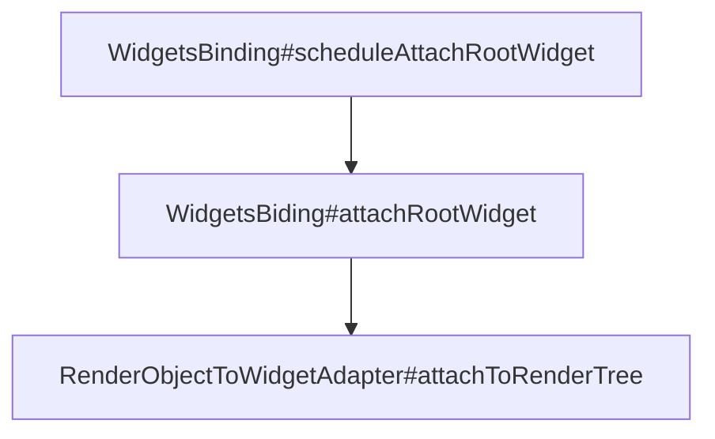
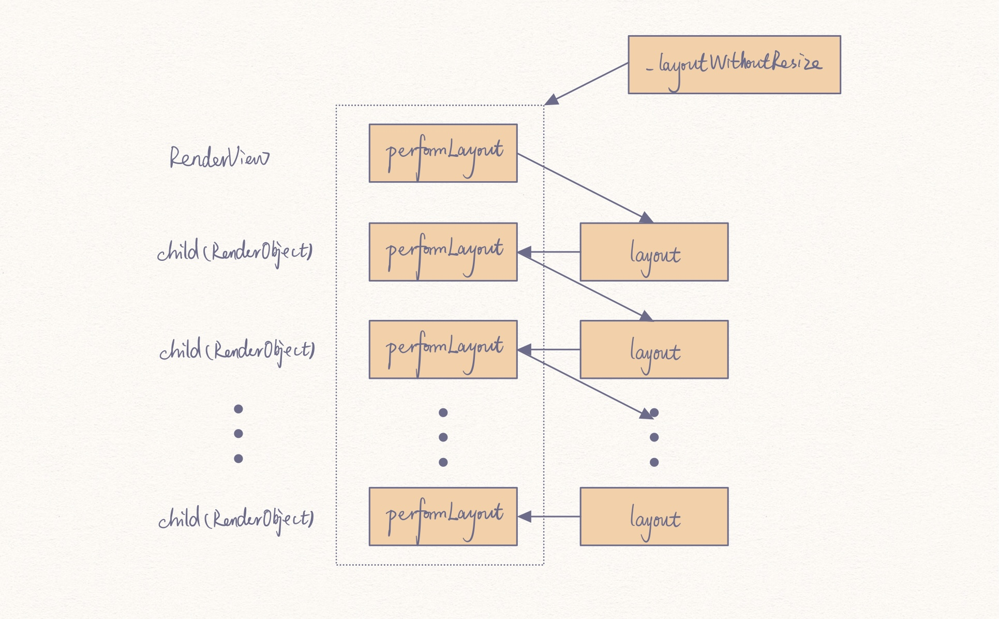
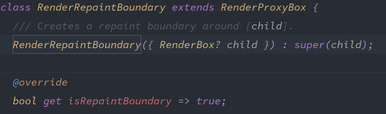

上篇文章[《背靠大树好乘凉》](背靠大树好乘凉.md)探究了 Flutter 在渲染过程中创建的三棵树，它们分别是 Widget 树、Element 树和 RenderObject 树。但是渲染过程可不只是这三棵树在发挥着作用，还有很多其他的知识点我们没有涉及到，这篇文章我们继续讨论。

## 提出问题

我们首先罗列出上篇文章中我们没有解释的以及延伸上篇文章后的新产生一些问题：

- 既然 RenderObject 是真正的渲染对象，那么为什么还需要 Element 呢？那为什么更多弄了个什么 Widget 呢？一个 RenderObject 直接创建渲染不是很好吗？
- RenderObject 树才是 Flutter 的渲染树，那在 RenderObject 树创建完成后如何对树进行渲染呢？
- 上篇文章中又提到只有继承自 RenderObjectWidget 的类才是需要渲染的类，那类似于 Container 等一些类，它们继承自 StatelessWidget 或 StatefulWidget，它们的诸如背景颜色等的属性又是如何渲染到屏幕上的？

带着这些问题，开始我们今天的探索之旅。首先从 RenderObject 树的渲染开始。

## 视图渲染

### 帧回调

在讨论渲染机制之前，我们先回想我们的 Flutter 工程，第一行代码一般是这样的：

```dart
void main() {
  runApp(MyApp());
}
```

这行代码虽然是模板生成的，但是它是我们应用的开始，我们思考一个问题，这个方法到底做了什么？

`MyApp()` 是我们自定义 Widget 的根 Widget，那我们就从这个方法出发，看一看 Flutter 究竟是如何渲染和绘制的。

```dart
void runApp(Widget app) {
  WidgetsFlutterBinding.ensureInitialized()
    ..scheduleAttachRootWidget(app)
    ..scheduleWarmUpFrame();
}
```

首先通过 `ensureInitialized()` 获取 WidgetsFlutterBinding 的单例，然后通过如下调用链将 Element 和 Widget 绑定，这部分内容我们上篇文章已经讨论过，不是我们今天这篇文章需要讨论的内容。



我们接着看下面的 `scheduleWarmUpFrame()` 方法。

```dart
void scheduleWarmUpFrame() {
    // ...
    
    // We use timers here to ensure that microtasks flush in between.
    Timer.run(() {
        assert(_warmUpFrame);
        handleBeginFrame(null);
    });
    Timer.run(() {
        assert(_warmUpFrame);
        handleDrawFrame();
        // ...
    });

    // ...
}
```

`handleBeginFrame()` 和 `handleDrawFrame()` 方法分别被 Flutter engine 调用，分别在新的帧产生前的准备阶段以及新的帧的产生阶段，是一个时序上的差异。在这之前，我们先了解一下 FrameCallback，在 Flutter 中（具体在 SchedulerBinding 类中）有三个 FrameCallback 的队列——`transientCallbacks`、`persistentCallbacks` 以及 `postFrameCallbacks`，它们分别在不同的时机被执行。`transientCallbacks` 正是在 `handleBeginFrame()` 方法中被执行，而 `persistentCallbacks` 和 `postFrameCallbacks` 则是在 `handleDrawFrame()` 方法中被执行。它们的作用分别如下：

1. `transientCallbacks`：用于存放一些临时回调，一般存放动画回调。可以通过`SchedulerBinding.instance.scheduleFrameCallback` 添加回调。
2. `persistentCallbacks`：用于存放一些持久的回调，不能在此类回调中再请求新的绘制帧，持久回调一经注册则不能移除。`SchedulerBinding.instance.addPersitentFrameCallback()`，这个回调中处理了布局与绘制工作。
3. `postFrameCallbacks`：在Frame结束时只会被调用一次，调用后会被系统移除，可由 `SchedulerBinding.instance.addPostFrameCallback()` 注册，注意，不要在此类回调中再触发新的Frame，这可以会导致循环刷新。

说到这，我们不妨来回忆一下，假如我们有在视图渲染完成后执行某些命令（如刷新视图操作）的需求，我们的做法是什么。是不是通常会使用 `WidgetsBinding.instance.addPostFrameCallback()` 这个方法来等效实现，WidgetsBinding 正是 SchedulerBinding 的实现，所以这个方法其实是借助帧的完成来实现需求的。因为该回调在调用一次后会被移除，所以也免了我们的后顾之忧。

### 绘制

在成为敲 Flutter 的小学生之前，我是一个敲 Android 的小学生，所以说到界面绘制，首先想到的就是那脍炙人口的三个流程——measure、layout  和 draw，那在 Flutter 中，绘制到底是怎么完成的呢？当我们讨论 Flutter 视图渲染的时候，真正讨论的其实是 RenderObject 的渲染，当我在 Android studio 中查看 RenderObject 的 structure 时（一般默认快捷键是`alt + 7`），看到了 RenderObject 也有一个 layout 方法，然后通过如下的调用链定位到了 PipelineOwner 这个类。


PipelineOwner 管理着渲染的通道，它提供了驱动绘制通道的接口，并存储了 RenderObject 在其各个时期都需要访问的状态。如果需要刷新绘制通道，需依次执行下面几个方法：

- `flushLayout()` 更新任何需要更新其布局的 RenderObject，在这个阶段，所有 RenderObject 的尺寸和布局都已被计算过，但它们的状态可能已被标记为「dirty」，需要重新绘制。
- `flushCompositingBits()` 更新任何 `needsCompositing` 变量被标记为 true 的 RenderObject。在此阶段，每个 RenderObject 都获悉它的孩子们是否需要重新组合，此信息被用于在绘制时期选择如何实现视觉效果（如裁剪）。如果某个 RenderObject 有组合的孩子，则需要使用「Layer」来创建裁剪以使其裁剪可以用于其组合的孩子（裁剪将被绘制进孩子自己的 Layer）。
- `flushPaint()` 访问任何需要被更新的 RenderObject。在这个阶段，RenderObject 有机会将绘制命令记录进 PictureLayer 中并且构造其他的 Layer。
- `flushSemantics()` 如果 semantic 被启用，这个方法将为 RenderObject 整合 semantic，semantic 一般用于语义反馈（如帮助视障人士的屏幕阅读功能，更多相关信息还请自行搜索相关资料）。

那我们就首先从 `flushLayout()` 方法看起：

```dart
/// PipelineOwner
void flushLayout() {
    // ...
    try {
        // TODO(ianh): assert that we're not allowing previously dirty nodes to redirty themselves
        while (_nodesNeedingLayout.isNotEmpty) {
            final List<RenderObject> dirtyNodes = _nodesNeedingLayout;
            _nodesNeedingLayout = <RenderObject>[];
            for (final RenderObject node in dirtyNodes..sort((RenderObject a, RenderObject b) => a.depth - b.depth)) {
                if (node._needsLayout && node.owner == this)
                    node._layoutWithoutResize();
            }
        }
    } finally {
        // ...
    }
}
```

在这个方法中，通过对 `_nodesNeedingLayout` 这个列表进行遍历，然后调用其 `_layoutWithoutResize()` 方法。我们在这里稍作停留，暂且不管这个方法，`_nodesNeedingLayout` 这个队列通过调用 RenderObject 的 `markNeedsLayout()` 方法，将 RenderObject 对象加入队列，以待重新 layout。

在上篇中我们知道，RenderObject 会通过调用 `insert()` 方法来插入对象成树的，而在 `insert()` 方法中会执行 `adoptChild()` 方法，我们看看代码：

```dart
/// RenderObject
@override
void adoptChild(RenderObject child) {
    assert(_debugCanPerformMutations);
    assert(child != null);
    setupParentData(child);
    markNeedsLayout();
    markNeedsCompositingBitsUpdate();
    markNeedsSemanticsUpdate();
    super.adoptChild(child);
}
```

此方法中则执行了 `markNeedsLayout()` 方法，即在 RenderObject 刚刚插入树的时候即被标记为需要重新布局。而 `markNeedLayout()` 方法同样会在 RenderObject 的各个实现中在适当的时机被调用（如尺寸位置等发生变化等），
`markNeedsCompositingBitsUpdate()` 和 `markNeesPaint()` 亦是同理。所以**当这些「脏节点」被标记完成之后，在下一个帧同步的信号到来时，会调用  RendererBinding 的 `drawFrame()` 方法从而使 `flushLayout()`、`flushCompositingBits()` 和、`flushPaint()` 和 `flushSemantics()` 依次得以执行。而这些方法的执行又会最终使得 RenderObject 的 layout 和 paint 等机制得以实现。**这就是 RenderObject 的渲染机制的主要流程了。下面我们继续向下看看它的实现细节。

#### layout

在 `flushLayout()` 中，会遍历脏节点，然后依次执行其 `_layoutWithoutResize()` 方法，然后该方法会执行 `performLayout()` 方法，该方法在 RenderObject 类中未实现，被 RenderObject 的子类实现，而其子类实现中基本会调用其孩子的 `layout()` 方法，`layout()` 方法通过向下传递 Constraints 对象参数，对孩子节点进行尺寸约束（`layout()` 方法会调用 `performResize()` 方法进行尺寸设置 ）。`layout()` 方法再调用同对象的 `performLayout()` 方法……依次形成如下的一个调用逻辑（RenderView 是 RenderObject 树的根节点，该类没有 `layout()` 方法）。



#### composite

检查 RenderObject 是否需要重绘，然后更新 `RenderObject.needsCompositing` 属性，如果该属性值被标记为`true`则需要重绘。

#### paint

`flushPaint()` 方法和 `flushLayout()` 方法类似，也是会遍历之前被 `markNeedsPaint()` 方法标记为脏的节点，依次将节点 RenderObject 传入PaintingContext 的 `repaintCompositedChild()` 方法中作为参数。

```dart
/// PipelineOwner
void flushPaint() {
    // ...
    try {
        final List<RenderObject> dirtyNodes = _nodesNeedingPaint;
        _nodesNeedingPaint = <RenderObject>[];
        // Sort the dirty nodes in reverse order (deepest first).
        for (final RenderObject node in dirtyNodes..sort((RenderObject a, RenderObject b) => b.depth - a.depth)) {
            assert(node._layer != null);
            if (node._needsPaint && node.owner == this) {
                if (node._layer!.attached) {
                    PaintingContext.repaintCompositedChild(node);
                } else {
                    node._skippedPaintingOnLayer();
                }
            }
        }
        assert(_nodesNeedingPaint.isEmpty);
    } finally {
        // ...
    }
}
```

PaintingContext 类持有 Canvas 实例，`repaintCompositedChild()` 方法在调用 RenderObject 类的 `_paintWithContext()` 方法时，会将自己的实例作为参数传入，这样，在接下来执行 `paint()` 方法时，其实例能够被 RenderObject 的子类在 `paint()` 方法的实现中获取，从而进行绘制。我们看一个 `paint()` 方法实现的例子，实现于类 _RenderRadio：

```dart
/// _RenderRadio
@override
void paint(PaintingContext context, Offset offset) {
    final Canvas canvas = context.canvas;

    paintRadialReaction(canvas, offset, size.center(Offset.zero));

    final Offset center = (offset & size).center;
    final Color radioColor = onChanged != null ? activeColor : inactiveColor;

    // Outer circle
    final Paint paint = Paint()
        ..color = Color.lerp(inactiveColor, radioColor, position.value)
        ..style = PaintingStyle.stroke
        ..strokeWidth = 2.0;
    canvas.drawCircle(center, _kOuterRadius, paint);

    // Inner circle
    if (!position.isDismissed) {
        paint.style = PaintingStyle.fill;
        canvas.drawCircle(center, _kInnerRadius * position.value, paint);
    }
}
```

### 什么？还有第四棵树？！

#### RepaintBoundary

上面我们说过，`markNeedsPaint()` 方法用来标记是否需要重绘，但并没有查看此方法的实现，现在我们来看看它的源码：

```dart
/// RenderObject
void markNeedsPaint() {
    assert(owner == null || !owner!.debugDoingPaint);
    if (_needsPaint)
        return;
    _needsPaint = true;
    if (isRepaintBoundary) {
        // ...
        if (owner != null) {
            owner!._nodesNeedingPaint.add(this);
            owner!.requestVisualUpdate();
        }
    } else if (parent is RenderObject) {
        final RenderObject parent = this.parent as RenderObject;
        parent.markNeedsPaint();
        assert(parent == this.parent);
    } else {
        // ...
        // If we're the root of the render tree (probably a RenderView),
        // then we have to paint ourselves, since nobody else can paint
        // us. We don't add ourselves to _nodesNeedingPaint in this
        // case, because the root is always told to paint regardless.
        if (owner != null)
            owner!.requestVisualUpdate();
    }
}
```

这里有一个 `isRepaintBoundary()` 变量，代码中显示，当此变量为 `false` 且父节点是 RenderObject 类型时，父节点也会被标记为需要重绘，那如果我们的视图树很庞大，我们希望每次重绘只重绘其中的某一小部分，那么该如何处理？

官方对这个变量的解释是「此 RenderObject 是否需要和它的 parent 分开重绘」。假如此变量为 `true`，那么 `markNeedsPaint()` 方法中就不会执行父节点（RenderObject）的标记重绘方法，那么在重绘时就能将进度阻截在某一个小范围内。

那这个变量如何设置其值为 `true` 呢？在使用 CustomPaint 这个控件的时候，我们可能在某些博客或者文章中看到推荐在其外面再包裹一个 RepaintBoundary 控件用于避免一些不需要的重绘操作。RepaintBoundary 继承自 SingleChildRenderObjectWidget 类，因此它必实现了 `createRenderObject()` 方法，下面是其实现：

```dart
@override
RenderRepaintBoundary createRenderObject(BuildContext context) => RenderRepaintBoundary();
```

RenderRepaintBoundary 是 RenderObject 的一个子类，而它的 `isRepaintBoundary` 变量的值正是为 `true`，所以如果需要达到上面部分重绘的目的，那么我们就可以使用这个控件来帮助我们实现。



### Layer

如果你以前接触过某些游戏框架的话，那么应该对 Layer 不陌生，可以把它理解成一张画纸，所有的控件都是画在这张「画纸」上的。那为了对所有的控件有一个整理，应该将它们画在不同的「画纸」上，便于做一些统一的操作，比如一次性更新一张「画纸」上的所有控件。没错，这个 Layer 也有一棵树，它就是所谓的「第四棵树」。

Layer 一般可分为 ContainerLayer  和其他 Layer，ContainerLayer 具备子节点，它又有如下子类：

- 位移类（OffsetLayer/TransformLayer）;
- 透明类（OpacityLayer）
- 裁剪类（ClipRectLayer/ClipRRectLayer/ClipPathLayer);
- 阴影类 (PhysicalModelLayer)

PaintingContext 的 `paintChild()` 方法被 RenderObject 的子类调用以绘制孩子节点：

```dart
/// PaintingContext
void paintChild(RenderObject child, Offset offset) {
    // ...

    if (child.isRepaintBoundary) {
        stopRecordingIfNeeded();
        _compositeChild(child, offset);
    } else {
        child._paintWithContext(this, offset);
    }

    // ...
}
```

当孩子节点的 `isRepaintBoundary` 属性值为 `true` 时，不会再执行孩子节点的 `_paintWithContext()` 方法进行绘制，而是会调用 `_compositeChild()` 方法创建新的 Layer 并追加到原来的 Layer 树中。

```dart
/// PaintingContext
void _compositeChild(RenderObject child, Offset offset) {
    // ...
    final OffsetLayer childOffsetLayer = child._layer as OffsetLayer;
    childOffsetLayer.offset = offset;
    appendLayer(child._layer!);
}

/// PaintingContext
@protected
void appendLayer(Layer layer) {
    assert(!_isRecording);
    layer.remove();
    _containerLayer.append(layer);
}

/// ContainerLayer
void append(Layer child) {
    // ...
    adoptChild(child);
    child._previousSibling = lastChild;
    if (lastChild != null)
        lastChild!._nextSibling = child;
    _lastChild = child;
    _firstChild ??= child;
    assert(child.attached == attached);
}
```

Container 的 `append()` 方法中的代码是不是有点眼熟？对，在上篇文章介绍 MultiChildRenderObjectElement 的孩子节点插入操作时，其 `_insertIntoChildList()` 方法也是类似的双链绑定操作。所以，与其说 Layer 树，倒不如说 Layer 链。

Layer 成链后，如果需要物尽其用，那么应该找到能够处理它的下家。

每个 RenderObject 对象都有一个绑定的 `layer` 对象，在 RendererBinding 的 `drawFrame()` 方法中，会执行 RenderView 对象的 `compositeFrame()` 方法：

```dart
/// RenderView
void compositeFrame() {
    Timeline.startSync('Compositing', arguments: timelineArgumentsIndicatingLandmarkEvent);
    try {
        final ui.SceneBuilder builder = ui.SceneBuilder();
        final ui.Scene scene = layer!.buildScene(builder);
        if (automaticSystemUiAdjustment)
            _updateSystemChrome();
        _window.render(scene);
        scene.dispose();
        // ...
    } finally {
        Timeline.finishSync();
    }
}
```

这里又接触到了一个新的类 Scene（是不是越来越觉得像某些游戏框架的设定），它是一个 native 类，对应 Flutter engine 中的 scene.cc，在 Flutter framework 中，Scene 只能通过 SceneBuilder 类创建。

我们知道 RenderView 是 RenderObject 树的根节点，那么上面方法中的 `layer` 也是 layer 链的第一个节点，带着这个概念，我们进入 `buildScene()` 方法中看看：

```dart
/// ContainerLayer
ui.Scene buildScene(ui.SceneBuilder builder) {
    // ...
    updateSubtreeNeedsAddToScene();
    addToScene(builder);
    // Clearing the flag _after_ calling `addToScene`, not _before_. This is
    // because `addToScene` calls children's `addToScene` methods, which may
    // mark this layer as dirty.
    _needsAddToScene = false;
    final ui.Scene scene = builder.build();
    // ...
    return scene;
}

/// ContainerLayer
@override
void addToScene(ui.SceneBuilder builder, [ Offset layerOffset = Offset.zero ]) {
    addChildrenToScene(builder, layerOffset);
}

/// ContainerLayer
void addChildrenToScene(ui.SceneBuilder builder, [ Offset childOffset = Offset.zero ]) {
    Layer? child = firstChild;
    while (child != null) {
        if (childOffset == Offset.zero) {
            child._addToSceneWithRetainedRendering(builder);
        } else {
            child.addToScene(builder, childOffset);
        }
        child = child.nextSibling;
    }
}
```

上面的调用链的作用就是遍历 Layer 链，然后执行它们的 `addToScene()` 方法，将 Layer 添加到 Scene，该方法声明在 Layer 基类中，被其子类实现。

当所有的 Layer 都执行了 `addToScene()` 的操作后，RenderView 的 `compositeFrame()` 方法中执行 `_window.render(scene)` 方法就会将包括了所有 Layer 的 Scene 推给 GPU 执行渲染工作。

## 三棵树都是需要的吗

Flutter 渲染的过程上面已经介绍完了，我们思考本文开头提出的三个问题中的另一个——既然 RenderObject 树才是负责渲染的树，那么 Flutter 为什么还会构建出另外两棵树？只维护 RenderObject 不是更省事吗？Widget 树既然和 Element 树是一一对应的，那它们是不是多余的呢？

对于这些问题，我也上网搜索了一些文章，并没有找到很详细说明这块问题的。大概的说法都是出于性能上的考虑，因为渲染的代价很高，每次改动都全局渲染会拖垮系统。我在写这篇文章的几天里，经常会想到这个问题，但是一直都没有想到一棵树无法完成的性能优化的场景，因为一棵树的情况下也是完全可以做到局部渲染和有必要才渲染的。想到我以前的几篇文章中提到的 Flutter 设计中经常采用的封装思想，即把系统对用户的暴露控制到最小，只暴露给用户需要的接口，实现部分完全由系统自己完成，我就开始怀疑这是不是也是完全因为处于这样的设计考量。所以作为一个敲代码的小学生，这个问题我暂时没有办法给出解答，也还在疑惑中，如果我后面有机会窥得其中奥妙，会再做修改和补充。能力不足，请多担待。

## 其他问题

上篇文章中说到，只有继承自 RenderObjectWidget 的 widget 才会有对应的 RenderObject 节点，才是真正需要渲染的节点，但有小伙伴可能会有疑惑：「我们最常用的 Text 控件，它是继承自 StatelessWidget 的，难道它不会被渲染吗？那屏幕上显示的那些文字又是如何来的呢？」

针对这个问题，我们看一下 Text 的相关源码。

```dart
/// Text
const Text(
    this.data,
    // ..
)

/// Text
@override
Widget build(BuildContext context) {
    // ...
    Widget result = RichText(
        // ...
        text: TextSpan(
            style: effectiveTextStyle,
            text: data,
            children: textSpan != null ? <InlineSpan>[textSpan] : null,
        ),
    );
    // ...
    return result;
}
```

可见，我们平时的代码譬如 `Text("Hello world")` 中的文字之所以能够显示是因为它是被包裹在 RichText 控件中的，而 RichText 类是继承自 RenderObjectWidget（MultiChildRenderObjectWidget）的。

再比如 Container 类继承自 StatelessWidget，那在给 Container 控件设置背景颜色时，它的颜色是如何渲染的呢？同样在其 `build()` 方法中可以看到颜色属性被传递给了 ColoredBox 这个类，而这个类同样继承自 RenderObjectWidget（SingleChildRenderObjectWidget）。诸如此类，说明我们在上一篇得到的结论是站得住脚的。

## 最后

关于 Flutter 渲染机制的问题，就先讨论这么多，其实还有很多的问题我们没有涉及到，比如 BuildContext，比如 Element 和 State 的一些状态和生命周期等，首先是这些都比较简单，相信凭大家的智慧一定不是问题，其次是因为我觉得相比于渲染和绘制的过程来说，它们好像又没有显得那么重要。这两篇文章前前后后着实花了不少时间，但是完成了还是很开心的，如有纰漏请指教。我是敲代码的小学生，下篇见！

