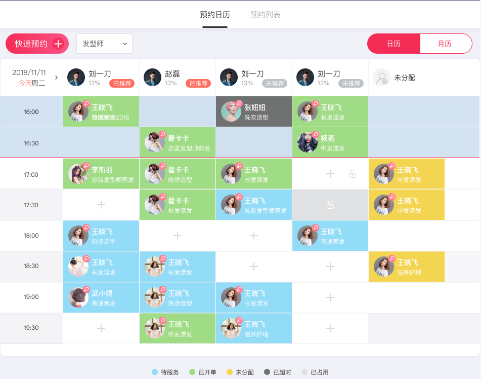
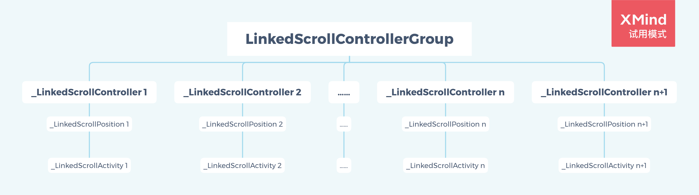

# 工作总结

## 一，预约模块

预约的首页是一个日历的表格，可以横向和纵向滑动。横向滑动时，左侧纵向时间轴固定，表头员工跟随同步滚动；纵向滑动时，表头员工行固定，左侧时间轴同步滑动。



看到这样的需求，刚开始的想法是通过 `Table` 来实现，外面嵌套横向和纵向的 `SingleChildScrollView`，实现两个方向上的滚动。

三下五除二，写好代码后运行发现了致命的问题。由于表格太多，测试数据中横向员工大概二三十个，纵向时间轴有大概二三十个，每个员工对应时间段最多可以设置4个预约项目，那么粗略算下来一张表就有三四千个单元格，真实情况可能更多。这就导致了整个页面极其消耗内存，最致命的是 build 的过程耗时太长，在一台性能不是很强大的终端机上可能耗时十几秒，这是无论如何无法接受的。优化！

既然一次性加载几千个表格拖慢了加载速度，那么优化的思路就是在构建页面的时候不能一次性加载这么多的表格，而是只加载界面中我们可以看到的部分。那么是否可以借助 `ListView` 的机制，实现这一设想呢？具体方案是在纵轴上用一个 `ListView`嵌套，实现纵向的滚动和每一行的懒加载，而每一行分别是一个 `ListView`，实现行的滚动和懒加载。

但是这个方案也有它的问题，虽然它可以实现懒加载，但是每一行在滚动的时候都是独自的，无法和其他的行同步，这是不符合要求的。

那么如何使得所有的行同步滚动呢？为了解决这一问题，我给所有的行 `ListView` 设置一个 `ScrollController`，当检测到其中的一个 `ScrollController` 发生滚动事件后，遍历其他的 `ScrollController`，将其位置跳转到相同位置。但是对所有 `ScrollController` 的监听及事件处理会导致死循环最终引起 OOM 的问题我没有想到合适的解决办法。

后来为了开发进度，舍弃了每一行都是一个 `ListView` 的方法，而是将每一行都设置成一个同样长度的 `Row`，然后最外层嵌套一个水平方向的 `SingleChildScrollView`，这样在行上是懒加载的，而在列上并不是，即每次按行加载。对于员工数据过多的情况，这种方案仍然不是很理想，但是算是当时的最优解了。

期间在网上也搜索了很多大表格的解决方案，但检索到的方案要么就是不符合实际需求，要么就是压根无法达到我懒加载的目的。

直到后来发现了网上的一个回答，推荐了官方的一个库，[linked_scroll_controller](https://pub.dev/packages/linked_scroll_controller)，它的作用正是使多个 `ScrollController`同步滚动。试用了之后，完美达到预期要求。

那么它究竟是怎么工作的，怎么完成我自己想做但是没有完成的工作的呢？

先看一下它的用法：

```dart
class LinkedScrollables extends StatefulWidget {
  @override
  _LinkedScrollablesState createState() => _LinkedScrollablesState();
}

class _LinkedScrollablesState extends State<LinkedScrollables> {
  LinkedScrollControllerGroup _controllers;
  ScrollController _letters;
  ScrollController _numbers;

  @override
  void initState() {
    super.initState();
    _controllers = LinkedScrollControllerGroup();
    _letters = _controllers.addAndGet();
    _numbers = _controllers.addAndGet();
  }

  @override
  void dispose() {
    _letters.dispose();
    _numbers.dispose();
    super.dispose();
  }

  @override
  Widget build(BuildContext context) {
    return Directionality(
      textDirection: TextDirection.ltr,
      child: Row(
        children: [
          Expanded(
            child: ListView(
              controller: _letters,
              children: <Widget>[
                _Tile('Hello A'),
                _Tile('Hello B'),
                _Tile('Hello C'),
                _Tile('Hello D'),
                _Tile('Hello E'),
              ],
            ),
          ),
          Expanded(
            child: ListView(
              controller: _numbers,
              children: <Widget>[
                _Tile('Hello 1'),
                _Tile('Hello 2'),
                _Tile('Hello 3'),
                _Tile('Hello 4'),
                _Tile('Hello 5'),
              ],
            ),
          ),
        ],
      ),
    );
  }
}

class _Tile extends StatelessWidget {
  final String caption;

  _Tile(this.caption);

  @override
  Widget build(_) => Container(
        margin: const EdgeInsets.all(8.0),
        padding: const EdgeInsets.all(8.0),
        height: 250.0,
        child: Center(child: Text(caption)),
      );
}
```

上面的代码摘自该库简介中给出的官方 demo。其实关键代码就这一句，`_controllers.addAndGet()`，废话不多说，代码见真章。

```dart
ScrollController addAndGet() {
    final initialScrollOffset = _attachedControllers.isEmpty
        ? 0.0
        : _attachedControllers.first.position.pixels;
    final controller =
        _LinkedScrollController(this, initialScrollOffset: initialScrollOffset);
    _allControllers.add(controller);
    controller.addListener(_offsetNotifier.notifyListeners);
    return controller;
}
```

代码很明了，就是每次创建一个 ScrollController，将它的位置同步到其他 ScrollController 的现在的位置，然后再将它存储到一个列表中。这个时候，需要考虑的就是如何在其中一个滚动时，同步其他所有的可滚动视图的位置了。

上面的方法还对每一个构建并存储起来的 ScrollController 添加了监听器，来看看这个监听回调里面都是些什么。

```dart
@override
void notifyListeners() {
    /// 这个 controllerGroup 就是类 LinkedScrollControllerGroup 的一个对象
    final currentOffset = controllerGroup.offset;
    if (currentOffset != _cachedOffset) {
        _cachedOffset = currentOffset;
        super.notifyListeners();
    }
}
```

我们再看一个方法，这个方法暴露给开发者监听偏移量的改变。

```dart
/// Adds a callback that will be called when the value of [offset] changes.
void addOffsetChangedListener(VoidCallback onChanged) {
    _offsetNotifier.addListener(onChanged);
}
```

所以通过 scrollController -> _offsetNotifier -> onChanged 这样一个传递过程，每当可滚动组件的偏移量发生变化时，开发者都可以及时地捕捉到它。

好了，这个不是很重要，我们继续向下看。_LinkedScrollController 创建了 _LinkedScrollPosition，_LinkedScrollPosition 又创建了 _LinkedScrollActivity，然后又通过一系列以“link”命名地方法实现相互持有，达到真正的“你中有我，我中有你”。

我们知道，在可滚动组件进行滚动时，会持续调用 ScrollPosition 的 `setPixels()` 和 `forcePixels()` 方法（具体的细节可参考[《滚动三剑客》](./flutter/滚动三剑客.md)这篇文章），下面把两个方法放在一起比较着看一看。

```dart
@override
double setPixels(double newPixels) {
    if (newPixels == pixels) {
        return 0.0;
    }
    updateUserScrollDirection(newPixels - pixels > 0.0
                              ? ScrollDirection.forward
                              : ScrollDirection.reverse);

    if (owner.canLinkWithPeers) {
        _peerActivities.addAll(owner.linkWithPeers(this));
        for (var activity in _peerActivities) {
            activity.moveTo(newPixels);
        }
    }

    return setPixelsInternal(newPixels);
}

@override
void forcePixels(double value) {
    if (value == pixels) {
        return;
    }
    updateUserScrollDirection(value - pixels > 0.0
                              ? ScrollDirection.forward
                              : ScrollDirection.reverse);

    if (owner.canLinkWithPeers) {
        _peerActivities.addAll(owner.linkWithPeers(this));
        for (var activity in _peerActivities) {
            activity.jumpTo(value);
        }
    }

    forcePixelsInternal(value);
}
```

上面的两段代码中的 _peerActivities 都是和当前 ScrollPosition 对应的可滚动组件的其他联动可滚动组件所对应的 ScrollActivity，这段话有些弯弯绕，可能不是很好理解，没关系，我画了个示意图，助力理解。



如上图，_LinkedScrollPosition 1 的 _peerActivities 中存放的是 _LinkedScrollActivity 2 到 _LinkedScrollActivity n+1，而_LinkedScrollPosition 2 的 _peerActivities 中存放的是_ LinkedScrollActivity 1 加上 _LinkedScrollActivity 3 到 _LinkedScrollActivity n+1，依此类推。

两个方法遍历了这些 Activity，然后分别执行了它们的两个方法——`moveTo()` 和 `jumpTo()`，分别看一下。

```dart
void moveTo(double newPixels) {
    _updateUserScrollDirection();
    delegate.setPixelsInternal(newPixels);
}

void jumpTo(double newPixels) {
    _updateUserScrollDirection();
    delegate.forcePixelsInternal(newPixels);
}
```

```dart
@override
_LinkedScrollPosition get delegate => super.delegate;
```

这里的 delegate 本质上就是 _LinkedScrollPosition，所以实质上是执行了 _LinkedScrollPosition 的 `setPixelsInternal()` 和 `forcePixelsInternal()` 的方法。

```dart
double setPixelsInternal(double newPixels) {
    return super.setPixels(newPixels);
}

void forcePixelsInternal(double value) {
    super.forcePixels(value);
}
```

可以看到这里终归是回到了 ScrollPosition 的 `setPixels()` 和 `forcePixels()` 方法，更新了可滚动组件的偏移位置。当所有的 peers 都按正常流程进行后，我们看到 _LinkedScrollPosition 的 `setPixels()` 和 `forcePixels()` 方法的最后一句，通过同样的方法更新了自己的偏移位置，自此所有的可滚动组件通过设置同一个偏移量保持了滚动进度的同步。


## iOS Release crash

这个问题的详情，可以参见我自己在遇到问题时在 flutter 的官方 github 项目下提的 [issue](https://github.com/flutter/flutter/issues/70441)。

## Android RecyclerView 结合 Timer